# ARCHITECTURE

Project: `SoulFlow Orchestrator`

## 1. 목적

채널 메시지를 비동기 오케스트레이션 파이프라인으로 처리하고, 실행 상태를 SQLite 중심 저장소에 유지해 재시작 후에도 복구 가능한 런타임을 제공합니다.

핵심 원칙:
- 논블로킹 루프 유지
- 실패 시 재시도 + DLQ
- 컨텍스트는 파일 기반 메모리/세션/결정/이벤트에서 재구성
- 서비스 간 비동기 디커플링 (MessageBus)

## 2. 상위 컴포넌트

| 모듈 | 디렉터리 | 역할 |
|------|----------|------|
| Entry | `src/main.ts` | 부트스트랩, 서비스 조립, graceful shutdown |
| Agent Domain | `src/agent/` | 에이전트 런타임, 루프, 도구, 스킬, 메모리 |
| Agent Backends | `src/agent/backends/` | 8개 백엔드 통합 (CLI 래퍼 + 네이티브 SDK + OpenAI 호환) |
| PTY Backend | `src/agent/pty/` | 컨테이너/PTY 기반 CLI 에이전트 (Docker 격리 + MCP 브릿지 + NDJSON 와이어) |
| Web Frontend | `web/` | React + Vite 대시보드 SPA (i18n, 마크다운 렌더링, SSE, Zustand) |
| OAuth | `src/oauth/` | OAuth 2.0 연동 (GitHub · Google · Custom), 토큰 자동 갱신 |
| Channel Layer | `src/channels/` | 매니저, 디스패치, 승인, 미디어, 세션 기록, 커맨드 |
| Orchestration | `src/orchestration/` | once/agent/task 실행 모드 선택 및 실행 |
| Provider Layer | `src/providers/` | LLM 프로바이더, Circuit Breaker, Health Scorer |
| Runtime Bus | `src/bus/` | 비동기 메시지 큐 (inbound/outbound/progress) |
| MCP | `src/mcp/` | MCP 서버 연결, 도구 등록 |
| Workflow Events | `src/events/` | 이벤트 기록 + TaskStore 동기화 |
| Decision/Session | `src/decision/`, `src/session/` | 결정사항·세션 저장소 |
| Security | `src/security/` | Secret Vault, 인바운드 seal, 감사 로그 |
| Scheduler | `src/cron/`, `src/heartbeat/` | 크론, 하트비트 |
| Ops/Dashboard | `src/ops/`, `src/dashboard/` | 운영 서비스, 웹 대시보드 API + SSE |
| Runtime | `src/runtime/` | ServiceManager, 인스턴스 락 |
| Config | `src/config/` | Zod 기반 설정 스키마 + env 파싱 |
| Skills | `src/skills/` | 역할 기반 스킬 시스템 (8개 역할 + 공유 프로토콜) |
| Utilities | `src/utils/` | SQLite 헬퍼, env 로더, 공용 함수 |

## 3. ServiceManager 라이프사이클

`ServiceManager` (`src/runtime/service-manager.ts`)가 모든 서비스의 생명주기를 관리합니다.

```
ServiceLike 인터페이스:
  name: string
  start(): Promise<void>
  stop(): Promise<void>
  health_check(): { ok: boolean; detail?: string }
```

- `register(service, { required? })` — 서비스 등록 (required 실패 시 부트 중단)
- `start()` — 등록 순서대로 시작
- `stop()` — 역순 정지
- `health_check()` — 전체 서비스 건강 상태 집계

## 4. 부트 시퀀스

`createRuntime()` (`src/main.ts`) 초기화 순서:

1. `.env` 로드 (`src/utils/env.ts`)
2. 단일 인스턴스 락 획득 (`src/runtime/instance-lock.ts`)
3. `load_config_from_env()` → `AppConfig`
4. 핵심 서비스 생성:
   - `MessageBus`
   - `DecisionService`, `WorkflowEventService`
   - `ProviderRegistry` (+ CircuitBreaker, HealthScorer)
   - 에이전트 백엔드 조립 (`provider-factory.ts` 팩토리 기반):
     - `CliAgent("claude_cli")`, `CliAgent("codex_cli")`, `CliAgent("gemini_cli")`, `CliAgent("container_cli")` (CLI 래퍼)
     - `ClaudeSdkAgent` (SDK 네이티브)
     - `CodexAppServerAgent` (JSON-RPC 네이티브)
     - `OpenAICompatibleAgent` (OpenAI 호환 API)
     - `OpenRouterProvider` (OpenRouter HTTP API)
   - `AgentSessionStore` (세션 영속화)
   - `AgentBackendRegistry` (CircuitBreaker + fallback + 세션 관리)
   - `AgentDomain` (tools, skills, memory, tasks, subagents)
   - `SessionStore`
   - `CronService`
   - `ChannelRegistry` (채널 어댑터 등록)
   - `DispatchService` (retry + DLQ + dedup + rate limiter)
   - `SessionRecorder`, `MediaCollector`
   - `ApprovalService`
   - `McpClientManager` → MCP 도구 자동 등록
   - `ProcessTracker`
   - `OrchestrationService`
   - `CommandRouter` (16개 슬래시 커맨드)
   - `TaskResumeService`
   - `ChannelManager`
5. 선택 서비스 생성:
   - `Phi4RuntimeManager`
   - `HeartbeatService`, `OpsRuntimeService`, `DashboardService`
6. 내장 도구 등록 (cron, memory, decision, secret, promise)
7. `ServiceManager`에 전체 서비스 등록 (required/optional 구분)
8. `ServiceManager.start()` → 순차 기동
9. `RuntimeApp` 인터페이스 반환

Graceful Shutdown (`SIGINT`/`SIGTERM`):
→ `ServiceManager.stop()` → `MessageBus.close()` → `SessionStore.close()` → 인스턴스 락 해제

## 5. 인바운드 파이프라인


```
Channel.read() → Dedup → Bus.publish_inbound → Bus.consume_inbound
  → CommandRouter (슬래시 커맨드 처리)
  → ApprovalService (승인 텍스트/리액션)
  → Sensitive Seal (민감정보 치환)
  → MediaCollector (첨부 다운로드)
  → OrchestrationService (AI 실행)
  → SessionRecorder (히스토리 저장)
  → DispatchService (응답 전송)
```

### 5.1 Polling

`ChannelManager.run_poll_loop()`가 채널별 `read()` 수행.
수신 메시지는 seen 기반 dedup 후 `Bus.publish_inbound()`.

### 5.2 커맨드 라우팅

`CommandRouter` (`src/channels/commands/router.ts`)가 16개 슬래시 커맨드를 라우팅:
`/help`, `/stop`, `/render`, `/secret`, `/memory`, `/decision`, `/promise`, `/cron`, `/reload`, `/task`, `/status`, `/skill`, `/doctor`, `/agent`, `/stats`, `/verify`

오타 자동 보정: Levenshtein 거리 ≤ 2 이내 퍼지 매칭.

`create_command_router()` (`src/channels/create-command-router.ts`) 팩토리가 17개 핸들러 인스턴스화 + 의존성 배선을 담당. `ChannelManager`는 이 팩토리 결과를 사용합니다.

### 5.3 승인 처리

`ApprovalService` (`src/channels/approval.service.ts`):
- 텍스트 응답에서 request_id 매칭 → approve/deny
- Slack 리액션 이모지 → 승인/거부/보류/취소 매핑
- stop 리액션 → 활성 실행 중지 + 서브에이전트 cascade cancel

### 5.4 민감정보 선차단

채널 수신 직후 `seal_inbound_sensitive_text` (`src/security/inbound-seal.ts`):
- 키 규칙: `inbound.<provider>.c<chatHash>.<type>.v<valueHash>`
- Secret reference/ciphertext 무결성 검사 (`inspect_secret_references_for_orchestration`)
- 키 미식별 / 암호문 무효 시 에이전트 실행 없이 `secret_resolution_required` 응답

### 5.5 미디어 수집

`MediaCollector` (`src/channels/media-collector.ts`):
- 채널 메타데이터 파일 (Slack files, Telegram, Discord)
- 인라인 URL 링크
- 로컬 파일 참조
→ `runtime/inbound-files/<provider>/`에 저장, 로컬 경로만 분석 컨텍스트에 주입

## 6. 실행 모델

`OrchestrationService` (`src/orchestration/service.ts`)가 실행 모드를 결정합니다.

모듈 분리 구조:

| 모듈 | 파일 | 역할 |
|------|------|------|
| Types | `types.ts` | `ExecutionMode`, `ClassificationResult`, `OrchestrationRequest/Result` 계약 타입 |
| Gateway | `gateway.ts` | 분류 결과 → `GatewayDecision` (builtin/inquiry/execute), tool_loop 미지원 시 `once` 다운그레이드 |
| Classifier | `classifier.ts` | Phi-4 기반 실행 모드 분류 (once/agent/task/builtin/inquiry), `detect_escalation` |
| Prompts | `prompts.ts` | 분류기 프롬프트 상수, 모드 오버레이, 포맷 유틸리티 (`format_tool_label` 등) |
| ToolCallHandler | `tool-call-handler.ts` | 레거시 CLI 백엔드 경로 도구 실행 + 결과 truncation |
| AgentHooksBuilder | `agent-hooks-builder.ts` | SDK 네이티브 백엔드용 `AgentHooks` 조립 (스트리밍/승인/CD/이벤트) |

실행 모드:

| 모드 | 구현 | 용도 |
|------|------|------|
| `once` | 단일 턴 응답 | 간단한 질의응답 |
| `agent` | `run_agent_loop` | 다중 턴 연속 목표 해결 |
| `task` | `run_task_loop` | 단계 노드 순차 실행/재개/승인 대기 |

실행 흐름:
1. Gateway → Classifier (실행 모드 분류)
2. 민감정보 seal
3. 스킬 해석 (always + request-triggered)
4. Secret 무결성 검사
5. 런타임 정책 결정 (커맨드 프로파일 기반)
6. 도구 컨텍스트 + 세션 히스토리 조립
7. 실행 모드 선택 → 에이전트 백엔드 실행
8. StreamBuffer를 통한 점진적 출력

### Agent Loop

`src/agent/loop.service.ts` (`run_agent_loop`):
- 단일 목표를 턴 제한 내 연속 해결
- 종료: `check_should_continue=false`, `max_turns` 도달, abort/error

### Task Loop

`src/agent/loop.service.ts` (`run_task_loop`):
- TaskNode 순차 실행/재개/승인 대기
- 상태: `running`, `waiting_approval`, `completed`, `failed`, `cancelled`, `max_turns_reached`
- 저장소: `TaskStore` (`runtime/tasks/tasks.db`)

## 7. 에이전트 백엔드 추상화



`AgentBackendRegistry` (`src/agent/agent-registry.ts`)가 8개 백엔드를 통합 관리합니다:

| 백엔드 | 구현 | 특성 |
|--------|------|------|
| `claude_cli` | `CliAgent` | Claude CLI 래퍼, 내부 tool loop |
| `codex_cli` | `CliAgent` | Codex CLI 래퍼, 내부 tool loop |
| `claude_sdk` | `ClaudeSdkAgent` | @anthropic-ai/claude-code SDK 네이티브, resume 지원 |
| `codex_appserver` | `CodexAppServerAgent` | Codex JSON-RPC AppServer 모드, resume 지원 |
| `gemini_cli` | `CliAgent` | Gemini CLI 래퍼, 내부 tool loop |
| `openai_compatible` | `OpenAICompatibleAgent` | vLLM · Ollama · LM Studio 등 OpenAI 호환 API |
| `openrouter` | `OpenRouterProvider` | OpenRouter HTTP API |
| `container_cli` | `CliAgent` | 컨테이너 내부 CLI 래퍼 (Podman/Docker) |

### Fallback 체인

동일 계열 자동 fallback:
```
claude_sdk  ──실패──▶ claude_cli
codex_appserver ──실패──▶ codex_cli
```

Fallback 트리거: 백엔드 미사용 가능, CircuitBreaker open, 실행 에러.

### PTY 에이전트 백엔드 (`src/agent/pty/`)

CLI 기반 에이전트를 PTY + NDJSON 와이어 프로토콜로 통합하는 계층:

| 모듈 | 역할 |
|------|------|
| `ContainerCliAgent` | `AgentBackend` 인터페이스 구현, tool_loop/resume 지원 |
| `ContainerPool` | PTY 인스턴스 라이프사이클 (spawn, reuse, idle cleanup) |
| `AgentBus` | 메시지 라우팅 + 세션 영속화 + followup 큐 |
| `LaneQueue` | 세션별 직렬화 (동시 쓰기 방지) |
| `NdjsonParser` | 스트리밍 버퍼 → 줄 단위 파싱 → `CliAdapter.parse_output()` |
| `CliAdapter` | CLI별 프로토콜 핸들링 (`ClaudeCliAdapter`, `CodexCliAdapter`, `GeminiCliAdapter`) |
| `LocalPty` | 로컬 node-pty / child_process 스포닝 |
| `AuthProfileTracker` | 멀티 API 키 라운드로빈 + 쿨다운 failover |
| `PtyTransport` | `AgentTransport` 구현 — 세션별 `PtyConnection` 관리, I/O 파이프라인 |
| `DockerOps` / `DockerPty` | 인프라 추상화 (`docker create/start/attach`) ↔ 도메인 구현 (Pty 인터페이스 + 보안 + 볼륨) |
| `ToolBridgeServer` | 호스트 Unix 소켓 MCP 브릿지 — 컨테이너 도구 요청을 `McpClientManager`로 중계 |
| `bridge-mcp-server.mjs` | 컨테이너 내부 경량 MCP 프록시 (순수 Node stdlib, npm 의존성 없음) |
| `tool-bridge-config.ts` | 브릿지 경로 상수 + MCP config JSON 생성/정리 |
| `CommPermissionGuard` | 에이전트간 통신 권한 매트릭스 (deny-all 기본, 규칙 기반 허용) |
| `ContextWindowGuard` | 프롬프트 전송 전 토큰 추정 차단 (hard_block / warn 2단계) |
| `SecretReader` | Docker Secrets (`/run/secrets/`) → 환경변수 맵 변환 |
| `Semaphore` | 비동기 N-슬롯 세마포어 (동시 컨테이너 수 제한) |

**MCP 브릿지 아키텍처:**
```
[호스트] ToolBridgeServer ←── Unix 소켓 ──→ bridge-mcp-server.mjs [컨테이너]
            │                                        ↑
    McpClientManager                          Claude/Codex CLI
            │                                  (--mcp-config)
       실제 MCP 도구들
```

개발 모드: `LocalPty` (node-pty), 프로덕션: `DockerPty` (Docker 컨테이너).

→ 상세 설계: `docs/*/design/pty-agent-backend.md`

### AgentSessionStore

`src/agent/agent-session-store.ts`:
- SQLite 기반 세션 영속화 (`runtime/agent-sessions.db`)
- TTL 기반 만료 (기본 24시간)
- 성공 실행 시 자동 저장, `task_id` 기반 조회
- resume 지원 백엔드(SDK/AppServer)에서 활용

### 에이전트 타입 시스템

`src/agent/agent.types.ts` — 에이전트-오케스트레이터 계약 타입:
- `AgentBackend` 인터페이스: `run(options)` → `AgentRunResult`
- `AgentEvent`: 14종 판별 유니온 (`init`, `content_delta`, `tool_use`, `tool_result`, `usage`, `rate_limit`, `compact_boundary`, `task_lifecycle`, `tool_summary`, `auth_request`, `error`, `complete` 등) — 4개 백엔드 이벤트를 단일 타입으로 정규화
- `AgentFinishReason`: `stop | max_turns | max_budget | max_tokens | output_retries | error | cancelled | approval_required`
- `AgentHooks`: `on_event`, `on_stream`, `on_approval`, `pre_tool_use`, `post_tool_use`

`src/agent/finish-reason-warnings.ts` — 비정상 종료 시 사용자 표시 메시지 (max_turns/max_budget/max_tokens/output_retries).

### CLI 인증 서비스

`src/agent/cli-auth.service.ts` — CLI 에이전트(Claude/Codex/Gemini) OAuth 인증 상태 확인 + 로그인 플로우 관리:
- Claude: `claude auth status` 실행 → JSON 파싱
- Codex: `~/.codex/` 인증 파일 존재 확인
- Gemini: `GEMINI_API_KEY` 환경변수 우선, `~/.gemini/` 파일 확인
- `start_login()`: OAuth 프로세스 spawn → URL 추출 → `login_progress` 이벤트 발행

## 8. 프로바이더 복원력



### ProviderRegistry

`src/providers/service.ts` — LLM 프로바이더 관리:

| 프로바이더 | 구현 | 프로토콜 |
|-----------|------|----------|
| `chatgpt` | CliHeadlessProvider | Codex CLI |
| `claude_code` | CliHeadlessProvider | Claude CLI |
| `openrouter` | OpenRouterProvider | HTTP API |
| `phi4_local` | Phi4LocalProvider | Local endpoint |
| `gemini_cli` | CliHeadlessProvider | Gemini CLI |
| `openai_compatible` | OpenAICompatibleProvider | OpenAI 호환 HTTP API |

### CircuitBreaker

`src/providers/circuit-breaker.ts` — 프로바이더/백엔드별 장애 차단:

```
closed (정상)  ──N회 실패──▶  open (차단)
                               │
                          timeout 경과
                               │
                               ▼
                         half_open (제한적)
                           │         │
                        성공→closed  실패→open
```

- `can_acquire()` — 상태 확인 (비소모)
- `try_acquire()` — 슬롯 소모 (half_open 시 제한)
- 기본: failure_threshold=5, reset_timeout=30s

### HealthScorer

`src/providers/health-scorer.ts`:
- 슬라이딩 윈도우 (50 샘플) 기반 성공률·지연시간 수집
- `score = success_weight × success_rate + latency_weight × (1 - avg_latency / target)`
- `rank()` → 점수 기반 프로바이더 순위 → 자동 fallback 체인

## 9. 역할 기반 스킬 시스템



`src/skills/` — 역할 기반 서브에이전트 시스템.

### 역할 (8개)

| 역할 | 식별자 | 설명 |
|------|--------|------|
| butler | `role:butler` | 사용자 직접 대면, 비개발 작업 처리, 개발 감지 시 PM/PL에 위임 |
| pm | `role:pm` | 요구사항 분석, 스펙 작성, 우선순위 결정 |
| pl | `role:pl` | 실행 조율, 개발팀 spawn, Phase Gate 판정 |
| generalist | `role:generalist` | 범용 서브에이전트, 전문 역할 불필요한 단일 작업 |
| implementer | `role:implementer` | 코드 구현 전문, 스펙 기반 파일 수정 + 셀프 검증 |
| reviewer | `role:reviewer` | 코드 리뷰 전문, 품질·보안·성능·컨벤션 검토 |
| debugger | `role:debugger` | 디버깅 전문, 버그 추적, 근본 원인 분석(RCA) |
| validator | `role:validator` | 검증 전문, 빌드·테스트·lint 실행 및 결과 판정 |

### 위임 계층

```
butler (사용자 대면)
  ├── pm (기획 필요)
  │     └── pl (실행 위임)
  └── pl (즉시 실행)
        ├── implementer (구현)
        ├── reviewer (리뷰)
        ├── validator (검증)
        ├── debugger (디버깅)
        └── generalist (잡무)
```

### 공유 프로토콜 (`_shared/`)

| 프로토콜 | 용도 |
|----------|------|
| `clarification-protocol` | 불확실성 분류 및 질문 판단 기준 |
| `session-metrics` | 세션 메트릭 수집/보고 규칙 |
| `phase-gates` | 단계별 체크포인트 통과 기준 |
| `difficulty-guide` | 작업 난이도 분류 및 턴 예산 배정 |
| `error-escalation` | 에러 시 에스컬레이션 절차 |
| `lang/typescript` | TypeScript 코드 컨벤션 |
| `lang/rust` | Rust 코드 컨벤션 |

### CD Scoring

`src/agent/cd-scoring.ts` — Clarification Debt 관찰자:

| 지표 | 점수 | 트리거 |
|------|------|--------|
| `clarify` | +10 | `ask_user` 도구 호출 |
| `correct` | +25 | 연속 3회 이상 도구 에러 후 성공/전환 |
| `redo` | +40 | 롤백 에러 이벤트 |

## 10. 아웃바운드 파이프라인

`DispatchService` (`src/channels/dispatch.service.ts`)가 전송을 담당합니다:

```
OutboundMessage → Bus.publish_outbound
  → DispatchService.consume_loop()
    → OutboundDedupePolicy (중복 감지)
    → TokenBucketRateLimiter (API rate limit 보호)
    → ChannelRegistry.send() (인라인 재시도)
    → 실패 시 exponential backoff 재큐잉
    → 최대 재시도 초과 시 DLQ (runtime/dlq/dlq.db)
```

### TokenBucketRateLimiter

`src/channels/rate-limiter.ts`:
- 용량 30 토큰, 1토큰/초 보충 (기본값)
- `try_consume()` → 토큰 차감 시도
- `wait_time_ms()` → 다음 토큰까지 대기 시간

### OutboundDedupePolicy

`src/channels/outbound-dedupe.ts`:
- provider + chat + thread + kind + trigger 기반 복합 키
- `agent_reply`/`agent_error`는 source message 기준 1회 전송 보장
- TTL + maxSize 기반 캐시 정리

### 채널별 장문 처리

Slack/Telegram: 분할 전송 + 길이 임계 초과 시 txt 첨부 폴백

## 11. 컨텍스트/메모리/세션

### ContextBuilder

`src/agent/context.service.ts` — 시스템 프롬프트 조립 파이프라인:

```
build_system_prompt() =
  security_override_policy + IDENTITY.md + AGENTS/SOUL/HEART/USER/TOOLS.md
  + longterm memory + decisions + promises
  + skills (always + 선택) + OAuth integrations
  + MODEL_ROUTING_GUIDE + current session
```

- `build_role_system_prompt()`: 서브에이전트 역할 컨텍스트 추가
- `build_messages()`: 히스토리 + 미디어 포함 전체 메시지 배열 조립
- 내부 컴포지션: `SkillsLoader`, `MemoryStore`, `DecisionService`, `PromiseService`

### SkillsLoader

`src/agent/skills.service.ts` — 스킬 파일 시스템 스캐너 + 메타데이터 레지스트리:

- 스캔 우선순위: `builtin_skills/` → `workspace/skills/` → `.claude/commands/` → `.claude/skills/`
- YAML frontmatter 직접 파싱 (외부 라이브러리 없음)
- `always: true` 스킬 자동 주입
- `suggest_skills_for_text()`: 키워드 점수 기반 스킬 추천 (name=6, trigger=5, alias=4)
- `_shared/` 프로토콜: 역할 스킬 간 공유 프로토콜 (`shared_protocols` frontmatter 참조)

### ContextBudget

`src/agent/context-budget.ts`:
- 우선순위 기반 섹션 선택 (0=필수, 1~3=선택)
- 토큰 추정: 4 chars ≈ 1 token
- `fit(sections)` → max_tokens 내 섹션 선택

### PromptVersion

`src/agent/prompt-version.ts`:
- `SHA-256(prompt).slice(0,12)` 기반 버전 추적
- 프롬프트 끝에 `<!-- prompt_version: XX -->` 스탬프

### MemoryStore

`src/agent/memory.service.ts`:
- longterm/daily read-write, 검색
- `consolidate_with_provider` 기반 압축

### SessionStore

`src/session/service.ts`:
- 저장: `runtime/sessions/sessions.db`
- 최근 N개 / N~M 범위 조회

### SessionRecorder

`src/channels/session-recorder.ts`:
- (provider, chat_id, alias, thread_id) 기준 히스토리 저장
- 사용자/어시스턴트 턴 기록 + daily memory 추가

## 12. MCP 통합

`McpClientManager` (`src/mcp/client-manager.ts`):

- stdio/SSE 기반 MCP 서버 프로세스 관리
- 서버별 도구 자동 검색 (`listTools`) + 이름 → 서버 매핑
- `call_tool(name, args, { signal })` → 올바른 서버로 라우팅
- 개별 서버 장애가 전체를 차단하지 않음

CLI 프로바이더 MCP 주입:
- `with_codex_mcp_runtime_overrides` → Codex CLI에 MCP 서버 설정 전달
- 프로젝트별 MCP 도구 자동 등록 (`ORCH_MCP_ENABLE_ALL_PROJECT`)

## 13. Tools 및 승인 흐름

### 도구 레지스트리

`src/agent/tools/` — 기본 도구:
- 파일/쉘/웹/메시지/파일전송/spawn/cron
- `oauth_fetch`: OAuth 인증 API 호출 (토큰 자동 주입, 401 시 자동 갱신 재시도, 15초 타임아웃)
- 동적 도구 (`runtime/custom-tools/tools.db`)
- `diagram_render`: Mermaid → SVG/ASCII (`@vercel/beautiful-mermaid`)
- MCP 도구 (McpClientManager 경유)

### Tool 레벨 비밀값 해석

모든 도구 실행은 `Tool.execute` (`src/agent/tools/base.ts`)에서 secret 해석:
- `resolve_inline_secrets_with_report` 정상 → 도구 내부 실행
- 실패 → `secret_resolution_required` 템플릿 반환 (복호화 금지)

### 승인 흐름

1. 도구가 `approval_required` 반환
2. 승인 요청 발행 (채널 메시지)
3. 텍스트 또는 리액션으로 결정
4. 승인 시 재실행

## 14. 스트리밍 출력

### StreamBuffer

`src/channels/stream-buffer.ts`:
- 점진적 출력 버퍼링 + 주기적 플러시
- 중복/오버랩 감지 (최근 4000자 비교, 델타 추출)
- 플러시 조건: buffer ≥ min_chars AND elapsed ≥ interval_ms

### ContentRenderer

`src/channels/content-renderer.ts`:
- 블록 타입: text, code, table, image, chart, media
- 출력 포맷: markdown, plain text, HTML

### OutputSanitizer

`src/channels/output-sanitizer.ts`:
- 도구 프로토콜 누출 (tool_calls, tool_call_id) 필터링
- 프로바이더 노이즈/페르소나 누출/민감 커맨드 제거

## 15. Channel Adapter

| 채널 | 구현 | SDK |
|------|------|-----|
| Slack | `src/channels/slack.channel.ts` | `@slack/web-api` WebClient |
| Telegram | `src/channels/telegram.channel.ts` | HTTP API |
| Discord | `src/channels/discord.channel.ts` | HTTP API |
| Base | `src/channels/base.ts` | 추상 기반 클래스 |

공통 인터페이스: `send`, `read`, `set_typing`, `parse_command`, `parse_agent_mentions`

Slack: `WebClient` 인스턴스 기반 `auth.test()` 검증, `filesUploadV2` 파일 전송.

## 16. Scheduler

### Cron

`src/cron/service.ts`:
- 스케줄 타입: `at` (1회), `every` (반복), `cron` (cron 표현식)
- `at` 1회성은 실행 후 auto-remove (`delete_after_run=true`)
- 저장: `runtime/cron/cron.db`

### Heartbeat

`src/heartbeat/service.ts`:
- `HEARTBEAT.md` 기반 주기 실행

## 17. Dashboard/Ops

### Dashboard (`src/dashboard/`)

- **프론트엔드**: React + Vite SPA (`web/`)
  - 전역 상태: Zustand (`store.ts`) — SSE 연결, 사이드바, 테마, 웹 스트리밍
  - i18n 지원 (ko/en) — `useT()` 훅, `t(key)` → ko → en → key fallback
  - 도구 설명 i18n: `tool-descriptions.ts` (빌트인 23종 한/영 번역)
  - 채팅 마크다운 렌더링: `react-markdown` + `remark-gfm` + `rehype-highlight` + `rehype-sanitize`
  - CSS 디자인 토큰 시스템: `var(--sp-*)`, `var(--fs-xs/sm/md)`, `var(--line)`, `var(--radius-*)` 등
  - 공용 훅: `useTestMutation` (채널/프로바이더 연결 테스트 추상화)
  - Setup Wizard (`/setup`): 4단계 초기 설정 (프로바이더 선택 → 기본값 → 에이전트 alias → 완료)
  - 컴포넌트: `ToggleSwitch`, `Badge`, `Toast`, `Modal`, `MarkdownContent` 등
- **백엔드 API**: 22개 라우트 핸들러로 분리 (`src/dashboard/routes/`)
  - `RouteContext` (`route-context.ts`): Fat Context 패턴 — req/res + `json()`, `read_body()`, `add_sse_client()`, `build_state()`, `register_media_token()` 액션 함수 포함
  - state · config · agent-provider · channel · chat · cron · health · memory · oauth · process · secret · session · skill · task · template · workspace · cli-auth · bootstrap · loop · approval · promise 등
- **서비스 분리**:
  - `SseManager` — SSE 클라이언트 관리 + 7종 이벤트 브로드캐스트 (process, message, cron, progress, task, web_stream, agent)
  - `StateBuilder` — 대시보드 상태 순수 조립 함수 (`build_dashboard_state`, `build_merged_tasks`)
  - `StaticServer` — SPA 정적 자산 서빙 + `index.html` fallback + 캐시 정책 (html: no-store, 나머지: immutable)
  - `MediaTokenStore` — 토큰 기반 미디어 서빙 (workspace 외부 경로 차단, 1시간 TTL, 60초 prune)
  - `OpsFactory` (`ops-factory.ts`) — 11개 도메인별 ops 객체 팩토리:

| Ops | 도메인 |
|-----|--------|
| `TemplateOps` | 시스템 프롬프트 템플릿 CRUD |
| `ChannelOps` | 채널 CRUD + `test_connection` |
| `AgentProviderOps` | 에이전트 프로바이더 CRUD + hot-swap |
| `BootstrapOps` | 초기 설정 (프로바이더 일괄 등록 + 템플릿 생성) |
| `MemoryOps` | longterm/daily 메모리 읽기/쓰기 |
| `WorkspaceOps` | workspace 파일 목록/읽기 (경로 탈출 방지) |
| `OAuthOps` | OAuth 연동 CRUD + auth URL 생성 + 토큰 갱신 |
| `ConfigOps` | 설정 섹션 조회/값 변경/리셋 |
| `SkillOps` | 스킬 목록/상세/파일 수정/ZIP 업로드 |
| `ToolOps` | 도구 이름/정의/MCP 서버 목록 |
| `CliAuthOps` | Claude/Codex/Gemini CLI 인증 상태/로그인 |

- 고정 포트 바인딩 (기본 4200)
  - `DASHBOARD_PORT_FALLBACK=1` 명시 설정 시에만 임시 포트 fallback 허용
  - 미설정 시 포트 충돌은 에러로 실패

### Ops (`src/ops/service.ts`)

- health tick, watchdog, decision dedupe

## 18. Workflow Events + Task 동기화

`src/events/service.ts`:
- 저장: `runtime/events/events.db`
- 이벤트 타입: `assign`, `progress`, `blocked`, `done`, `approval`
- append 시 dedupe + detail append + `TaskStore` 상태 자동 동기화

## 19. 보안 계층

### Secret Vault

- AES-256-GCM 암호화 (`src/security/secret-vault.ts`)
- 싱글턴 패턴 (`src/security/secret-vault-factory.ts`)
- master.key + secrets.db (`runtime/security/`)

### 인바운드 Seal

- 채널 수신 즉시 민감정보를 secret reference로 치환
- 에이전트에는 참조/암호문만 전달
- 복호화는 도구 실행 경로에서만 허용

### 감사 로그

`src/security/audit-log.ts`:
- SQLite 테이블: `audit_log`
- 이벤트: secret_access, tool_execute, approval_request/response, command_execute, provider_fallback

## 20. OAuth 통합

`src/oauth/` — OAuth 2.0 외부 서비스 연동:

| 모듈 | 역할 |
|------|------|
| `flow-service.ts` | OAuth 플로우 관리 (auth URL 생성, 콜백 처리, 토큰 갱신) |
| `integration-store.ts` | SQLite 기반 OAuth 연동 영속화 (client_id/secret, 토큰, 스코프) |

지원 서비스: GitHub (`repo`, `read:user`) · Google (`openid`, `email`, `profile`) · Custom (사용자 정의 auth_url/token_url).

에이전트 도구 연동: `oauth_fetch` 도구가 `service_id` 기반으로 토큰 자동 주입, 401 시 자동 갱신 재시도.

`scripts/oauth-relay.mjs` — NAT/컨테이너 환경용 TCP 릴레이 (`0.0.0.0:1456` → `127.0.0.1:1455`). CLI OAuth 콜백이 localhost만 수신하므로 외부 포트에서 들어오는 callback을 내부로 릴레이합니다.

## 21. 데이터 저장소 맵

```
workspace/
  memory/memory.db              ← 메모리 DB
  runtime/
    security/
      master.key                ← AES-256-GCM 마스터 키
      secrets.db                ← 시크릿 저장소
    sessions/sessions.db        ← 세션 히스토리
    agent-sessions.db           ← 에이전트 백엔드 세션 (resume)
    tasks/tasks.db              ← 태스크 상태
    events/events.db            ← 워크플로우 이벤트
    decisions/decisions.db      ← 결정사항
    cron/cron.db                ← 크론 스케줄
    dlq/dlq.db                  ← 전송 실패 DLQ
    custom-tools/tools.db       ← 동적 도구
    inbound-files/<provider>/   ← 채널 첨부파일
```

## 22. 실패/복구 전략

- 루프: 논블로킹 유지
- Graceful shutdown: `SIGINT`/`SIGTERM` → 역순 정지
- 전송 실패: exponential backoff 재시도 → DLQ 보존
- 에이전트 백엔드 장애: CircuitBreaker 차단 → 동일 계열 fallback
- 프로바이더 장애: HealthScorer 기반 자동 순위 재조정
- 메모리/세션/이벤트/태스크: SQLite 기반 복구

## 23. 다이어그램

### 서비스 아키텍처


### 인바운드 파이프라인


### 프로바이더 복원력


### 역할 위임 흐름


### 오케스트레이션 실행 흐름


### 민감정보 Sealing


## 24. 핵심 추상화

| 개념 | 구현 | 용도 |
|------|------|------|
| `ServiceLike` | 인터페이스 | ServiceManager가 관리하는 서비스 단위 |
| `ChannelProvider` | `"slack" \| "discord" \| "telegram"` | 메시지 소스/목적지 |
| `ExecutorProvider` | `"chatgpt" \| "claude_code" \| "phi4_local" \| "openrouter" \| "gemini_cli" \| "openai_compatible"` | LLM 프로바이더 |
| `AgentBackendId` | `"claude_cli" \| "codex_cli" \| "claude_sdk" \| "codex_appserver" \| "gemini_cli" \| "openai_compatible" \| "openrouter" \| "container_cli"` | 에이전트 백엔드 |
| `AgentBackend` | 인터페이스 | `run(options)` → `AgentRunResult` |
| `AgentEvent` | 14종 판별 유니온 | 4개 백엔드의 이벤트를 정규화 (init, content_delta, tool_use, complete 등) |
| `AgentFinishReason` | `stop \| max_turns \| max_budget \| ...` | 에이전트 종료 사유 (8가지) |
| `GatewayDecision` | 유니온 타입 | 분류 → 실행 결정 (builtin/inquiry/execute) |
| `ExecutionMode` | `"once" \| "task" \| "agent"` | 실행 전략 |
| `CircuitState` | `"closed" \| "open" \| "half_open"` | 장애 허용 상태 |
| `BudgetSection` | `{name, content, priority, estimated_tokens}` | 컨텍스트 윈도우 할당 |
| `ContentBlock` | 유니온 타입 | 구조화 출력 (text, code, table, chart 등) |

## 25. Docker 배포

멀티스테이지 빌드 (`Dockerfile`):

| 스테이지 | 용도 |
|----------|------|
| `deps` | Node 22-slim + 네이티브 빌드 도구 (python3, make, g++) |
| `build` | TypeScript 컴파일 + Vite 프론트엔드 번들 |
| `production` | 런타임 최소 이미지 (python3, lxml, tini) |
| `full` | CLI 에이전트 포함 (claude-code, codex, gemini) + CA 인증서 |
| `dev` | 전체 의존성 + CLI 에이전트 (라이브 리로드용) |

Docker Compose:
- `docker-compose.yml` — 프로덕션: orchestrator(`full`) + phi4(Ollama GPU)
- `docker-compose.dev.yml` — 개발: 소스 마운트 + Vite watch + tsx watch

```bash
# 프로덕션
docker compose up -d

# 개발
docker compose -f docker-compose.dev.yml up
```

## 26. Dev Container

`.devcontainer/` — VS Code Dev Container 설정:
- `docker-compose.yml` + `docker-compose.devcontainer.yml` 조합
- `workspaceFolder: /app`
- `postCreateCommand`: `npm ci && cd web && npm ci`
- VS Code 확장: ESLint + Prettier

## 27. 설계 문서

| 문서 | 위치 | 상태 | 내용 |
|------|------|------|------|
| PTY Agent Backend | `docs/*/design/pty-agent-backend.md` | 핵심 구현 완료 | 컨테이너 기반 에이전트 백엔드 설계 (DockerPty, AgentBus, MCP 브릿지) |
| Loop Continuity + HITL | `docs/*/design/loop-continuity-hitl.md` | 이슈 문서화 | 에이전트 루프 지속성 + 태스크 HITL 아키텍처 갭 분석 |
| Phase Loop | `docs/*/design/phase-loop.md` | 설계 아이디어 | 병렬 멀티에이전트 Phase Loop 실행 모델 |
