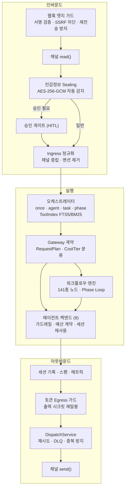
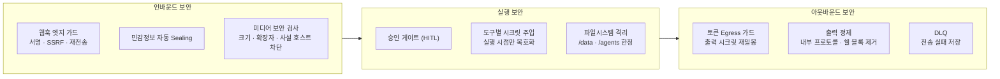

# Architecture

이 문서는 구현 세부보다 운영자와 사용자 관점에서 SoulFlow가 어떻게 동작하는지 설명합니다.

## 1. 시스템을 한 문장으로 설명하면

SoulFlow는 "채팅 요청을 받아, 적절한 실행 경로로 보내고, 결과와 상태를 다시 사용자에게 돌려주는 로컬 우선 오케스트레이션 서버"입니다.

## 2. 사용자가 실제로 보는 계층

### 채널 계층

- Slack
- Telegram
- Discord
- Web Chat

사용자는 여기서 요청을 보냅니다. 어떤 채널에서 시작했는지가 이후 응답, 승인, 재개 위치를 결정합니다.

### 제어 계층

- Slash command
- Approval
- Session recording
- Secret sealing

이 계층은 "바로 실행할지", "먼저 확인할지", "민감정보를 숨길지"를 결정합니다.

### 실행 계층

- once: 짧은 답변
- agent: 도구를 쓰는 멀티턴 실행
- task: 체크포인트가 필요한 장기 실행
- workflow/phase: 병렬 단계형 실행

사용자 입장에서는 같은 채팅처럼 보이지만, 내부에서는 요청 성격에 따라 다른 경로를 탑니다.

### 운영 계층

- Dashboard
- Providers
- Secrets
- OAuth
- Workflows
- Memory / Sessions / Cron

이 계층은 "시스템을 쓰는 곳"이지 "개발자를 위한 내부 패널"이 아닙니다. 운영자는 여기서 연결 상태, 설정, 실행 결과를 관리합니다.

## 3. 요청 처리 흐름

기본 흐름은 아래와 같습니다.

1. 채널에서 메시지를 받습니다.
2. 중복 여부와 커맨드 여부를 확인합니다.
3. 민감정보를 seal 합니다.
4. 승인 대상인지 확인합니다.
5. 오케스트레이터가 실행 경로를 고릅니다.
6. 필요한 도구나 워크플로우를 실행합니다.
7. 결과를 원래 채널로 돌려보냅니다.
8. 세션, 이벤트, 메모리에 기록합니다.

이 흐름 덕분에 사용자는 "채팅만 보낸다"는 경험을 유지하면서도, 내부에서는 안전성과 재시작 복구가 보장됩니다.

## 4. 주요 저장소

워크스페이스 아래에 운영 데이터가 저장됩니다.

- `runtime/`
  - 세션
  - 태스크
  - 이벤트
  - 크론
  - 전송 실패 DLQ
  - 보안 Vault
- `skills/`
  - 사용자 정의 스킬
- `templates/`
  - 템플릿과 시스템 프롬프트
- `workflows/`
  - YAML 워크플로우 템플릿

즉, 코드는 저장소에 있고, 운영 데이터는 워크스페이스에 있습니다.

## 5. 왜 대시보드가 중요한가

대시보드는 단순 모니터링 화면이 아닙니다.

- 초기 설정
- 채널 연결
- 프로바이더 관리
- 시크릿 관리
- 워크플로우 생성과 실행
- 세션/메모리 확인
- 운영 설정 변경

이 대부분이 대시보드에서 이뤄집니다. 그래서 SoulFlow의 실제 사용자 경험은 "채팅 + 대시보드" 조합입니다.

## 6. 보안 경계

보안은 한 곳에서만 처리하지 않습니다.

운영자가 기억해야 할 핵심은 두 가지입니다.

- 시크릿은 채팅에 직접 넣지 말고 Vault에 저장
- 외부 공개가 필요 없다면 대시보드는 로컬로만 바인딩

## 7. 반복 업무를 다루는 방식

반복 업무는 세 단계로 진화합니다.

1. 채팅으로 한번 실행
2. 유용하면 워크플로우 템플릿으로 저장
3. 주기적이라면 Heartbeat나 크론으로 자동화

이 구조 덕분에 운영자는 "대화형 실험"에서 "재현 가능한 자동화"로 자연스럽게 넘어갈 수 있습니다.

## 8. 확장 포인트

운영자가 주로 건드리는 확장 포인트는 다음입니다.

- Provider 추가
- OAuth 연동 추가
- Skill 추가
- Workflow 추가
- Channel 추가

개발자가 주로 건드리는 확장 포인트는 다음입니다.

- Tool 추가
- Route/ops 추가
- Backend 추가
- Dashboard UI 추가

## 9. 문서 연결

- 사용 시작: [docs/ko/getting-started/introduction.md](docs/ko/getting-started/introduction.md)
- 설치: [docs/ko/getting-started/installation.md](docs/ko/getting-started/installation.md)
- 운영: [docs/ko/guide/operations.md](docs/ko/guide/operations.md)
- 워크플로우: [docs/ko/guide/workflows.md](docs/ko/guide/workflows.md)
- 보안: [docs/ko/core-concepts/security.md](docs/ko/core-concepts/security.md)
