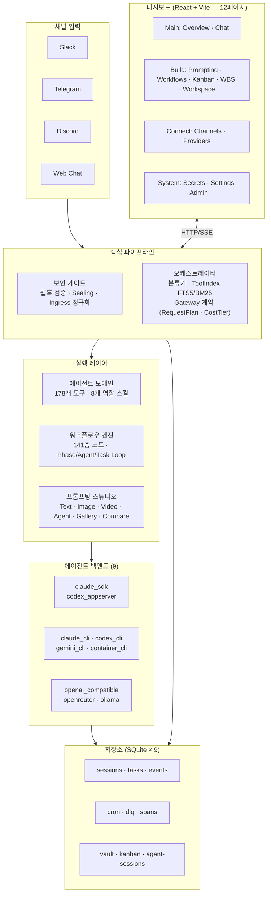
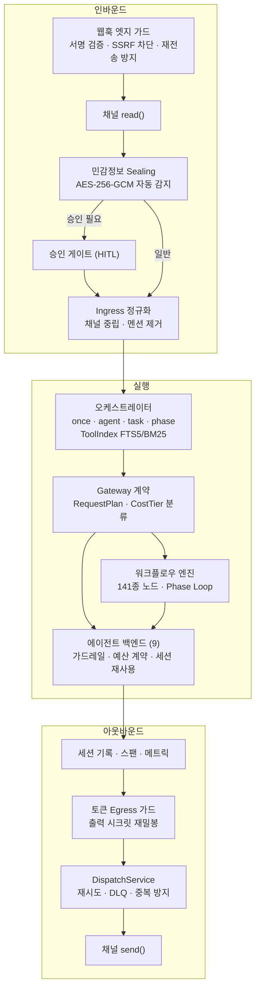
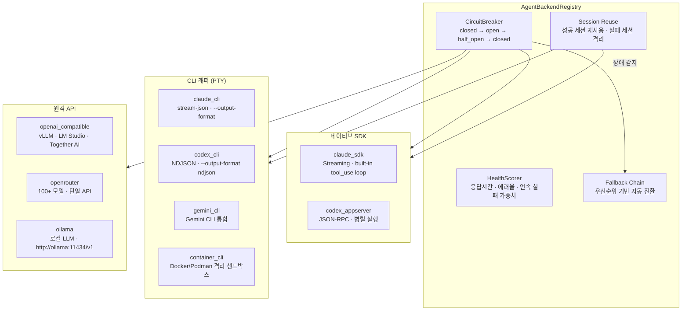
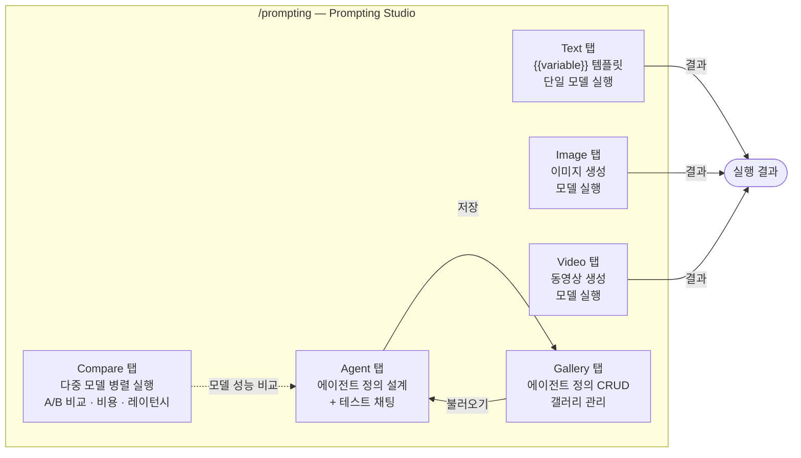
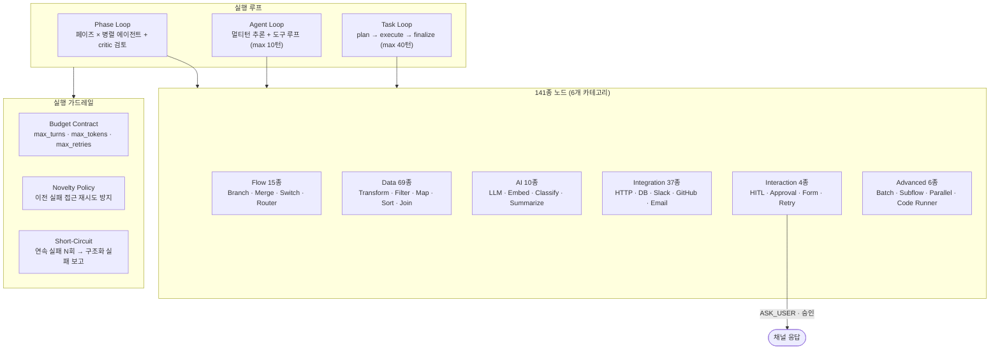
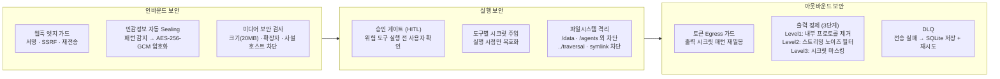
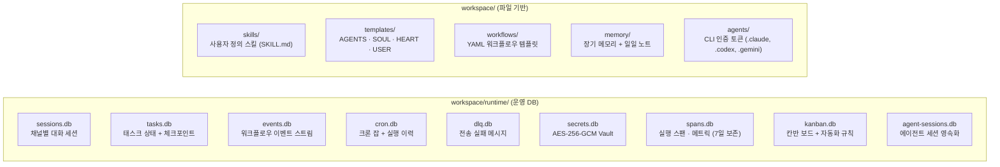

# Architecture — SoulFlow Orchestrator

채팅 요청을 받아 적절한 실행 경로로 보내고, 결과를 사용자에게 돌려주는 **로컬 우선 비동기 오케스트레이션 런타임**입니다.

---

## 1. 전체 시스템 컴포넌트



---

## 2. 모듈 테이블

| 디렉터리 | 역할 |
|----------|------|
| `src/agent/backends/` | 9개 백엔드 어댑터 (CLI 래퍼 + 네이티브 SDK + OpenAI 호환 + Ollama) |
| `src/agent/nodes/` | 141종 워크플로우 노드 핸들러 (OCP 플러그인 아키텍처) |
| `src/agent/pty/` | PTY 기반 CLI 통합 (ContainerPool, AgentBus, NDJSON 와이어) |
| `src/agent/tools/` | 에이전트 도구 178개 (oauth_fetch, workflow, ask-user 등) |
| `src/bootstrap/` | 15개 부트스트랩 모듈 (서비스 조립, main.ts 분해) |
| `src/bus/` | MessageBus (인메모리 기본 / Redis Streams 다중 인스턴스) |
| `src/channels/` | 채널 매니저 · 커맨드 · 디스패치 · 승인 · 페르소나 톤 |
| `src/config/` | Zod 기반 설정 스키마 + env 파싱 |
| `src/cron/` | 크론 스케줄러 (SQLite 영속화) |
| `src/dashboard/` | 웹 대시보드 백엔드 (ops × 13 + routes × 26 + SSE) |
| `src/decision/` | 결정사항 서비스 |
| `src/evals/` | 평가 파이프라인 (EvalRunner, judges, scorers, bundles) |
| `src/events/` | 워크플로우 이벤트 서비스 |
| `src/heartbeat/` | 하트비트 서비스 |
| `src/i18n/` | 공유 i18n 프로토콜 + JSON 로케일 (1,800+ 키) |
| `src/mcp/` | MCP 클라이언트 매니저 (stdio / SSE) |
| `src/oauth/` | OAuth 2.0 연동 (flow-service, token 자동 갱신) |
| `src/orchestration/` | Classifier · ToolIndex · ConfirmationGuard · Gateway 계약 |
| `src/providers/` | LLM 프로바이더 레지스트리 (CircuitBreaker, HealthScorer) |
| `src/runtime/` | ServiceManager · 인스턴스 락 |
| `src/security/` | Secret Vault (AES-256-GCM) · Sealing · Egress 가드 |
| `src/services/` | 도메인 서비스 (embed, vector-store, kanban, webhook, model-catalog) |
| `src/session/` | 세션 저장소 |
| `src/skills/` | 역할 기반 스킬 (8개 역할 + 공유 프로토콜) |
| `web/src/` | React + Vite 대시보드 SPA (i18n, Zustand, React Query) |

---

## 3. 요청 처리 파이프라인



---

## 4. 에이전트 백엔드 시스템



**자동 fallback 경로:** `claude_sdk` → `claude_cli` / `codex_appserver` → `codex_cli`

---

## 5. 프롬프팅 스튜디오



**Agent 탭 정의 필드:** `name` · `description` · `icon` · `role_skill` · `soul` · `heart` · `tools` · `shared_protocols` · `skills` · `use_when` · `not_use_for` · `extra_instructions`

자연어로 설명 → AI가 전체 필드 자동 생성 (Generate from description).

---

## 6. 워크플로우 엔진



---

## 7. 보안 아키텍처



**Secret Vault 토큰 형식:** `sv1.{iv}.{tag}.{ciphertext}` (base64url) — AAD 바인딩으로 위조 감지.

---

## 8. 저장소 아키텍처



---

## 9. 관찰성 (Observability)

| 계층 | 수집 항목 | 저장 위치 |
|------|----------|----------|
| **실행 스팬** | trace_id · span_id · duration_ms · status · attributes | `spans.db` |
| **메트릭** | agent.requests · agent.latency_ms · tool.calls · delivery.success/fail | `spans.db` |
| **전달 추적** | 전송 시도 · 재시도 횟수 · 최종 상태 | `dlq.db` + span 연결 |

**선택적 내보내기:** OpenTelemetry (OTLP/gRPC) · Prometheus (pull) · Console JSON.

---

## 10. 대시보드 네비게이션

```
사이드바 그룹
├── Main
│   ├── / (Overview) — SSE 실시간 피드 · 메트릭 · 프로세스
│   └── /chat        — 웹 채팅 · 마크다운 · 스트리밍
├── Build
│   ├── /prompting   — 프롬프팅 스튜디오 (Text/Image/Video/Agent/Gallery/Compare)
│   ├── /workflows   — Phase Loop · 141종 노드 그래프 에디터
│   ├── /kanban      — 칸반 보드 · 자동화 규칙
│   ├── /wbs         — WBS 계층 트리 뷰
│   └── /workspace   — 10탭 (Memory · Sessions · Skills · Cron · Tools ·
│                              Agents · Templates · OAuth · Models · References)
├── Connect
│   ├── /channels    — Slack · Telegram · Discord · Web 연결
│   └── /providers   — 백엔드 CRUD · CircuitBreaker 상태
├── System
│   ├── /secrets     — AES-256-GCM Vault
│   └── /settings    — 런타임 설정
└── Admin (슈퍼어드민)
    └── /admin       — 팀/사용자 관리 · 전역 프로바이더 · 모니터링
```

---

## 11. 문서 연결

- 시작하기: [docs/ko/getting-started/introduction.md](docs/ko/getting-started/introduction.md)
- 설치: [docs/ko/getting-started/installation.md](docs/ko/getting-started/installation.md)
- 에이전트 백엔드: [docs/ko/core-concepts/agents.md](docs/ko/core-concepts/agents.md)
- 보안: [docs/ko/core-concepts/security.md](docs/ko/core-concepts/security.md)
- 워크플로우: [docs/ko/guide/workflows.md](docs/ko/guide/workflows.md)
- 대시보드: [docs/ko/guide/dashboard.md](docs/ko/guide/dashboard.md)
