# SoulFlow Orchestrator

`SoulFlow Orchestrator`는 Slack/Telegram/Discord에서 들어오는 메시지를 Headless 에이전트 실행으로 처리하는 비동기 오케스트레이션 런타임입니다.

## 현재 핵심 기능
- 멀티 채널 수신/응답: `slack`, `telegram`, `discord`
- Headless 실행기 라우팅: `chatgpt(codex CLI)`, `claude_code(CLI)`, `openrouter`, `phi4_local`
- 이중 루프 모델:
  - `Agent Loop`: 단일 목표를 최대 턴까지 연속 해결
  - `Task Loop`: 단계형 노드 실행/재개/승인 대기
- 컨텍스트 빌더:
  - `templates/*.md`, `agents/*.md`, `memory/memory.db`, `skills/`
- 논블로킹 채널 처리:
  - 메시지 그룹핑, 스트리밍, typing, `/stop|/cancel|/중지`, `/help`, `/render`
  - `/memory`, `/decision`, `/cron`은 오케스트레이터 서비스 직접 처리(에이전트 bypass)
- 전송 안정화:
  - 인라인 재시도 + 디스패치 재큐잉(backoff) + DLQ(`runtime/dlq/dlq.db`)
- 긴 메시지 처리:
  - 채널별 분할 전송 + 파일 첨부 폴백
- 승인/제어 자동화:
  - 텍스트 승인 + Slack 리액션 승인/거부/보류/취소
  - Slack stop 리액션 기반 실행 중지
- 워크플로우 이벤트:
  - `assign/progress/blocked/done/approval` 이벤트 기록
  - 이벤트 -> TaskStore 상태 자동 동기화
- 대시보드:
  - 에이전트/태스크/결정/워크플로우 이벤트 조회

## 보안 우선 정책 (오케스트레이터 강제)
- 민감정보/보안 규칙은 다른 모든 규칙보다 우선합니다.
- 채널 입력 수신 직후 민감정보를 키 기반 secret 참조로 치환합니다.
  - 키 규칙: `inbound.<provider>.c<chatHash>.<type>.v<valueHash>`
  - 예시 type: `password`, `token`, `card`, `account`, `private_key`, `secret`
- 세션/메모리 저장 시 민감정보 평문/secret ref/ciphertext를 남기지 않습니다.
- 에이전트에는 참조/암호문만 전달되며, 복호화는 도구 실행 경로에서만 허용됩니다.
- 키 미식별 또는 암호문 무효 시:
  - 복호화 금지
  - `secret_resolution_required` 템플릿으로 즉시 사용자 안내
  - 에이전트 실행 이전에 오케스트레이터가 선차단

## 채널 파일 처리
- 첨부 파일 수신 시 `runtime/inbound-files/<provider>/`로 다운로드 후 분석 입력으로 전달합니다.
- 지원 채널:
  - Slack: file API 다운로드
  - Telegram: `getFile` 다운로드
  - Discord: attachment URL 다운로드
- 메시지 본문에 파일 확장자 URL(`.pdf`, `.csv`, `.json`, `.png`, `.zip` 등)이 있으면 원격 다운로드 후 동일 경로로 분석합니다.
- 렌더링 템플릿(`요약/핵심/코드·명령/미디어`)에서 미디어 블록은 `[IMAGE|VIDEO|FILE: ...]` 표기와 로컬 첨부를 공통 처리합니다.

## 아키텍처 다이어그램 (diagram 도구로 생성)
아래 다이어그램은 `diagram_render` 도구(`@vercel/beautiful-mermaid`)로 생성된 SVG입니다.




## 빠른 시작
### 1) 요구사항
- Node.js 20+
- 최소 1개 채널 Bot Token
- (선택) Podman/Docker + Ollama (`phi4_local` 런타임 사용 시)

### 2) 설치/빌드
```powershell
cd next
npm install
```

프로덕션 빌드:
```powershell
npm run build
```

### 3) 워크스페이스 및 환경 변수
런타임은 **실행 디렉터리(`process.cwd()`)를 workspace**로 사용합니다.

권장 실행 위치:
- `next/workspace`

`.env` 로딩 순서:
1. `<workspace>/.env`
2. `<workspace>/.env.local`
3. `<workspace>/../.env`
4. `<workspace>/../.env.local`

예시:
```powershell
cd next/workspace
copy ..\.env.example .env
```

최소 필수:
- Slack: `SLACK_BOT_TOKEN`, `SLACK_DEFAULT_CHANNEL`
- Telegram: `TELEGRAM_BOT_TOKEN`, `TELEGRAM_DEFAULT_CHAT_ID`
- Discord: `DISCORD_BOT_TOKEN`, `DISCORD_DEFAULT_CHANNEL`

권장(자기 메시지 재처리 방지):
- `SLACK_BOT_USER_ID`
- `TELEGRAM_BOT_USER_ID`
- `DISCORD_BOT_USER_ID`

### 4) 실행
개발 모드(핫리로드, 빌드 불필요):
```powershell
cd next
npm run dev
```

1회 실행:
```powershell
cd next
npm run dev:once
```

프로덕션 실행:
```powershell
cd next/workspace
node ../dist/main.js
```

### 5) 대시보드
- 기본 URL: `http://127.0.0.1:3789`
- `DASHBOARD_ENABLED=true`일 때 활성화
- 포트 바인딩이 `EACCES` 또는 `EADDRINUSE`로 실패하면 자동으로 가용 포트로 fallback
- 실제 바인딩 URL은 런타임 로그의 `[runtime] dashboard ...` 라인에서 확인

### 6) 공통 슬래시 명령
- `/help`
  - 공통 명령/사용법 출력
- `/stop` | `/cancel` | `/중지`
  - 현재 채널 실행 중 작업 중지
- `/render status`
  - 현재 채널의 렌더 모드/차단 정책 확인
- `/render markdown|html|plain`
  - 채널 렌더 모드 설정 (Telegram 기본: `html`, Slack/Discord 기본: `markdown`)
- `/render link indicator|text|remove`
  - 차단된 링크 표현 방식 설정
- `/render image indicator|text|remove`
  - 차단된 이미지 표현 방식 설정
- `/render reset`
  - 렌더 설정 기본값 복원
- `/secret status|list|set|get|reveal|remove`
  - AES-256-GCM 기반 secret vault 조회/저장/삭제
- `/secret encrypt <text>` / `/secret decrypt <cipher>`
  - 즉시 암복호화
- `/memory status|list|today|longterm|search <query>`
  - 메모리 상태/목록/당일/장기/검색 (오케스트레이터 직처리)
- `/decision status|list|set <key> <value>`
  - 현재 지침/결정사항 조회 및 수정 (오케스트레이터 직처리)
- `/cron status|list|add|remove`
  - 크론 상태/목록/등록/삭제
  - 자연어 등록: `N분후`, `N시간후`, `N후 M간격으로 ...`

## 주요 환경 변수
### 채널/폴링
- `CHANNEL_PROVIDER`
- `CHANNEL_POLL_INTERVAL_MS`
- `CHANNEL_READ_LIMIT`

### 대시보드
- `DASHBOARD_ENABLED`
- `DASHBOARD_HOST`
- `DASHBOARD_PORT`
- `DASHBOARD_ASSETS_DIR`
- `DASHBOARD_PORT_FALLBACK`

### 그룹핑/스트리밍
- `CHANNEL_GROUPING_ENABLED`
- `CHANNEL_GROUPING_WINDOW_MS`
- `CHANNEL_GROUPING_MAX_MESSAGES`
- `CHANNEL_STREAMING_ENABLED`
- `CHANNEL_STREAMING_INTERVAL_MS`
- `CHANNEL_STREAMING_MIN_CHARS`
- `CHANNEL_SUPPRESS_FINAL_AFTER_STREAM`
- `CHANNEL_PROGRESS_PULSE`
- `CHANNEL_SESSION_HISTORY_MAX_AGE_MS`

### 전송 재시도/DLQ
- `CHANNEL_SEND_INLINE_RETRIES`
- `CHANNEL_SEND_INLINE_RETRY_MS`
- `CHANNEL_MANAGER_INLINE_RETRIES`
- `CHANNEL_DISPATCH_RETRY_MAX`
- `CHANNEL_DISPATCH_RETRY_BASE_MS`
- `CHANNEL_DISPATCH_RETRY_MAX_MS`
- `CHANNEL_DISPATCH_RETRY_JITTER_MS`
- `CHANNEL_DISPATCH_DLQ_ENABLED`
- `CHANNEL_DISPATCH_DLQ_PATH`

### 승인/리액션 제어
- `APPROVAL_REACTION_ENABLED`
- `CONTROL_REACTION_ENABLED`
- `REACTION_ACTION_TTL_MS`

### 장문 분할/파일 폴백
- `SLACK_TEXT_CHUNK_SIZE`
- `SLACK_TEXT_FILE_FALLBACK_THRESHOLD`
- `TELEGRAM_TEXT_CHUNK_SIZE`
- `TELEGRAM_TEXT_FILE_FALLBACK_THRESHOLD`

### 루프 제한
- `AGENT_LOOP_MAX_TURNS`
- `TASK_LOOP_MAX_TURNS`

### 실행기 선택
- `ORCH_EXECUTOR_PROVIDER`
- `ORCH_ORCHESTRATOR_PROVIDER`
- `CHATGPT_HEADLESS_COMMAND`, `CHATGPT_HEADLESS_ARGS`
- `CLAUDE_HEADLESS_COMMAND`, `CLAUDE_HEADLESS_ARGS`
- `ORCH_CODEX_SANDBOX_MODE`
- `ORCH_CODEX_ADD_DIRS`
- `ORCH_CODEX_BYPASS_SANDBOX`
- `ORCH_CLAUDE_PERMISSION_MODE`
- `ORCH_MCP_ENABLED`
- `ORCH_MCP_ENABLE_ALL_PROJECT`
- `ORCH_MCP_SERVERS_FILE`
- `ORCH_MCP_SERVERS_JSON`
- `ORCH_MCP_SERVER_NAMES`
- `ORCH_MCP_STARTUP_TIMEOUT_SEC`
- `OPENROUTER_API_KEY`
- `PHI4_API_BASE`, `PHI4_MODEL`

## 디렉터리 구조
```text
next/
  docs/
    diagrams/
      orchestrator-flow.svg
      sensitive-seal-flow.svg
  src/
  dist/
  dashboard/
  workspace/
    .env
    templates/
    agents/
    memory/
      memory.db
    runtime/
      security/
        master.key
        secrets.db
      sessions/
        sessions.db
      tasks/
        tasks.db
      events/
        events.db
      decisions/
        decisions.db
      cron/
        cron.db
      dlq/
        dlq.db
      custom-tools/
        tools.db
      inbound-files/
```

## 트러블슈팅
- 시작 직후 `another instance is active`가 뜰 때
  - 동일 Bot Token 조합으로 이미 다른 런타임이 실행 중입니다.
  - 같은 토큰을 사용하는 중복 프로세스(다른 폴더/이전 세션 포함)를 정리한 뒤 다시 실행하세요.
- 응답이 없을 때
  - 토큰/채널 ID 확인
  - 로그에서 `channel manager start failed` 확인
- 대시보드 시작 실패(`listen EACCES`, `EADDRINUSE`)가 뜰 때
  - 기본 동작은 자동 fallback입니다. 로그의 `[runtime] dashboard http://...` 최종 주소를 사용하세요.
  - fallback을 끄려면 `DASHBOARD_PORT_FALLBACK=0`
- 전송 실패가 반복될 때
  - `runtime/dlq/dlq.db` 확인
  - 재시도 관련 env 조정
- 스트리밍이 약할 때
  - `CHANNEL_STREAMING_ENABLED=1`
  - `CHANNEL_STREAMING_INTERVAL_MS`, `CHANNEL_STREAMING_MIN_CHARS` 조정
- `exec`를 가상 bash로 격리하고 싶을 때
  - `just-bash` 설치: `npm i -g just-bash`
  - 참고: https://github.com/vercel-labs/just-bash
  - 설치되어 있으면 `exec`/dynamic shell tool에서 자동으로 우선 사용
- phi4가 꼭 필요한지
  - 일반 채널 응답/크론 실행은 `ORCH_EXECUTOR_PROVIDER` 경로를 사용하므로 phi4 필수 아님
  - `spawn` 기반 서브에이전트 컨트롤러는 `ORCH_ORCHESTRATOR_PROVIDER`를 사용
  - 로컬 phi4를 쓰지 않으면 `ORCH_ORCHESTRATOR_PROVIDER=chatgpt` 또는 `claude_code`
- phi4 점검
```powershell
cd next
npm run health:phi4
```
