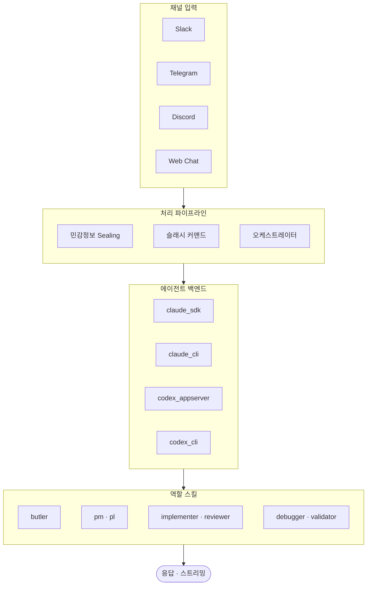

# SoulFlow Orchestrator

한국어 | [English](docs/README.en.md)

Slack · Telegram · Discord 메시지를 **헤드리스 에이전트**로 처리하는 비동기 오케스트레이션 런타임.

4개 에이전트 백엔드(Claude/Codex × CLI/SDK), 8개 역할 기반 스킬 시스템, CircuitBreaker 기반 프로바이더 복원력, AES-256-GCM 보안 Vault, OAuth 2.0 외부 서비스 연동을 내장한 올인원 솔루션입니다.

## 목차

- [아키텍처](#아키텍처)
- [이게 뭔가요?](#이게-뭔가요)
- [빠른 시작](#빠른-시작)
- [대시보드 사용법](#대시보드-사용법)
- [OAuth 연동](#oauth-연동)
- [사용 예시](#사용-예시)
- [슬래시 커맨드](#슬래시-커맨드)
- [디렉터리 구조](#디렉터리-구조)
- [트러블슈팅](#트러블슈팅)

## 아키텍처


```mermaid
flowchart TD
    subgraph Channels["채널 입력"]
        direction LR
        SL[Slack]
        TG[Telegram]
        DS[Discord]
        WEB[Web Chat]
    end

    subgraph Pipeline["처리 파이프라인"]
        direction TB
        SEAL[민감정보 Sealing]
        CMD[슬래시 커맨드]
        ORCH[오케스트레이터]
    end

    subgraph Backends["에이전트 백엔드"]
        direction LR
        CSDK[claude_sdk]
        CCLI[claude_cli]
        CAPPS[codex_appserver]
        CCLIX[codex_cli]
    end

    subgraph Skills["역할 스킬"]
        direction TB
        BT[butler]
        PM[pm · pl]
        IMPL[implementer · reviewer]
        DBG[debugger · validator]
    end

    Channels --> Pipeline
    Pipeline --> Backends
    Backends --> Skills
    Skills --> OUT([응답 · 스트리밍])
```

상세 다이어그램: [서비스 아키텍처](docs/diagrams/service-architecture.svg) · [인바운드 파이프라인](docs/diagrams/inbound-pipeline.svg) · [프로바이더 복원력](docs/diagrams/provider-resilience.svg) · [역할 위임](docs/diagrams/role-delegation.svg)

## 이게 뭔가요?

채팅 채널에서 메시지를 받아 전문 에이전트에게 분배하는 **오케스트레이션 런타임**입니다.

| 구성 요소 | 역할 | 핵심 특징 |
|----------|------|----------|
| **채널 매니저** | Slack · Telegram · Discord 수신/응답 | 스트리밍 · 그룹핑 · typing 갱신 |
| **오케스트레이터** | 인바운드 → 에이전트 실행 | Agent Loop · Task Loop 이중 모드 |
| **에이전트 백엔드** | Claude/Codex × CLI/SDK 실행 | CircuitBreaker · HealthScorer · 자동 fallback |
| **역할 스킬** | 8개 역할 계층적 분담 | butler → pm/pl → implementer/reviewer/validator/debugger |
| **보안 Vault** | AES-256-GCM 민감정보 관리 | 인바운드 자동 sealing · 도구 경로 복호화만 허용 |
| **OAuth 연동** | 외부 서비스 인증 | GitHub · Google · Custom OAuth 2.0 |
| **대시보드** | 웹 기반 실시간 모니터링 | SSE 피드 · 에이전트/태스크/결정/프로바이더 관리 |
| **MCP 통합** | 외부 도구 서버 연결 | stdio/SSE · 자동 CLI 주입 |
| **크론** | 정기 작업 스케줄 | SQLite 기반 · 핫 리로드 |

### 에이전트 백엔드

| 백엔드 | 방식 | 특징 | 자동 fallback |
|--------|------|------|--------------|
| `claude_sdk` | 네이티브 SDK | tool loop 내장 · 스트리밍 | → `claude_cli` |
| `claude_cli` | Headless CLI 래퍼 | 안정성 · 범용 | — |
| `codex_appserver` | 네이티브 AppServer | 병렬 실행 · tool loop 내장 | → `codex_cli` |
| `codex_cli` | Headless CLI 래퍼 | 샌드박스 모드 지원 | — |

### 역할 스킬

| 역할 | 전문 분야 | 위임 방향 |
|------|----------|----------|
| `butler` | 요청 수신 · 역할 라우팅 | → pm/pl/generalist |
| `pm` | 요구사항 분석 · 태스크 분해 | → implementer |
| `pl` | 기술 리드 · 아키텍처 설계 | → implementer/reviewer |
| `implementer` | 실제 구현 · 코드 작성 | — |
| `reviewer` | 코드 리뷰 · 품질 검증 | — |
| `debugger` | 버그 진단 · 근본 원인 분석 | — |
| `validator` | 출력 검증 · 회귀 테스트 | — |
| `generalist` | 범용 처리 | — |

## 빠른 시작

### 요구사항

- **Node.js** 20+
- 최소 1개 채널 Bot Token (Slack · Telegram · Discord)
- (선택) `@anthropic-ai/claude-code` SDK — `claude_sdk` 백엔드 사용 시
- (선택) Podman/Docker + Ollama — `phi4_local` 분류기 사용 시

### 설치 및 실행

```bash
cd next
npm install
npm run dev      # 개발 모드 (핫리로드)
```

프로덕션:
```bash
npm run build
cd workspace && node ../dist/main.js
```

### Setup Wizard

첫 실행 시 프로바이더가 설정되지 않으면 대시보드가 자동으로 Setup Wizard(`/setup`)로 이동합니다.

```
http://127.0.0.1:4200
```

Wizard에서 다음을 순서대로 설정합니다:
1. **AI 프로바이더** — Claude/Codex API 키 입력
2. **채널** — Slack/Telegram/Discord Bot Token 입력
3. **에이전트 설정** — 기본 역할 및 백엔드 선택

`.env` 파일을 직접 작성할 필요 없이, Wizard에서 모든 설정을 완료할 수 있습니다.

---

## 대시보드 사용법

대시보드 URL: `http://127.0.0.1:4200`

사이드바에서 7개 섹션으로 이동합니다. 오른쪽 하단 버튼으로 다크/라이트 테마를 전환할 수 있습니다.

---

### Overview

런타임 전체 상태를 한눈에 확인합니다.

| 섹션 | 내용 |
|------|------|
| **통계 카드** | 활성 에이전트 수 · 실행 중 프로세스 · 연결된 채널 |
| **Performance** | CPU · 메모리 · Swap 사용률 (프로그레스 바) |
| **Network** | 네트워크 수신/송신 속도 (KB/s) — Linux 환경에서만 표시 |
| **에이전트** | 역할별 상태 배지 · 마지막 메시지 시간 |
| **실행 중인 프로세스** | run_id · 모드 · 도구 호출 수 · 에러 여부 |
| **크론** | 활성 크론 잡 (잡 있을 때만 표시) |
| **결정사항** | 주요 결정 키-값 (결정 있을 때만 표시) |
| **최근 이벤트** | 워크플로우 이벤트 스트림 |

---

### Workspace

에이전트 워크스페이스를 관리합니다. 8개 탭으로 구성됩니다.

#### Memory 탭
에이전트의 메모리와 DB 기반 기록을 조회/편집합니다.
- **Long-term**: 장기 메모리 (편집 가능)
- **Daily**: 날짜별 일일 노트 (편집 가능)
- **Decisions/Promises/Events**: DB에 저장된 결정사항·약속·이벤트

#### Sessions 탭
대화 세션 목록과 히스토리를 조회합니다.
- 채널별 세션 필터
- 세션 클릭 → 전체 메시지 히스토리 표시

#### Skills 탭
에이전트 스킬 목록과 파일 내용을 확인/편집합니다.
- **builtin 스킬**: 읽기 전용 (코드로 내장된 역할 스킬)
- **workspace 스킬**: `SKILL.md` 및 `references/` 파일을 직접 편집 가능
- 파일 탭으로 전환, 편집 후 Save 버튼

#### Cron 탭
크론 잡을 관리합니다.
- 잡 목록 · 활성/비활성 상태 · 다음 실행 시간
- 잡 추가/수정/삭제 · 즉시 실행 (Run Now)

#### Tools 탭
에이전트가 사용 가능한 도구 목록을 조회합니다.
- 도구명 · 소스(MCP 서버명 등) · 파라미터 수
- 행 클릭 → 파라미터 상세 (이름 · 타입 · 필수 여부 · 설명)

#### Agents 탭
에이전트 설정을 관리합니다.
- 에이전트 목록 · 역할 · 백엔드
- 에이전트 추가/수정/삭제

#### Templates 탭
시스템 프롬프트 템플릿을 편집합니다.
- `IDENTITY.md` · `USER.md` · `SOUL.md` · `HEART.md` · `TOOLS.md` 등
- 텍스트 편집기에서 직접 수정

#### OAuth 탭
OAuth 2.0 외부 서비스 연동을 관리합니다. → [OAuth 연동](#oauth-연동) 참고

---

### Chat

웹 브라우저에서 직접 에이전트와 대화합니다.
- 에이전트 선택 후 메시지 전송
- 실시간 스트리밍 응답
- Slack/Telegram 없이도 에이전트 테스트 가능

---

### Channels

채널 연결 상태를 확인합니다.
- Slack · Telegram · Discord 채널별 연결 상태 배지
- 마지막 메시지 수신 시간
- 채널 관련 글로벌 설정 (폴링 주기 · 스트리밍 · 디스패치)

---

### Providers

AI 프로바이더(LLM 백엔드)를 관리합니다.
- 프로바이더 목록 · Circuit Breaker 상태 · 헬스 스코어
- 토큰 설정 · 활성화/비활성화
- 프로바이더 추가 (Claude · OpenRouter 등)

---

### Secrets

AES-256-GCM 암호화된 민감정보를 관리합니다.
- 시크릿 목록 (값은 가려짐)
- 추가 · 삭제 · Reveal (복호화 확인)
- 에이전트는 시크릿 참조명으로만 접근 — 실제 값은 도구 실행 경로에서만 복호화

---

### Settings

런타임 전체 설정을 조회/편집합니다.
- 섹션별 설정 카드 (에이전트 · MCP · 오케스트레이터 · 로깅 등)
- 설정 변경 후 핫 리로드 지원

---

## OAuth 연동

대시보드 **Workspace → OAuth 탭**에서 외부 서비스 OAuth 2.0 연동을 관리합니다.

### 지원 서비스

| 서비스 | service_type | 기본 스코프 |
|--------|-------------|------------|
| GitHub | `github` | `repo`, `read:user` |
| Google | `google` | `openid`, `email`, `profile` |
| Custom | `custom` | 사용자 정의 |

### 연동 추가

1. **Workspace → OAuth 탭** 접속
2. **Add** 버튼 클릭
3. 서비스 선택 (GitHub / Google / Custom)
4. **Label** 입력 (식별용 이름)
5. **Client ID** / **Client Secret** 입력
   - GitHub: `github.com/settings/developers` → OAuth Apps
   - Google: `console.cloud.google.com` → 사용자 인증 정보
   - Custom: `auth_url` · `token_url` 직접 입력
6. 필요한 스코프 선택 후 **Add**

### 연결(Connect)

추가 후 카드의 **Connect** 버튼을 클릭합니다.
1. OAuth 팝업 창이 열립니다
2. 해당 서비스에서 권한 승인
3. 콜백 성공 시 카드 상태가 **Connected**로 변경

> 연결 완료까지 약 3초 후 자동 갱신됩니다.

### 토큰 관리

| 버튼 | 동작 |
|------|------|
| **Connect** | OAuth 팝업으로 신규 인증 |
| **Refresh** | Refresh Token으로 Access Token 갱신 |
| **Test** | 현재 토큰으로 API 호출 테스트 |
| **Edit** | 스코프 · 활성화 상태 수정 |
| **Remove** | 연동 삭제 (토큰 포함) |

### 에이전트에서 사용

연동된 OAuth 토큰은 에이전트 도구에서 `oauth:{instance_id}` 참조로 사용할 수 있습니다.

```
사용자: GitHub에서 내 이슈 목록 가져와줘
→ 에이전트가 oauth:github 토큰으로 GitHub API 호출
```

---

## 사용 예시

**단순 작업** (butler → 자동 역할 분배):

```
사용자: 이 코드에서 버그 찾아줘
→ butler → debugger 활성화 → 근본 원인 분석 → 응답
```

**태스크 실행** (단계형 실행/승인):

```
사용자: /task list
→ 실행 중인 태스크 목록 반환

사용자: 사용자 인증 API 구현해줘
→ pm 기획 → pl 설계 → implementer 구현 → reviewer 검토
```

**민감정보 관리**:

```
사용자: /secret set MY_API_KEY sk-abc123
→ AES-256-GCM 암호화 저장

사용자: MY_API_KEY로 API 호출해줘
→ 도구 실행 시 자동 복호화 (에이전트에는 참조만 전달)
```

**실시간 스트리밍**:

```
사용자: 복잡한 분석 요청
→ agent 사고 중... (typing 갱신)
→ 부분 응답 점진적 전송
→ 최종 응답
```

**슬래시 커맨드 제어**:

```
/stop          → 현재 채널 작업 즉시 중지
/status        → 런타임 상태 · 도구 · 스킬 목록
/reload skills → 스킬 핫 리로드 (재시작 없음)
/doctor        → 서비스 건강 상태 자가진단
```

## 슬래시 커맨드

| 커맨드 | 설명 |
|--------|------|
| `/help` | 공통 명령/사용법 출력 |
| `/stop` · `/cancel` · `/중지` | 현재 채널 활성 작업 중지 |
| `/render status\|markdown\|html\|plain\|reset` | 렌더 모드 설정/조회/초기화 |
| `/render link\|image indicator\|text\|remove` | 차단된 링크/이미지 표현 방식 |
| `/secret status\|list\|set\|get\|reveal\|remove` | AES-256-GCM secret vault 관리 |
| `/secret encrypt <text>` · `/secret decrypt <cipher>` | 즉시 암복호화 |
| `/memory status\|list\|today\|longterm\|search <q>` | 메모리 조회/검색 |
| `/decision status\|list\|set <key> <value>` | 결정사항 관리 |
| `/cron status\|list\|add\|remove` | 크론 스케줄 관리 |
| `/promise status\|list\|resolve <id> <value>` | Promise/지연 실행 관리 |
| `/reload config\|tools\|skills` | 설정/도구/스킬 핫 리로드 |
| `/task list\|cancel <id>` | 프로세스·작업 조회/취소 |
| `/status` | 런타임 상태 요약 (도구·스킬 목록 포함) |
| `/agent list\|cancel\|send` | 서브에이전트 목록/취소/입력 전송 |
| `/skill list\|info\|suggest` | 스킬 목록/상세/추천 |
| `/stats` | 런타임 통계 (CD 점수·세션 메트릭) |
| `/verify` | 출력물 검증 |
| `/doctor` | 런타임 자가진단 (서비스 건강 상태 점검) |

## 디렉터리 구조

```text
next/
  src/
    agent/          ← 에이전트 런타임 (backends/, tools/)
    bus/            ← MessageBus (inbound/outbound pub/sub)
    channels/       ← 채널 매니저 · 커맨드 · 디스패치 · 승인
    config/         ← Zod 기반 설정 스키마
    cron/           ← 크론 스케줄러 (SQLite)
    dashboard/      ← 웹 대시보드 (API + SSE)
    decision/       ← 결정사항 서비스
    mcp/            ← MCP 클라이언트 매니저
    orchestration/  ← Agent Loop · Task Loop 실행기
    security/       ← Secret Vault (AES-256-GCM)
    session/        ← 세션 저장소
    skills/
      _shared/      ← 공유 프로토콜
      roles/        ← 8개 역할 스킬
  workspace/
    templates/      ← 시스템 프롬프트 템플릿
    skills/         ← 사용자 정의 스킬
    runtime/        ← SQLite DB 모음 (sessions, tasks, events, decisions, cron, dlq)
  web/              ← 대시보드 프론트엔드 (React + Vite)
  docs/diagrams/    ← SVG 아키텍처 다이어그램
```

## 트러블슈팅

| 증상 | 해결 |
|------|------|
| `another instance is active` | 동일 Bot Token으로 실행 중인 다른 프로세스 종료 |
| 응답 없음 | 토큰/채널 ID 확인, 로그에서 `channel manager start failed` 확인 |
| 대시보드 시작 실패 | Settings에서 포트 변경 또는 포트 충돌 프로세스 종료 |
| 전송 실패 반복 | `runtime/dlq/dlq.db` 확인, Settings → `channel.dispatch`에서 재시도 설정 조정 |
| 스트리밍 미동작 | Settings → `channel.streaming` 활성화 확인 |
| SDK 백엔드 실패 | 로그의 `backend_fallback` 확인 (`claude_sdk` → `claude_cli` 자동 전환) |
| OAuth Connect 안 됨 | 팝업 차단 해제, Client ID/Secret 확인, Redirect URI 설정 확인 |
| phi4 점검 | `npm run health:phi4` |

## 라이선스

MIT
