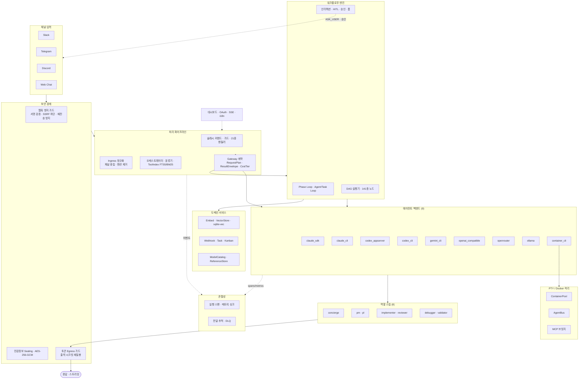
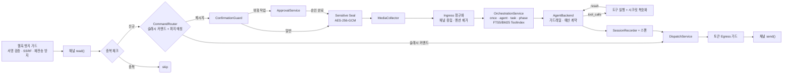
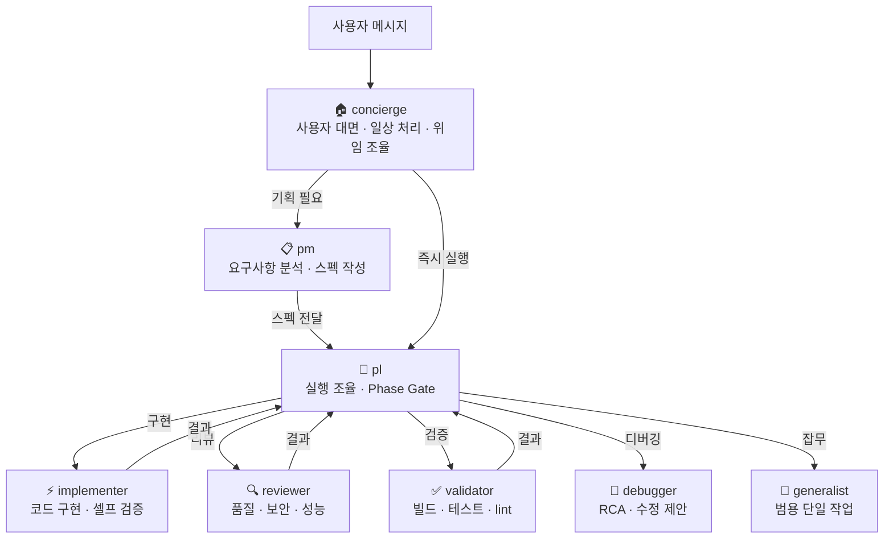

# SoulFlow Orchestrator

[](https://github.com/berrzebb/SoulFlow-Orchestrator/actions/workflows/ci.yml)
[](https://github.com/berrzebb/SoulFlow-Orchestrator/actions/workflows/ci.yml)
[](https://github.com/berrzebb/SoulFlow-Orchestrator/actions/workflows/ci.yml)
[](https://github.com/berrzebb/SoulFlow-Orchestrator)
[](https://nodejs.org/)
[](https://www.typescriptlang.org/)
[](LICENSE)

한국어 | [English](docs/README.en.md)

**어떤 LLM 프로바이더도 코드 한 줄 없이 교체할 수 있는** 클라우드 비종속 AI 에이전트 런타임.

Claude가 끊기면 Codex로, 비용이 부담되면 로컬 Ollama로 — CircuitBreaker가 자동 전환합니다.
Slack · Telegram · Discord · 웹 채팅의 메시지를 8개 역할 에이전트 팀이 처리하고,
민감정보는 AES-256-GCM Vault에 격리됩니다. **데이터는 내 서버에만 존재합니다.**

## 목차

- [이게 뭔가요?](#이게-뭔가요)
- [아키텍처](#아키텍처)
- [빠른 시작](#빠른-시작)
- [대시보드](#대시보드)
- [OAuth 연동](#oauth-연동)
- [사용 예시](#사용-예시)
- [슬래시 커맨드](#슬래시-커맨드)
- [디렉터리 구조](#디렉터리-구조)
- [로드맵](#로드맵)
- [트러블슈팅](#트러블슈팅)

## 이게 뭔가요?

채팅 채널에서 메시지를 받아 전문 에이전트에게 분배하는 **오케스트레이션 런타임**입니다.

| 구성 요소 | 역할 | 핵심 특징 |
|----------|------|----------|
| **채널 매니저** | Slack · Telegram · Discord 수신/응답 | 스트리밍 · 그룹핑 · 페르소나 톤 렌더링 |
| **오케스트레이터** | 인바운드 → 에이전트 실행 | Agent Loop · Task Loop · Phase Loop 삼중 모드 |
| **에이전트 백엔드** | Claude/Codex/Gemini × CLI/SDK 실행 | CircuitBreaker · HealthScorer · 자동 fallback |
| **역할 스킬** | 8개 역할 계층적 분담 | concierge → pm/pl → implementer/reviewer/validator/debugger |
| **보안 Vault** | AES-256-GCM 민감정보 관리 | 인바운드 자동 sealing · 도구 경로 복호화만 허용 |
| **OAuth 연동** | 외부 서비스 인증 | GitHub · Google · Custom OAuth 2.0 |
| **워크플로우 엔진** | Phase Loop · DAG 실행 | 141종 노드 그래프 에디터 · 6개 카테고리 · HITL 인터랙션 노드 |
| **메시지 버스** | 내부 이벤트 라우팅 | 인메모리 (기본) · Redis Streams (다중 인스턴스) |
| **도메인 서비스** | 임베딩 · 벡터 스토어 · 웹훅 · 칸반 | sqlite-vec KNN · 하이브리드 검색 · 칸반 자동화 규칙 |
| **대시보드** | 웹 기반 실시간 모니터링 | SSE 피드 · 에이전트/태스크/결정/프로바이더 관리 |
| **MCP 통합** | 외부 도구 서버 연결 | stdio/SSE · 자동 CLI 주입 |
| **크론** | 정기 작업 스케줄 | SQLite 기반 · 핫 리로드 |

### 에이전트 백엔드

`claude_sdk` · `claude_cli` · `codex_appserver` · `codex_cli` · `gemini_cli` · `openai_compatible` · `openrouter` · `ollama` · `container_cli` — CircuitBreaker · 자동 fallback.

→ [에이전트 백엔드 선택 가이드](docs/ko/core-concepts/agents.md)

### 역할 스킬 & 팀 구성

8개 역할이 계층적으로 협업합니다. `concierge`가 사용자를 직접 대면하고, 개발 작업은 `pm`/`pl`을 통해 전문 역할에 위임합니다.

```
concierge (사용자 대면)
  ├── pm (기획) → pl (실행 조율)
  └── pl (즉시 실행)
        ├── implementer · reviewer · validator · debugger
        └── generalist
```

| 팀 프리셋 | 구성 | 용도 |
|----------|------|------|
| **풀 팀** | PM → PL → Implementer → Reviewer → Validator | 복잡한 개발 작업 |
| **라이트** | PM → Implementer → Validator | 소규모·명확한 작업 |
| **기획팀** | PM | 계획 수립 · 문서화 |
| **품질관리팀** | Reviewer + Implementer | 코드 리뷰 · 구조 개선 |
| **테스트팀** | Validator | 빌드 · 테스트 · lint |

### 도구 & 스킬 동적 선택

158개 도구 전체 전송 시 ~25,000 토큰 소비. **ToolIndex FTS5**가 한/영 키워드 확장 + BM25 랭킹으로 요청별 최적 도구 20~35개를 자동 선택합니다. (Core 13개 항상 포함)

## 아키텍처


```mermaid
flowchart TD
    subgraph Channels["채널 입력"]
        direction LR
        SL[Slack]
        TG[Telegram]
        DS[Discord]
        WEB[Web Chat]
    end

    subgraph Security["보안 경계"]
        direction TB
        WHOOK[웹훅 엣지 가드\n서명 검증 · SSRF 차단 · 재전송 방지]
        SEAL[민감정보 Sealing · AES-256-GCM]
        EGRS[토큰 Egress 가드\n출력 시크릿 재밀봉]
    end

    subgraph Pipeline["처리 파이프라인"]
        direction TB
        CMD[슬래시 커맨드 · 가드 · 21종 핸들러]
        NGRD[Ingress 정규화\n채널 중립 · 멘션 제거]
        ORCH[오케스트레이터 · 분류기 · ToolIndex FTS5/BM25]
        GW[Gateway 계약\nRequestPlan · ResultEnvelope · CostTier]
    end

    subgraph Backends["에이전트 백엔드 (9)"]
        direction LR
        CSDK[claude_sdk]
        CCLI[claude_cli]
        CAPPS[codex_appserver]
        CCLIX[codex_cli]
        GCLI[gemini_cli]
        OAI[openai_compatible]
        ORT[openrouter]
        OLL[ollama]
        CTR[container_cli]
    end

    subgraph PTY["PTY / Docker 격리"]
        direction LR
        POOL[ContainerPool]
        BUS[AgentBus]
        BRIDGE[MCP 브릿지]
    end

    subgraph Workflows["워크플로우 엔진"]
        direction TB
        PL[Phase Loop · Agent/Task Loop]
        DAG[DAG 실행기 · 141종 노드]
        INTERACT[인터랙션 · HITL · 승인 · 폼]
    end

    subgraph Skills["역할 스킬 (8)"]
        direction TB
        BT[concierge]
        PM[pm · pl]
        IMPL[implementer · reviewer]
        DBG[debugger · validator]
    end

    subgraph Services["도메인 서비스"]
        direction LR
        EMBED[Embed · VectorStore · sqlite-vec]
        WEBHOOK[Webhook · Task · Kanban]
        CATALOG[ModelCatalog · ReferenceStore]
    end

    subgraph Observability["관찰성"]
        direction LR
        SPANS[실행 스팬 · 메트릭 싱크]
        TRACE[전달 추적 · DLQ]
    end

    DASH[대시보드 · OAuth · SSE · i18n]

    Channels --> Security
    Security --> Pipeline
    Pipeline --> GW
    GW --> Backends
    GW --> Workflows
    Workflows --> Backends
    INTERACT -.->|ASK_USER · 승인| Channels
    CTR --> PTY
    Backends --> Skills
    Skills --> EGRS
    EGRS --> OUT([응답 · 스트리밍])
    Workflows --> Services
    DASH -.-> Pipeline
    Backends -.->|spans/metrics| Observability
    Pipeline -.->|이벤트| Observability
```

**인바운드 파이프라인**


```mermaid
flowchart LR
  WHOOK["웹훅 엣지 가드\n서명 검증 · SSRF · 재전송 방지"]
  CH["채널 read()"]
  DD{"중복 체크"}
  CMD{"CommandRouter\n슬래시 커맨드 + 퍼지 매칭"}
  GUARD["ConfirmationGuard"]
  APR["ApprovalService"]
  SEAL["Sensitive Seal\nAES-256-GCM"]
  MEDIA["MediaCollector"]
  NGRD["Ingress 정규화\n채널 중립 · 멘션 제거"]
  ORCH["OrchestrationService\nonce · agent · task · phase\nFTS5/BM25 ToolIndex"]
  BACK["AgentBackend\n가드레일 · 예산 계약"]
  TOOL["도구 실행 + 시크릿 복호화"]
  REC["SessionRecorder + 스팬"]
  DISP["DispatchService"]
  EGRS["토큰 Egress 가드"]
  OUT["채널 send()"]

  WHOOK --> CH
  CH --> DD
  DD -->|신규| CMD
  DD -->|중복| X(skip)
  CMD -->|슬래시 커맨드| DISP
  CMD -->|메시지| GUARD
  GUARD -->|위험 작업| APR
  GUARD -->|일반| SEAL
  APR -->|승인 완료| SEAL
  SEAL --> MEDIA --> NGRD --> ORCH
  ORCH --> BACK
  BACK -->|tool_calls| TOOL
  TOOL -->|result| BACK
  BACK --> REC --> DISP --> EGRS --> OUT
```

**역할 위임 계층**


```mermaid
flowchart TD
  USER["사용자 메시지"]
  CON["🏠 concierge\n사용자 대면 · 일상 처리 · 위임 조율"]
  PM["📋 pm\n요구사항 분석 · 스펙 작성"]
  PL["🔧 pl\n실행 조율 · Phase Gate"]
  IMPL["⚡ implementer\n코드 구현 · 셀프 검증"]
  REV["🔍 reviewer\n품질 · 보안 · 성능"]
  VAL["✅ validator\n빌드 · 테스트 · lint"]
  DBG["🐛 debugger\nRCA · 수정 제안"]
  GEN["🔄 generalist\n범용 단일 작업"]

  USER --> CON
  CON -->|기획 필요| PM -->|스펙 전달| PL
  CON -->|즉시 실행| PL
  PL -->|구현| IMPL
  PL -->|리뷰| REV
  PL -->|검증| VAL
  PL -->|디버깅| DBG
  PL -->|잡무| GEN
  IMPL & REV & VAL -->|결과| PL
```

## 빠른 시작

### 요구사항

- **Docker** 또는 **Podman**
- AI 프로바이더 API 키 (Claude, OpenAI, OpenRouter 등)
- (선택) 채널 Bot Token (Slack · Telegram · Discord) — 없으면 Web 채널로 바로 사용

### 시작

```bash
git clone https://github.com/berrzebb/SoulFlow-Orchestrator.git
cd SoulFlow-Orchestrator

# Linux/macOS
./run.sh prod --workspace=/path/to/workspace

# Windows
.\run.ps1 prod --workspace=D:\workspace
```

브라우저에서 `http://localhost:4200` 열고 **Setup Wizard**를 완료하면 끝입니다.

> 상세: [설치 가이드](docs/ko/getting-started/installation.md) — 개발/스테이징/다중 인스턴스, 에이전트 로그인, Docker Compose 직접 사용

---

## 대시보드

`http://127.0.0.1:4200` — React + Vite SPA. 한국어/영어 i18n 지원 (브라우저 로케일 자동 감지).

| 페이지 | 경로 | 기능 |
|--------|------|------|
| Overview | `/` | 런타임 상태 요약, 시스템 메트릭, SSE 실시간 피드 |
| Chat | `/chat` | 웹 기반 에이전트 대화 (마크다운 렌더링 + 코드 하이라이팅) |
| **Prompting** | `/prompting` | 프롬프팅 스튜디오 · Text/Image/Video 생성 · 에이전트 설계·테스트 · Gallery · A/B 비교 |
| Workspace | `/workspace` | 메모리 · 세션 · 스킬 · 크론 · 도구 · 에이전트 · 템플릿 · OAuth · 모델 · 레퍼런스 (10탭) |
| Channels | `/channels` | 채널 연결 상태 · 글로벌 설정 |
| Providers | `/providers` | 에이전트 프로바이더 CRUD · Circuit Breaker 상태 |
| Secrets | `/secrets` | AES-256-GCM 시크릿 관리 |
| Workflows | `/workflows` | Phase Loop 워크플로우 관리 · 141종 노드 그래프 에디터 · 에이전트 채팅 |
| Kanban | `/kanban` | 드래그앤드롭 칸반 보드 · 자동화 규칙 |
| WBS | `/wbs` | 칸반 카드 계층 트리 뷰 (parent_id 기반) |
| Settings | `/settings` | 글로벌 런타임 설정 |

→ 상세: [대시보드 가이드](docs/ko/guide/dashboard.md)

## OAuth 연동

GitHub · Google · Custom OAuth 2.0 외부 서비스 연동. 대시보드 Workspace → OAuth 탭에서 관리합니다.

에이전트 도구에서 `oauth:{instance_id}` 참조로 토큰 자동 주입, 401 시 자동 갱신 재시도.

→ 상세: [OAuth 가이드](docs/ko/guide/oauth.md)

---

## 사용 예시

**단순 작업** (concierge → 자동 역할 분배):

```
사용자: 이 코드에서 버그 찾아줘
→ concierge → debugger 활성화 → 근본 원인 분석 → 응답
```

**태스크 실행** (단계형 실행/승인):

```
사용자: /task list
→ 실행 중인 태스크 목록 반환

사용자: 사용자 인증 API 구현해줘
→ pm 기획 → pl 설계 → implementer 구현 → reviewer 검토
```

**민감정보 관리**:

```
사용자: /secret set MY_API_KEY sk-abc123
→ AES-256-GCM 암호화 저장

사용자: MY_API_KEY로 API 호출해줘
→ 도구 실행 시 자동 복호화 (에이전트에는 참조만 전달)
```

**실시간 스트리밍**:

```
사용자: 복잡한 분석 요청
→ agent 사고 중... (typing 갱신)
→ 부분 응답 점진적 전송
→ 최종 응답
```

**슬래시 커맨드 제어**:

```
/stop          → 현재 채널 작업 즉시 중지
/status        → 런타임 상태 · 도구 · 스킬 목록
/reload skills → 스킬 핫 리로드 (재시작 없음)
/doctor        → 서비스 건강 상태 자가진단
```

## 슬래시 커맨드

자주 쓰는 커맨드:

| 커맨드 | 설명 |
|--------|------|
| `/help` | 공통 명령/사용법 출력 |
| `/stop` · `/cancel` · `/중지` | 현재 채널 활성 작업 중지 |
| `/status` | 런타임 상태 요약 (도구·스킬 목록 포함) |
| `/secret set\|get\|list\|reveal\|remove` | AES-256-GCM secret vault 관리 |
| `/task list\|cancel <id>` | 프로세스·작업 조회/취소 |
| `/agent list\|cancel\|send` | 서브에이전트 목록/취소/입력 전송 |
| `/reload config\|tools\|skills` | 설정/도구/스킬 핫 리로드 |
| `/doctor` | 런타임 자가진단 (서비스 건강 상태 점검) |
| `/workflow list\|create\|cancel <id>` | Phase Loop 워크플로우 관리 |
| `/mcp list\|reconnect <name>` | MCP 서버 상태/재연결 |

→ [전체 커맨드 참조](docs/ko/guide/slash-commands.md)

## 디렉터리 구조

```text
next/
  run.sh / run.ps1 / run.cmd ← 환경 관리 (dev/test/staging/prod)
  Dockerfile              ← 멀티스테이지 Docker 빌드
  .devcontainer/          ← VS Code Dev Container 설정
  docker/                 ← docker-compose 파일 (prod, dev, instance 오버라이드)
  src/
    agent/
      backends/     ← SDK/AppServer/OpenAI 백엔드 어댑터 (7개)
      nodes/        ← 141종 워크플로우 노드 핸들러 (OCP 플러그인 아키텍처)
      pty/          ← PTY 기반 CLI 통합 (ContainerPool, AgentBus, NDJSON 와이어)
      tools/        ← 에이전트 도구 구현 (oauth_fetch, workflow, ask-user 등)
    bootstrap/      ← 15개 부트스트랩 모듈 (main.ts 분해)
    bus/            ← MessageBus (인메모리 · Redis Streams)
    channels/       ← 채널 매니저 · 커맨드 · 디스패치 · 승인 · 페르소나 톤
    config/         ← Zod 기반 설정 스키마
    cron/           ← 크론 스케줄러 (SQLite)
    dashboard/
      ops/          ← 13개 ops 모듈
      routes/       ← 라우트 핸들러
    decision/       ← 결정사항 서비스
    evals/          ← 평가 파이프라인 (EvalRunner, EvalCase, judges, scorers, bundles)
    events/         ← 워크플로우 이벤트 서비스
    heartbeat/      ← 하트비트 서비스
    i18n/           ← 공유 i18n 프로토콜 + JSON 로케일
    mcp/            ← MCP 클라이언트 매니저
    oauth/          ← OAuth 2.0 연동 (flow-service, integration-store)
    orchestration/  ← Classifier · ToolIndex · ConfirmationGuard · HitlPendingStore
    providers/      ← LLM 프로바이더 (Claude, Codex, Gemini, OpenAI-compatible)
    runtime/        ← 인스턴스 잠금 · ServiceManager
    security/       ← Secret Vault (AES-256-GCM)
    services/       ← 도메인 서비스 (embed, vector-store, kanban, webhook, model-catalog 등)
    session/        ← 세션 저장소
    skills/
      _shared/      ← 공유 프로토콜
      roles/        ← 8개 역할 (concierge, pm, pl, implementer, reviewer, validator, debugger, generalist)
      diagram / github / sandbox / ...  ← 추가 빌트인 스킬
  scripts/
    scaffold/       ← 코드 생성기 (tool, node, handler, route, page)
    generate-diagrams.mjs ← SVG 다이어그램 생성
    i18n-sync.ts    ← i18n 키 동기화 (--check / --fix)
  tests/
    evals/          ← 평가 테스트 케이스 (cases/*.json) 및 executor 테스트
  <workspace>/      ← --workspace 로 지정 (런타임 데이터)
    runtime/        ← SQLite DB (sessions, tasks, events, cron, kanban, dlq 등)
    skills/         ← 사용자 정의 스킬
    templates/      ← 시스템 프롬프트 템플릿
  web/              ← 대시보드 프론트엔드 (React + Vite + i18n)
    src/pages/workflows/  ← 그래프 에디터 · 노드 인스펙터 · 141종 노드 UI
  docs/
    diagrams/       ← SVG 아키텍처 다이어그램
    */guide/        ← 사용자 가이드
    */design/       ← 아키텍처 설계 문서
```

## 설계 문서

주요 기능의 아키텍처 설계 문서입니다. 각 문서에 목적·범위·타입 설계·영향 파일이 포함되어 있습니다.

> 한국어 버전: [docs/ko/design/](docs/ko/design/)

### 에이전트 & 실행

| 문서 | 설명 |
|------|------|
| [Phase Loop](docs/en/design/phase-loop.md) | 다중 에이전트 페이즈 워크플로우 + worktree 격리 |
| [Interactive Loop](docs/en/design/interactive-loop.md) | 대화형 Phase 루프 |
| [Loop Continuity + HITL](docs/en/design/loop-continuity-hitl.md) | 에이전트 루프 연속성 + Task HITL |
| [Gateway / Direct Execution](docs/en/design/gateway-direct-execution.md) | 직접/모델/에이전트 경로 분류 및 라우팅 |
| [Execution Guardrails](docs/en/design/execution-guardrails.md) | 세션 재사용 · 신선도 게이트 · 도구 예산 계약 |
| [PTY Agent Backend](docs/en/design/pty-agent-backend.md) | 컨테이너 CLI 백엔드 + FailoverError |
| [Execute Dispatcher](docs/en/design/execute-dispatcher.md) | 실행 디스패치 계층 |
| [Orchestrator LLM](docs/en/design/orchestrator-llm.md) | 오케스트레이터 LLM 모델 관리 |
| [Request Preflight](docs/en/design/request-preflight.md) | 요청 전처리 · 분류 · 가드 |
| [Agent Definitions](docs/en/design/agent-definitions.md) | 에이전트 정의 구조 |
| [Session State Injection](docs/en/design/session-state-injection.md) | 세션 협력자 외부 주입 · HITL 상태 공유 |
| [Large-File Decomposition](docs/en/design/large-file-split.md) | 조립/실행 경계 분리 · 컴포지션 루트 설계 |
| [Skill Matching & Completion Check](docs/en/design/skill-matching-completion-check.md) | FTS5 스킬 자동 매칭 · 완료 체크 · 프로젝트 문서 프로토콜 |

### 워크플로우 엔진

| 문서 | 설명 |
|------|------|
| [Node Registry](docs/en/design/node-registry.md) | OCP 기반 노드 아키텍처 (141종) |
| [Interaction Nodes](docs/en/design/interaction-nodes.md) | HITL · Approval · Form · Retry · Batch 노드 |
| [Phase Workflow Runtime](docs/en/design/phase-workflow-extraction.md) | 페이즈 런타임 모듈 경계 · 의존성 번들 |
| [Parallel Agent Reconciliation](docs/en/design/parallel-agent-reconciliation.md) | fan-out/fan-in · ReconcileNode · CriticGate |
| [Workflow Tool](docs/en/design/workflow-tool.md) | 자연어 → 워크플로우 CRUD |
| [Container Code Runner](docs/en/design/container-code-runner.md) | 다중 언어 컨테이너 샌드박스 |
| [Workflow Builder](docs/en/design/workflow-builder-command-palette.md) | 커맨드 팔레트 + 노드 검색 |

### 보안 & 격리

| 문서 | 설명 |
|------|------|
| [Security Hardening](docs/en/design/local-binding-security-hardening.md) | 로컬 바인딩 보안 · 파일시스템 격리 |
| [Multi-Tenant](docs/en/design/multi-tenant.md) | 팀·사용자·워크스페이스 격리 설계 |
| [Role Protocol Architecture](docs/en/design/role-protocol-architecture.md) | 역할 기반 프로토콜 정책 |

### 메모리 & 검색

| 문서 | 설명 |
|------|------|
| [Hybrid Vector Search](docs/en/design/hybrid-vector-search.md) | FTS5/BM25 + 벡터 하이브리드 검색 |
| [Vector Store (sqlite-vec)](docs/en/design/vector-store-sqlite-vec.md) | sqlite-vec KNN 임베딩 스토어 |
| [Tool Selection FTS5](docs/en/design/tool-selection-fts5.md) | BM25 기반 도구 자동 선택 |
| [RAG Reference Store](docs/en/design/rag-reference-store.md) | 레퍼런스 문서 검색 증강 |
| [Memory Search](docs/en/design/memory-search-upgrade.md) | 청크 단위 검색 · 하이브리드 리트리벌 · 시간 감쇠 |

### 평가 & 품질

| 문서 | 설명 |
|------|------|
| [Evaluation Pipeline](docs/en/design/evaluation-pipeline.md) | EvalCase · EvalRunner · Scorecard · 프로바이더 비교 |

### 서비스 & 채널

| 문서 | 설명 |
|------|------|
| [Chat NDJSON Streaming](docs/en/design/chat-ndjson-streaming.md) | 스트리밍 응답 프로토콜 |
| [Persona Message Renderer](docs/en/design/persona-message-renderer.md) | 페르소나 톤 렌더링 파이프라인 |
| [Kanban Board](docs/en/design/kanban-board.md) | 칸반 보드 + 자동화 규칙 |
| [i18n Protocol](docs/en/design/i18n-protocol.md) | 공유 i18n 프로토콜 + 자동화 도구 |
| [Provider-Neutral Output Reduction](docs/en/design/provider-neutral-output-reduction.md) | 프로바이더 중립 출력 축소 |
| [Multi-Environment Setup](docs/en/design/multi-environment-setup.md) | 프로파일 기반 환경 조립 · 컨테이너 우선 설정 |

## 트러블슈팅

| 증상 | 해결 |
|------|------|
| `another instance is active` | 동일 Bot Token으로 실행 중인 다른 프로세스 종료 |
| 응답 없음 | 토큰/채널 ID 확인, 로그에서 `channel manager start failed` 확인 |
| 대시보드 시작 실패 | Settings에서 포트 변경 또는 포트 충돌 프로세스 종료 |
| 전송 실패 반복 | `runtime/dlq/dlq.db` 확인, Settings → `channel.dispatch`에서 재시도 설정 조정 |
| 스트리밍 미동작 | Settings → `channel.streaming` 활성화 확인 |
| SDK 백엔드 실패 | 로그의 `backend_fallback` 확인 (`claude_sdk` → `claude_cli` 자동 전환) |
| OAuth Connect 안 됨 | 팝업 차단 해제, Client ID/Secret 확인, Redirect URI 설정 확인 |
| LLM 런타임 점검 | `npm run health:llm` |
| CLI 에이전트 미인증 | `./run.sh login claude --workspace=...` (3.5단계) — 컨테이너는 `~/.claude`가 아닌 `{workspace}/.agents/.claude`를 사용 |
| 평가 실행 | `npm run eval:smoke` (빠른 검증) / `npm run eval:full` (전체 케이스) |

## 라이선스

[GNU Affero General Public License v3.0](LICENSE) (AGPL-3.0-only)

Copyright (C) 2026 Hyun Park
