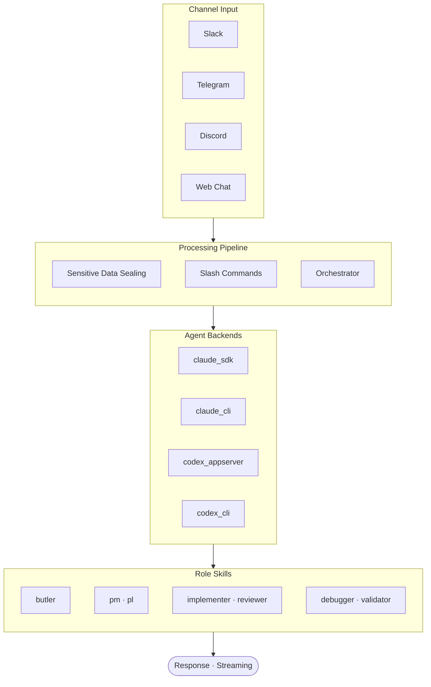

# SoulFlow Orchestrator

[한국어](README.ko.md) | English

An asynchronous orchestration runtime that processes Slack · Telegram · Discord messages through **headless agents**.

The batteries-included solution featuring 5 agent backends (Claude/Codex × CLI/SDK + OpenAI-compatible), an 8-role skill system, CircuitBreaker-based provider resilience, AES-256-GCM security vault, and OAuth 2.0 external service integrations.

## Table of Contents

- [Architecture](#architecture)
- [What Is This?](#what-is-this)
- [Quick Start](#quick-start)
- [Dashboard Guide](#dashboard-guide)
- [OAuth Integration](#oauth-integration)
- [Usage Examples](#usage-examples)
- [Slash Commands](#slash-commands)
- [Directory Structure](#directory-structure)
- [Troubleshooting](#troubleshooting)

## Architecture



Detailed diagrams: [Service Architecture](diagrams/service-architecture.svg) · [Inbound Pipeline](diagrams/inbound-pipeline.svg) · [Provider Resilience](diagrams/provider-resilience.svg) · [Role Delegation](diagrams/role-delegation.svg)

## What Is This?

An **orchestration runtime** that receives messages from chat channels and dispatches them to specialized agents.

| Component | Role | Key Features |
|-----------|------|-------------|
| **Channel Manager** | Slack · Telegram · Discord I/O | Streaming · grouping · typing updates |
| **Orchestrator** | Inbound → agent execution | Agent Loop · Task Loop dual mode |
| **Agent Backends** | Claude/Codex × CLI/SDK execution | CircuitBreaker · HealthScorer · auto-fallback |
| **Role Skills** | 8-role hierarchical delegation | butler → pm/pl → implementer/reviewer/validator/debugger |
| **Security Vault** | AES-256-GCM secret management | Auto inbound sealing · decrypt only in tool path |
| **OAuth Integration** | External service authentication | GitHub · Google · Custom OAuth 2.0 |
| **Dashboard** | Web-based real-time monitoring | SSE feed · agent/task/decision/provider management |
| **MCP Integration** | External tool server connections | stdio/SSE · auto CLI injection |
| **Cron** | Recurring task scheduling | SQLite-backed · hot reload |

### Agent Backends

| Backend | Mode | Features | Auto Fallback |
|---------|------|----------|---------------|
| `claude_sdk` | Native SDK | Built-in tool loop · streaming | → `claude_cli` |
| `claude_cli` | Headless CLI wrapper | Stability · general purpose | — |
| `codex_appserver` | Native AppServer | Parallel execution · built-in tool loop | → `codex_cli` |
| `codex_cli` | Headless CLI wrapper | Sandbox mode support | — |
| `openai_compatible` | OpenAI-compatible API | vLLM · Ollama · LM Studio · Together AI · Gemini and other local/remote models | — |

### Role Skills

| Role | Specialization | Delegation |
|------|---------------|------------|
| `butler` | Request routing · role dispatch | → pm/pl/generalist |
| `pm` | Requirements analysis · task decomposition | → implementer |
| `pl` | Tech lead · architecture design | → implementer/reviewer |
| `implementer` | Implementation · code writing | — |
| `reviewer` | Code review · quality verification | — |
| `debugger` | Bug diagnosis · root cause analysis | — |
| `validator` | Output verification · regression tests | — |
| `generalist` | General purpose | — |

## Quick Start

### Prerequisites

- **Node.js** 20+
- At least 1 channel Bot Token (Slack · Telegram · Discord)
- (Optional) `@anthropic-ai/claude-code` SDK — for `claude_sdk` backend
- (Optional) Podman/Docker + Ollama — for `phi4_local` classifier

### Install & Run

```bash
cd next
npm install
npm run dev      # Development mode (hot reload)
```

Production:
```bash
npm run build
cd workspace && node ../dist/main.js
```

### Setup Wizard

On first launch, if no provider is configured, the dashboard automatically redirects to the Setup Wizard (`/setup`).

```
http://127.0.0.1:4200
```

The wizard guides you through:
1. **AI Provider** — Enter Claude/Codex API key
2. **Channels** — Enter Slack/Telegram/Discord Bot Token
3. **Agent Settings** — Select default role and backend

No need to create a `.env` file manually — the Wizard handles all configuration.

---

## Dashboard Guide

Dashboard URL: `http://127.0.0.1:4200`

Navigate between 7 sections via the sidebar. Toggle dark/light theme with the button at the bottom of the sidebar.

---

### Overview

View the entire runtime at a glance.

| Section | Content |
|---------|---------|
| **Stat cards** | Active agent count · running processes · connected channels |
| **Performance** | CPU · Memory · Swap usage (progress bars) |
| **Network** | Network RX/TX speed (KB/s) — Linux only |
| **Agents** | Role badges · last message time |
| **Running Processes** | run_id · mode · tool call count · error status |
| **Cron** | Active cron jobs (shown only when jobs exist) |
| **Decisions** | Key decisions (shown only when decisions exist) |
| **Recent Events** | Workflow event stream |

---

### Workspace

Manage the agent workspace. Organized in 8 tabs.

#### Memory Tab
View and edit the agent's memory and DB-backed records.
- **Long-term**: Long-term memory (editable)
- **Daily**: Daily notes by date (editable)
- **Decisions/Promises/Events**: Decision · promise · event records from DB

#### Sessions Tab
View conversation session list and message history across all channels.
- **Channel filter**: All / Slack / Telegram / Discord / Web provider tabs
- Click a session → provider badge + full message history with timestamps

#### Skills Tab
View and edit agent skill files.
- **Builtin skills**: read-only
- **Workspace skills**: directly edit `SKILL.md` and `references/` files
- Switch between file tabs, edit, and click Save
- **Tool picker** (shown automatically when editing `SKILL.md`)
  - `Tools:` — click to toggle SoulFlow registry tools → updates frontmatter `tools:`
  - `SDK:` — Bash · Read · Write · Edit · Glob · Grep and other Claude Code native tools
  - `OAuth:` — click to toggle registered OAuth services → updates frontmatter `oauth:`
  - `Role preset:` — click a role skill button → bulk-merge that role's tool set

#### Cron Tab
Manage cron jobs — list, add, edit, delete, run now.

#### Tools Tab
Browse all tools available to agents. Click a row → expand parameter details.

#### Agents Tab
Manage agent configurations (role · backend · add/edit/delete).

#### Templates Tab
Edit system prompt templates: `IDENTITY.md` · `USER.md` · `SOUL.md` · etc.

#### OAuth Tab
Manage OAuth 2.0 external service integrations → [OAuth Integration](#oauth-integration)

---

### Chat

Chat directly with agents from your web browser (useful for testing without Slack/Telegram).

---

### Channels

Check channel connection status and configure global channel settings (poll interval · streaming · dispatch).

---

### Providers

Manage AI providers (LLM backends) — Circuit Breaker state · health score · token configuration.

---

### Secrets

Manage AES-256-GCM encrypted secrets. Agents access secrets by reference only; actual values are decrypted only during tool execution.

---

### Settings

View and edit global runtime settings (agents · MCP · orchestrator · logging · etc.).

---

## OAuth Integration

Manage external service OAuth 2.0 integrations from **Workspace → OAuth tab**.

### Supported Services

| Service | service_type | Default Scopes |
|---------|-------------|---------------|
| GitHub | `github` | `repo`, `read:user` |
| Google | `google` | `openid`, `email`, `profile` |
| Custom | `custom` | User-defined |

### Adding an Integration

1. Go to **Workspace → OAuth tab**
2. Click **Add**
3. Select service (GitHub / Google / Custom)
4. Enter **Label** (display name)
5. Enter **Client ID** / **Client Secret**
   - GitHub: `github.com/settings/developers` → OAuth Apps
   - Google: `console.cloud.google.com` → Credentials
   - Custom: enter `auth_url` · `token_url` directly
6. Select required scopes → click **Add**

### Connecting

After adding, click **Connect** on the card:
1. An OAuth popup opens
2. Authorize in the service
3. On callback success, card status changes to **Connected**

> The card auto-refreshes about 3 seconds after successful connection.

### Token Management

| Button | Action |
|--------|--------|
| **Connect** | Start new OAuth flow via popup |
| **Refresh** | Refresh access token using refresh token |
| **Test** | Test API call with current token |
| **Edit** | Modify scopes · enabled state |
| **Remove** | Delete integration (including token) |

### Using in Agents

Connected OAuth tokens can be used in agent tools via `oauth:{instance_id}` reference.

```
User: Fetch my GitHub issues
→ Agent calls GitHub API with oauth:github token
```

---

## Usage Examples

**Simple task** (butler → automatic role dispatch):

```
User: Find the bug in this code
→ butler → debugger activates → root cause analysis → response
```

**Task execution** (phased execution with approval):

```
User: /task list
→ Returns list of active tasks

User: Implement a user authentication API
→ pm plans → pl designs → implementer builds → reviewer validates
```

**Secret management**:

```
User: /secret set MY_API_KEY sk-abc123
→ AES-256-GCM encrypted storage

User: Call the API using MY_API_KEY
→ Auto-decryption during tool execution (agent receives only a reference)
```

**Slash command control**:

```
/stop          → Immediately stop active task in current channel
/status        → Runtime state · tool · skill lists
/reload skills → Hot reload skills (no restart needed)
/doctor        → Service health self-diagnosis
```

## Slash Commands

| Command | Description |
|---------|-------------|
| `/help` | Common commands/usage help |
| `/stop` · `/cancel` | Stop active task in current channel |
| `/render status\|markdown\|html\|plain\|reset` | Set/view/reset render mode |
| `/render link\|image indicator\|text\|remove` | Blocked link/image display mode |
| `/secret status\|list\|set\|get\|reveal\|remove` | AES-256-GCM secret vault management |
| `/secret encrypt <text>` · `/secret decrypt <cipher>` | Instant encrypt/decrypt |
| `/memory status\|list\|today\|longterm\|search <q>` | Memory query/search |
| `/decision status\|list\|set <key> <value>` | Decision management |
| `/cron status\|list\|add\|remove` | Cron schedule management |
| `/promise status\|list\|resolve <id> <value>` | Promise/deferred execution management |
| `/reload config\|tools\|skills` | Hot reload config/tools/skills |
| `/task list\|cancel <id>` | Process/task view/cancel |
| `/status` | Runtime status summary (incl. tool/skill lists) |
| `/agent list\|cancel\|send` | Sub-agent list/cancel/send input |
| `/skill list\|info\|suggest` | Skill list/detail/suggest |
| `/stats` | Runtime statistics (CD score · session metrics) |
| `/verify` | Output verification |
| `/doctor` | Runtime self-diagnosis (service health check) |

## Directory Structure

```text
next/
  src/
    agent/          ← Agent runtime (backends/, tools/)
    bus/            ← MessageBus (inbound/outbound pub/sub)
    channels/       ← Channel manager · commands · dispatch · approval
    config/         ← Zod-based config schema
    cron/           ← Cron scheduler (SQLite)
    dashboard/      ← Web dashboard (API + SSE)
    decision/       ← Decision service
    mcp/            ← MCP client manager
    orchestration/  ← Agent Loop · Task Loop executors
    security/       ← Secret Vault (AES-256-GCM)
    session/        ← Session store
    skills/
      _shared/      ← Shared protocols
      roles/        ← 8 role skills
  workspace/
    templates/      ← System prompt templates
    skills/         ← User-defined skills
    runtime/        ← SQLite DBs (sessions, tasks, events, decisions, cron, dlq)
  web/              ← Dashboard frontend (React + Vite)
  diagrams/         ← SVG architecture diagrams
```

## Troubleshooting

| Symptom | Solution |
|---------|----------|
| `another instance is active` | Terminate other process running with the same Bot Token |
| No response | Check token/channel ID, look for `channel manager start failed` in logs |
| Dashboard won't start | Change port in Settings or stop the conflicting process |
| Repeated send failures | Check `runtime/dlq/dlq.db`, adjust retry settings in Settings → `channel.dispatch` |
| Streaming not working | Enable streaming in Settings → `channel.streaming` |
| SDK backend failure | Check `backend_fallback` in logs (`claude_sdk` → `claude_cli` auto-switch) |
| OAuth Connect fails | Disable popup blocker, verify Client ID/Secret, check Redirect URI |
| phi4 check | `npm run health:phi4` |

## License

MIT
