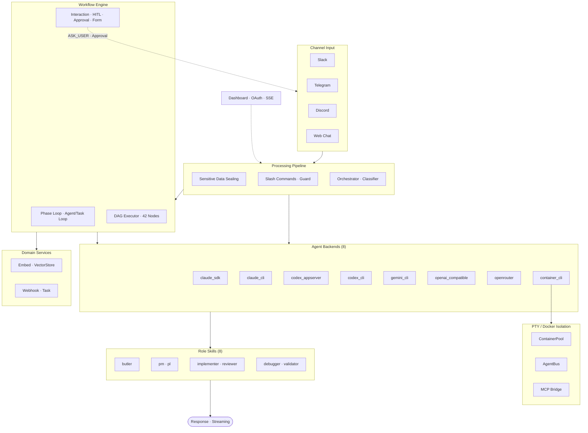

# SoulFlow Orchestrator

[한국어](README.ko.md) | English

An asynchronous orchestration runtime that processes Slack · Telegram · Discord messages through **headless agents**.

The batteries-included solution featuring 8 agent backends (Claude/Codex/Gemini × CLI/SDK + OpenAI-compatible + OpenRouter + container), an 8-role skill system, CircuitBreaker-based provider resilience, AES-256-GCM security vault, OAuth 2.0 integrations, a 42-node workflow graph editor, WorkflowTool for agent-driven CRUD, and a React + Vite web dashboard with i18n and markdown rendering.

## Table of Contents

- [Architecture](#architecture)
- [What Is This?](#what-is-this)
- [Quick Start](#quick-start)
- [Dashboard](#dashboard)
- [OAuth Integration](#oauth-integration)
- [Usage Examples](#usage-examples)
- [Slash Commands](#slash-commands)
- [Directory Structure](#directory-structure)
- [Troubleshooting](#troubleshooting)

## Architecture



Detailed diagrams: [Service Architecture](diagrams/service-architecture.svg) · [Inbound Pipeline](diagrams/inbound-pipeline.svg) · [Orchestrator Flow](diagrams/orchestrator-flow.svg) · [Provider Resilience](diagrams/provider-resilience.svg) · [Role Delegation](diagrams/role-delegation.svg) · [Container Architecture](diagrams/container-architecture.svg) · [Phase Loop Lifecycle](diagrams/phase-loop-lifecycle.svg) · [Lane Queue](diagrams/lane-queue.svg) · [Error Recovery](diagrams/error-recovery.svg)

## What Is This?

An **orchestration runtime** that receives messages from chat channels and dispatches them to specialized agents.

| Component | Role | Key Features |
|-----------|------|-------------|
| **Channel Manager** | Slack · Telegram · Discord I/O | Streaming · grouping · typing updates |
| **Orchestrator** | Inbound → agent execution | Agent Loop · Task Loop · Phase Loop triple mode |
| **Agent Backends** | Claude/Codex × CLI/SDK execution | CircuitBreaker · HealthScorer · auto-fallback |
| **Role Skills** | 8-role hierarchical delegation | butler → pm/pl → implementer/reviewer/validator/debugger |
| **Security Vault** | AES-256-GCM secret management | Auto inbound sealing · decrypt only in tool path |
| **OAuth Integration** | External service authentication | GitHub · Google · Custom OAuth 2.0 |
| **Workflow Engine** | Phase Loop · DAG execution | 42-node graph editor · 6 categories · HITL interaction nodes |
| **Domain Services** | Embedding · vector store · webhook | Stateful pipelines · persistent task execution |
| **Dashboard** | Web-based real-time monitoring | SSE feed · agent/task/decision/provider management |
| **MCP Integration** | External tool server connections | stdio/SSE · auto CLI injection |
| **Cron** | Recurring task scheduling | SQLite-backed · hot reload |

### Agent Backends

| Backend | Mode | Features | Auto Fallback |
|---------|------|----------|---------------|
| `claude_sdk` | Native SDK | Built-in tool loop · streaming | → `claude_cli` |
| `claude_cli` | Headless CLI wrapper | Stability · general purpose | — |
| `codex_appserver` | Native AppServer | Parallel execution · built-in tool loop | → `codex_cli` |
| `codex_cli` | Headless CLI wrapper | Sandbox mode support | — |
| `gemini_cli` | Headless CLI wrapper | Gemini CLI integration | — |
| `openai_compatible` | OpenAI-compatible API | vLLM · Ollama · LM Studio · Together AI · Gemini and other local/remote models | — |
| `openrouter` | OpenRouter API | Multi-model routing · 100+ model access | — |
| `container_cli` | Container CLI wrapper | Podman/Docker sandboxed execution | — |

### Role Skills

| Role | Specialization | Delegation |
|------|---------------|------------|
| `butler` | Request routing · role dispatch | → pm/pl/generalist |
| `pm` | Requirements analysis · task decomposition | → implementer |
| `pl` | Tech lead · architecture design | → implementer/reviewer |
| `implementer` | Implementation · code writing | — |
| `reviewer` | Code review · quality verification | — |
| `debugger` | Bug diagnosis · root cause analysis | — |
| `validator` | Output verification · regression tests | — |
| `generalist` | General purpose | — |

## Quick Start

### Prerequisites

- **Docker** or **Podman** (recommended)
- At least 1 channel Bot Token (Slack · Telegram · Discord)
- AI Provider API Key (Claude, OpenAI, OpenRouter, etc.)
- (Optional) GPU — for local Ollama orchestrator LLM classifier

### Docker (Recommended)

```bash
# Production (orchestrator + ollama + docker-proxy)
docker compose up -d

# Development (live reload)
docker compose -f docker-compose.yml -f docker-compose.dev.yml up
```

The `full` image includes Claude Code, Codex CLI, and Gemini CLI pre-installed.

### Local (Not Recommended)

```bash
cd next
npm install
npm run dev      # Development mode (hot reload)
```

> Container deployment is recommended for CLI agent isolation and consistent environments. See [Installation Guide](en/getting-started/installation.md) for details.

### Setup Wizard

On first launch, if no provider is configured, the dashboard automatically redirects to the Setup Wizard (`/setup`).

```
http://127.0.0.1:4200
```

The wizard guides you through:
1. **AI Provider** — Enter Claude/Codex API key
2. **Channels** — Enter Slack/Telegram/Discord Bot Token
3. **Agent Settings** — Select default role and backend

No need to create a `.env` file manually — the Wizard handles all configuration.

---

## Dashboard

`http://127.0.0.1:4200` — React + Vite SPA. Korean/English i18n (auto-detected from browser locale).

| Page | Path | Function |
|------|------|----------|
| Overview | `/` | Runtime status summary, system metrics, SSE live feed |
| Workspace | `/workspace` | Memory · sessions · skills · cron · tools · agents · templates · OAuth (8 tabs) |
| Chat | `/chat` | Web-based agent conversation (markdown rendering + code highlighting) |
| Channels | `/channels` | Channel connection status · global settings |
| Providers | `/providers` | Agent provider CRUD · Circuit Breaker state |
| Secrets | `/secrets` | AES-256-GCM secret management |
| Models | `/models` | Orchestrator LLM runtime · model pull/delete/switch |
| Workflows | `/workflows` | Phase Loop workflow management · 42-node graph editor · agent chat |
| Settings | `/settings` | Global runtime settings |

→ Details: [Dashboard Guide](en/guide/dashboard.md) · [Workflows Guide](en/guide/workflows.md)

## OAuth Integration

GitHub · Google · Custom OAuth 2.0 external service integrations. Managed from Dashboard Workspace → OAuth tab.

Agent tools use `oauth:{instance_id}` reference for automatic token injection with 401 auto-refresh retry.

→ Details: [OAuth Guide](en/guide/oauth.md)

---

## Usage Examples

**Simple task** (butler → automatic role dispatch):

```
User: Find the bug in this code
→ butler → debugger activates → root cause analysis → response
```

**Multi-agent Phase Loop** (parallel specialists + critic quality gate):

```
User: Do a full market research on AI infrastructure
→ Classifier detects "phase" mode
→ Phase 1: Market Analyst + Tech Analyst + Strategist run in parallel
→ Critic reviews all results, requests missing data
→ Phase 2: Strategist synthesizes findings
→ Each agent has independent chat — click 💬 to follow up
```

**Autonomous development pipeline** (interactive spec → sequential implementation):

```
User: Build a REST API for user authentication
→ Phase 1 (Interactive): PM co-creates spec via conversation
   PM: "Which framework do you prefer?" → User: "Express"
   PM: "Need OAuth support?" → User: "Yes, Google OAuth"
→ Phase 2 (Parallel): PL breaks spec into atomic tasks
→ Phase 3 (Sequential Loop): Implementer executes tasks one-by-one
   Each iteration uses fresh context to prevent context rot
   If blocked: [ASK_USER] "Which DB driver?" → User: "PostgreSQL"
→ Phase 4: Reviewer checks code quality
→ Phase 5: Validator runs tests — if fails, goto Phase 3 (fix loop)
```

**Workflow automation** (agent-driven CRUD via natural language):

```
User: Crawl RSS every morning at 9 and summarize
→ Agent infers DAG: HTTP node (fetch RSS) → LLM node (summarize) → Template node (format)
→ WorkflowTool: create "daily-rss" with cron trigger
→ Runs automatically every day at 9 AM

User: Show my workflows
→ WorkflowTool: list → "daily-rss (cron: 0 9 * * *), competitor-monitor, ..."
```

**Container sandbox code execution** (7 languages):

```
User: Run this Python data analysis script
→ Code node spawns isolated container (python:3.12-slim)
→ --network=none, --read-only, --memory=256m
→ Returns stdout/stderr → passes result to next workflow node
```

**Task execution** (phased execution with approval):

```
User: Implement a user authentication API
→ pm plans → pl designs → implementer builds → reviewer validates
```

**Secret management**:

```
User: /secret set MY_API_KEY sk-abc123
→ AES-256-GCM encrypted storage

User: Call the API using MY_API_KEY
→ Auto-decryption during tool execution (agent receives only a reference)
```

**Slash command control**:

```
/stop          → Immediately stop active task in current channel
/status        → Runtime state · tool · skill lists
/reload skills → Hot reload skills (no restart needed)
/doctor        → Service health self-diagnosis
```

## Slash Commands

| Command | Description |
|---------|-------------|
| `/help` | Common commands/usage help |
| `/stop` · `/cancel` | Stop active task in current channel |
| `/render status\|markdown\|html\|plain\|reset` | Set/view/reset render mode |
| `/render link\|image indicator\|text\|remove` | Blocked link/image display mode |
| `/secret status\|list\|set\|get\|reveal\|remove` | AES-256-GCM secret vault management |
| `/secret encrypt <text>` · `/secret decrypt <cipher>` | Instant encrypt/decrypt |
| `/memory status\|list\|today\|longterm\|search <q>` | Memory query/search |
| `/decision status\|list\|set <key> <value>` | Decision management |
| `/cron status\|list\|add\|remove` | Cron schedule management |
| `/promise status\|list\|resolve <id> <value>` | Promise/deferred execution management |
| `/reload config\|tools\|skills` | Hot reload config/tools/skills |
| `/task list\|cancel <id>` | Process/task view/cancel |
| `/status` | Runtime status summary (incl. tool/skill lists) |
| `/agent list\|cancel\|send` | Sub-agent list/cancel/send input |
| `/skill list\|info\|suggest` | Skill list/detail/suggest |
| `/stats` | Runtime statistics (CD score · session metrics) |
| `/verify` | Output verification |
| `/guard on\|off` | Toggle confirmation gate for risky operations |
| `/doctor` | Runtime self-diagnosis (service health check) |

## Directory Structure

```text
next/
  Dockerfile              ← Multi-stage Docker build (5 stages)
  docker-compose.yml      ← Production deployment
  docker-compose.dev.yml  ← Development with live reload
  .devcontainer/          ← VS Code Dev Container setup
  src/
    agent/
      backends/     ← SDK/CLI/OpenAI backend adapters (8 backends)
      nodes/        ← 42 workflow node handlers (OCP plugin architecture)
      pty/          ← PTY-based CLI integration (ContainerPool, AgentBus, MCP bridge, NDJSON wire)
      tools/        ← Agent tool implementations (incl. oauth_fetch, workflow, ask-user, approval-notifier)
    bus/            ← MessageBus (inbound/outbound pub/sub)
    channels/       ← Channel manager · commands · dispatch · approval · confirmation guard
    config/         ← Zod-based config schema + config-meta
    cron/           ← Cron scheduler (SQLite)
    dashboard/
      routes/       ← 22 route handlers (state, config, chat, cron, workflows, etc.)
      service.ts    ← HTTP server + route registration
    decision/       ← Decision service
    mcp/            ← MCP client manager
    oauth/          ← OAuth 2.0 integration (flow-service, integration-store)
    orchestration/  ← Gateway · Classifier · Prompts · ToolCallHandler · NodeSelector · ToolDescriptionFilter · ConfirmationGuard
    services/       ← Domain services (embed, vector-store, query-db, webhook-store, create-task)
    security/       ← Secret Vault (AES-256-GCM)
    session/        ← Session store
    skills/
      _shared/      ← Shared protocols
      roles/        ← 8 role skills
  scripts/          ← oauth-relay.mjs (OAuth TCP relay)
  workspace/
    templates/      ← System prompt templates
    skills/         ← User-defined skills
    runtime/        ← SQLite DBs (sessions, tasks, events, decisions, cron, dlq)
  web/              ← Dashboard frontend (React + Vite + i18n + Zustand)
    src/pages/workflows/  ← Graph editor, Node Inspector, Node Picker, 42 node UI components
  docs/
    */guide/        ← User guides (dashboard, oauth, providers, heartbeat, workflows)
    */design/       ← Architecture design documents (phase-loop, pty-agent-backend, node-registry, workflow-tool, etc.)
  diagrams/         ← SVG architecture diagrams
```

## Troubleshooting

| Symptom | Solution |
|---------|----------|
| `another instance is active` | Terminate other process running with the same Bot Token |
| No response | Check token/channel ID, look for `channel manager start failed` in logs |
| Dashboard won't start | Change port in Settings or stop the conflicting process |
| Repeated send failures | Check `runtime/dlq/dlq.db`, adjust retry settings in Settings → `channel.dispatch` |
| Streaming not working | Enable streaming in Settings → `channel.streaming` |
| SDK backend failure | Check `backend_fallback` in logs (`claude_sdk` → `claude_cli` auto-switch) |
| OAuth Connect fails | Disable popup blocker, verify Client ID/Secret, check Redirect URI |
| LLM runtime check | `npm run health:llm` |

## License

MIT
