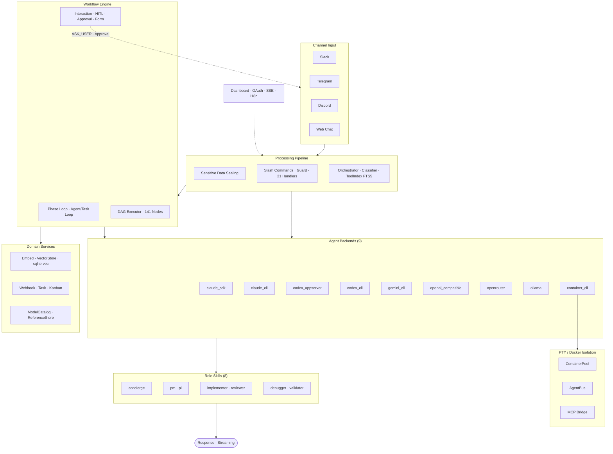
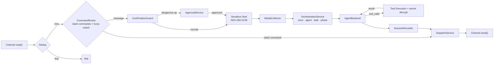
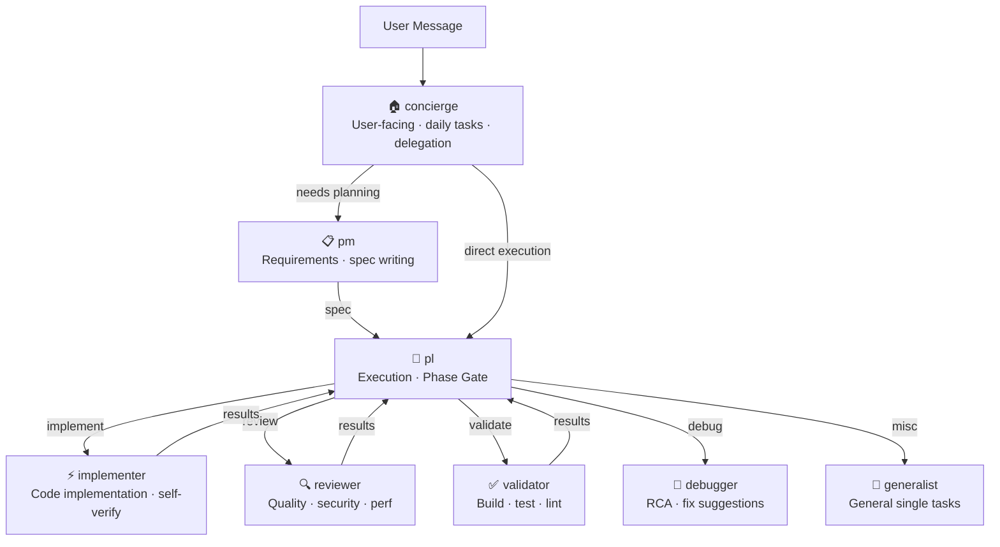

# SoulFlow Orchestrator

[](https://github.com/berrzebb/SoulFlow-Orchestrator/actions/workflows/ci.yml)
[](https://github.com/berrzebb/SoulFlow-Orchestrator/actions/workflows/ci.yml)
[](https://github.com/berrzebb/SoulFlow-Orchestrator/actions/workflows/ci.yml)
[](https://github.com/berrzebb/SoulFlow-Orchestrator)
[](https://nodejs.org/)
[](https://www.typescriptlang.org/)
[](LICENSE)

[한국어](README.ko.md) | English

An asynchronous orchestration runtime that processes Slack · Telegram · Discord messages through **headless agents**.

The batteries-included solution featuring 9 agent backends (Claude/Codex/Gemini × CLI/SDK + OpenAI-compatible + OpenRouter + Ollama + container), an 8-role skill system, CircuitBreaker-based provider resilience, AES-256-GCM security vault, OAuth 2.0 integrations, a 141-node workflow graph editor, WorkflowTool for agent-driven CRUD, and a React + Vite web dashboard with i18n and markdown rendering.

## Table of Contents

- [Architecture](#architecture)
- [What Is This?](#what-is-this)
- [Quick Start](#quick-start)
- [Dashboard](#dashboard)
- [OAuth Integration](#oauth-integration)
- [Usage Examples](#usage-examples)
- [Slash Commands](#slash-commands)
- [Directory Structure](#directory-structure)
- [Troubleshooting](#troubleshooting)

## Architecture



**Inbound Pipeline**



**Role Delegation Hierarchy**



## What Is This?

An **orchestration runtime** that receives messages from chat channels and dispatches them to specialized agents.

| Component | Role | Key Features |
|-----------|------|-------------|
| **Channel Manager** | Slack · Telegram · Discord I/O | Streaming · grouping · persona tone rendering |
| **Orchestrator** | Inbound → agent execution | Agent Loop · Task Loop · Phase Loop triple mode |
| **Agent Backends** | Claude/Codex × CLI/SDK execution | CircuitBreaker · HealthScorer · auto-fallback |
| **Role Skills** | 8-role hierarchical delegation | concierge → pm/pl → implementer/reviewer/validator/debugger |
| **Security Vault** | AES-256-GCM secret management | Auto inbound sealing · decrypt only in tool path |
| **OAuth Integration** | External service authentication | GitHub · Google · Custom OAuth 2.0 |
| **Workflow Engine** | Phase Loop · DAG execution | 141-node graph editor · 6 categories · HITL interaction nodes |
| **Message Bus** | Internal event routing | In-memory (default) · Redis Streams (multi-instance) |
| **Domain Services** | Embedding · vector store · webhook · kanban | sqlite-vec KNN · hybrid search · kanban automation rules |
| **Dashboard** | Web-based real-time monitoring | SSE feed · agent/task/decision/provider management |
| **MCP Integration** | External tool server connections | stdio/SSE · auto CLI injection |
| **Cron** | Recurring task scheduling | SQLite-backed · hot reload |

### Agent Backends

`claude_sdk` · `claude_cli` · `codex_appserver` · `codex_cli` · `gemini_cli` · `openai_compatible` · `openrouter` · `ollama` · `container_cli` — CircuitBreaker · auto-fallback.

→ [Choosing an Agent Backend](en/core-concepts/agents.md)

### Role Skills & Team Composition

8 roles collaborate in a delegation hierarchy. `concierge` faces the user and delegates dev tasks to `pm`/`pl`.

```
concierge (user-facing)
  ├── pm (planning) → pl (execution)
  └── pl (direct)
        ├── implementer · reviewer · validator · debugger
        └── generalist
```

| Team Preset | Composition | Use Case |
|-------------|-------------|----------|
| **Full Team** | PM → PL → Implementer → Reviewer → Validator | Complex dev tasks |
| **Light** | PM → Implementer → Validator | Small, clear tasks |
| **Planning** | PM | Spec writing · documentation |
| **QA Team** | Reviewer + Implementer | Code review · refactoring |
| **Test Team** | Validator | Build · test · lint |

### Tool & Skill Dynamic Selection

Sending all 158 tools on every request costs ~25,000 tokens. **ToolIndex FTS5** selects the optimal 20–35 tools per request using keyword expansion + BM25 ranking. (13 core tools always included)

## Quick Start

### Prerequisites

- **Docker** or **Podman**
- AI Provider API Key (Claude, OpenAI, OpenRouter, etc.)
- (Optional) Channel Bot Token (Slack · Telegram · Discord) — Web chat works without any token

### Start

```bash
git clone https://github.com/berrzebb/SoulFlow-Orchestrator.git
cd SoulFlow-Orchestrator

# Linux/macOS
./run.sh prod --workspace=/path/to/workspace

# Windows
.\run.ps1 prod --workspace=D:\workspace
```

Open `http://localhost:4200` in your browser and complete the **Setup Wizard**.

> Details: [Installation Guide](en/getting-started/installation.md) — dev/staging/multi-instance, agent login, Docker Compose direct usage

---

## Dashboard

`http://127.0.0.1:4200` — React + Vite SPA. Korean/English i18n (auto-detected from browser locale).

| Page | Path | Function |
|------|------|----------|
| Overview | `/` | Runtime status summary, system metrics, SSE live feed |
| Workspace | `/workspace` | Memory · sessions · skills · cron · tools · agents · templates · OAuth · models · references (10 tabs) |
| Chat | `/chat` | Web-based agent conversation (markdown rendering + code highlighting) |
| Channels | `/channels` | Channel connection status · global settings |
| Providers | `/providers` | Agent provider CRUD · Circuit Breaker state |
| Secrets | `/secrets` | AES-256-GCM secret management |
| Workflows | `/workflows` | Phase Loop workflow management · 141-node graph editor · agent chat |
| Kanban | `/kanban` | Drag-and-drop kanban board · automation rules |
| WBS | `/wbs` | Kanban card hierarchy tree view (parent_id based) |
| Settings | `/settings` | Global runtime settings |

→ Details: [Dashboard Guide](en/guide/dashboard.md) · [Workflows Guide](en/guide/workflows.md)

## OAuth Integration

GitHub · Google · Custom OAuth 2.0 external service integrations. Managed from Dashboard Workspace → OAuth tab.

Agent tools use `oauth:{instance_id}` reference for automatic token injection with 401 auto-refresh retry.

→ Details: [OAuth Guide](en/guide/oauth.md)

---

## Usage Examples

**Simple task** (concierge → automatic role dispatch):

```
User: Find the bug in this code
→ concierge → debugger activates → root cause analysis → response
```

**Multi-agent Phase Loop** (parallel specialists + critic quality gate):

```
User: Do a full market research on AI infrastructure
→ Classifier detects "phase" mode
→ Phase 1: Market Analyst + Tech Analyst + Strategist run in parallel
→ Critic reviews all results, requests missing data
→ Phase 2: Strategist synthesizes findings
→ Each agent has independent chat — click 💬 to follow up
```

**Autonomous development pipeline** (interactive spec → sequential implementation):

```
User: Build a REST API for user authentication
→ Phase 1 (Interactive): PM co-creates spec via conversation
   PM: "Which framework do you prefer?" → User: "Express"
   PM: "Need OAuth support?" → User: "Yes, Google OAuth"
→ Phase 2 (Parallel): PL breaks spec into atomic tasks
→ Phase 3 (Sequential Loop): Implementer executes tasks one-by-one
   Each iteration uses fresh context to prevent context rot
   If blocked: [ASK_USER] "Which DB driver?" → User: "PostgreSQL"
→ Phase 4: Reviewer checks code quality
→ Phase 5: Validator runs tests — if fails, goto Phase 3 (fix loop)
```

**Workflow automation** (agent-driven CRUD via natural language):

```
User: Crawl RSS every morning at 9 and summarize
→ Agent infers DAG: HTTP node (fetch RSS) → LLM node (summarize) → Template node (format)
→ WorkflowTool: create "daily-rss" with cron trigger
→ Runs automatically every day at 9 AM

User: Show my workflows
→ WorkflowTool: list → "daily-rss (cron: 0 9 * * *), competitor-monitor, ..."
```

**Container sandbox code execution** (7 languages):

```
User: Run this Python data analysis script
→ Code node spawns isolated container (python:3.12-slim)
→ --network=none, --read-only, --memory=256m
→ Returns stdout/stderr → passes result to next workflow node
```

**Task execution** (phased execution with approval):

```
User: Implement a user authentication API
→ pm plans → pl designs → implementer builds → reviewer validates
```

**Secret management**:

```
User: /secret set MY_API_KEY sk-abc123
→ AES-256-GCM encrypted storage

User: Call the API using MY_API_KEY
→ Auto-decryption during tool execution (agent receives only a reference)
```

**Slash command control**:

```
/stop          → Immediately stop active task in current channel
/status        → Runtime state · tool · skill lists
/reload skills → Hot reload skills (no restart needed)
/doctor        → Service health self-diagnosis
```

## Slash Commands

| Command | Description |
|---------|-------------|
| `/help` | Common commands/usage help |
| `/stop` · `/cancel` | Stop active task in current channel |
| `/render status\|markdown\|html\|plain\|reset` | Set/view/reset render mode |
| `/render link\|image indicator\|text\|remove` | Blocked link/image display mode |
| `/secret status\|list\|set\|get\|reveal\|remove` | AES-256-GCM secret vault management |
| `/secret encrypt <text>` · `/secret decrypt <cipher>` | Instant encrypt/decrypt |
| `/memory status\|list\|today\|longterm\|search <q>` | Memory query/search |
| `/decision status\|list\|set <key> <value>` | Decision management |
| `/cron status\|list\|add\|remove` | Cron schedule management |
| `/promise status\|list\|resolve <id> <value>` | Promise/deferred execution management |
| `/reload config\|tools\|skills` | Hot reload config/tools/skills |
| `/task list\|cancel <id>` | Process/task view/cancel |
| `/status` | Runtime status summary (incl. tool/skill lists) |
| `/agent list\|cancel\|send` | Sub-agent list/cancel/send input |
| `/skill list\|info\|suggest` | Skill list/detail/suggest |
| `/stats` | Runtime statistics (CD score · session metrics) |
| `/verify` | Output verification |
| `/guard on\|off` | Toggle confirmation gate for risky operations |
| `/doctor` | Runtime self-diagnosis (service health check) |
| `/workflow list\|create\|cancel <id>` | Phase Loop workflow management |
| `/model list\|set <name>` | Orchestrator LLM model switch |
| `/mcp list\|reconnect <name>` | MCP server status/reconnect |
| `/tone <style>\|status\|reset` | Persona tone control (formal/casual/warm/cool/short/detailed) |

## Directory Structure

```text
next/
  run.sh / run.ps1 / run.cmd ← Environment management (dev/test/staging/prod)
  Dockerfile              ← Multi-stage Docker build
  .devcontainer/          ← VS Code Dev Container setup
  docker/                 ← docker-compose files (prod, dev, instance overrides)
  src/
    agent/
      backends/     ← SDK/AppServer/OpenAI backend adapters (7 backends)
      nodes/        ← 141 workflow node handlers (OCP plugin architecture)
      pty/          ← PTY-based CLI integration (ContainerPool, AgentBus, NDJSON wire)
      tools/        ← Agent tool implementations (oauth_fetch, workflow, ask-user, etc.)
    bootstrap/      ← 15 bootstrap modules (decomposed from main.ts)
    bus/            ← MessageBus (in-memory · Redis Streams)
    channels/       ← Channel manager · commands · dispatch · approval · persona tone
    config/         ← Zod-based config schema
    cron/           ← Cron scheduler (SQLite)
    dashboard/
      ops/          ← 13 ops modules
      routes/       ← Route handlers
    decision/       ← Decision service
    events/         ← Workflow event service
    heartbeat/      ← Heartbeat service
    i18n/           ← Shared i18n protocol + JSON locales
    mcp/            ← MCP client manager
    oauth/          ← OAuth 2.0 integration (flow-service, integration-store)
    orchestration/  ← Classifier · ToolIndex · ConfirmationGuard · HitlPendingStore
    providers/      ← LLM providers (Claude, Codex, Gemini, OpenAI-compatible)
    runtime/        ← Instance lock · ServiceManager
    security/       ← Secret Vault (AES-256-GCM)
    services/       ← Domain services (embed, vector-store, kanban, webhook, model-catalog, etc.)
    session/        ← Session store
    skills/
      _shared/      ← Shared protocols
      roles/        ← 8 roles (concierge, pm, pl, implementer, reviewer, validator, debugger, generalist)
      diagram / github / sandbox / ...  ← Additional built-in skills
  scripts/
    scaffold/       ← Code generators (tool, node, handler, route, page)
    generate-diagrams.mjs ← SVG diagram generation
    i18n-sync.ts    ← i18n key synchronization (--check / --fix)
  <workspace>/      ← Specified via --workspace (runtime data)
    runtime/        ← SQLite DBs (sessions, tasks, events, cron, kanban, dlq, etc.)
    skills/         ← User-defined skills
    templates/      ← System prompt templates
  web/              ← Dashboard frontend (React + Vite + i18n)
    src/pages/workflows/  ← Graph editor · Node Inspector · 141-node UI
  docs/
    diagrams/       ← SVG architecture diagrams
    */guide/        ← User guides
    */design/       ← Architecture design documents
```

## Troubleshooting

| Symptom | Solution |
|---------|----------|
| `another instance is active` | Terminate other process running with the same Bot Token |
| No response | Check token/channel ID, look for `channel manager start failed` in logs |
| Dashboard won't start | Change port in Settings or stop the conflicting process |
| Repeated send failures | Check `runtime/dlq/dlq.db`, adjust retry settings in Settings → `channel.dispatch` |
| Streaming not working | Enable streaming in Settings → `channel.streaming` |
| SDK backend failure | Check `backend_fallback` in logs (`claude_sdk` → `claude_cli` auto-switch) |
| OAuth Connect fails | Disable popup blocker, verify Client ID/Secret, check Redirect URI |
| LLM runtime check | `npm run health:llm` |

## License

[GNU Affero General Public License v3.0](../LICENSE) (AGPL-3.0-only)

Copyright (C) 2026 Hyun Park
