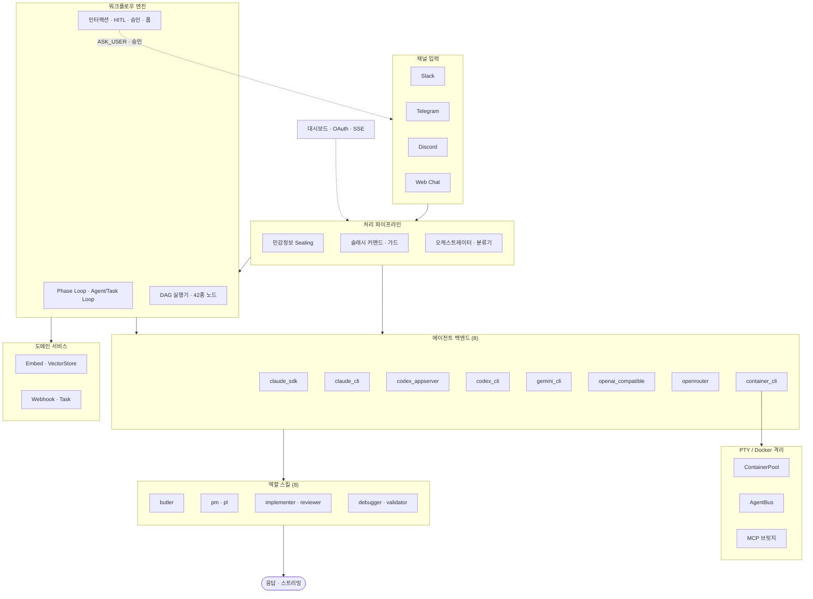

# SoulFlow Orchestrator

[한국어](README.ko.md) | [English](README.en.md)

> 루트 버전: [README.md](../README.md)

Slack · Telegram · Discord 메시지를 **헤드리스 에이전트**로 처리하는 비동기 오케스트레이션 런타임.

8개 에이전트 백엔드(Claude/Codex/Gemini × CLI/SDK + OpenAI 호환 + OpenRouter + 컨테이너), 8개 역할 기반 스킬 시스템, CircuitBreaker 기반 프로바이더 복원력, AES-256-GCM 보안 Vault, OAuth 2.0 연동, 42종 노드 워크플로우 그래프 에디터, 에이전트 기반 WorkflowTool CRUD, React + Vite 웹 대시보드(i18n, 마크다운 렌더링)를 내장한 올인원 솔루션입니다.

## 목차

- [아키텍처](#아키텍처)
- [이게 뭔가요?](#이게-뭔가요)
- [빠른 시작](#빠른-시작)
- [대시보드](#대시보드)
- [OAuth 연동](#oauth-연동)
- [사용 예시](#사용-예시)
- [슬래시 커맨드](#슬래시-커맨드)
- [디렉터리 구조](#디렉터리-구조)
- [트러블슈팅](#트러블슈팅)

## 아키텍처



상세 다이어그램: [서비스 아키텍처](diagrams/service-architecture.svg) · [인바운드 파이프라인](diagrams/inbound-pipeline.svg) · [오케스트레이터 흐름](diagrams/orchestrator-flow.svg) · [프로바이더 복원력](diagrams/provider-resilience.svg) · [역할 위임](diagrams/role-delegation.svg) · [컨테이너 아키텍처](diagrams/container-architecture.svg) · [Phase Loop 생명주기](diagrams/phase-loop-lifecycle.svg) · [Lane Queue](diagrams/lane-queue.svg) · [에러 복구](diagrams/error-recovery.svg)

## 이게 뭔가요?

채팅 채널에서 메시지를 받아 전문 에이전트에게 분배하는 **오케스트레이션 런타임**입니다.

| 구성 요소 | 역할 | 핵심 특징 |
|----------|------|----------|
| **채널 매니저** | Slack · Telegram · Discord 수신/응답 | 스트리밍 · 그룹핑 · typing 갱신 |
| **오케스트레이터** | 인바운드 → 에이전트 실행 | Agent Loop · Task Loop · Phase Loop 삼중 모드 |
| **에이전트 백엔드** | Claude/Codex × CLI/SDK 실행 | CircuitBreaker · HealthScorer · 자동 fallback |
| **역할 스킬** | 8개 역할 계층적 분담 | butler → pm/pl → implementer/reviewer/validator/debugger |
| **보안 Vault** | AES-256-GCM 민감정보 관리 | 인바운드 자동 sealing · 도구 경로 복호화만 허용 |
| **OAuth 연동** | 외부 서비스 인증 | GitHub · Google · Custom OAuth 2.0 |
| **워크플로우 엔진** | Phase Loop · DAG 실행 | 42종 노드 그래프 에디터 · 6개 카테고리 · HITL 인터랙션 노드 |
| **도메인 서비스** | 임베딩 · 벡터 스토어 · 웹훅 | 상태 유지 파이프라인 · 영속 태스크 실행 |
| **대시보드** | 웹 기반 실시간 모니터링 | SSE 피드 · 에이전트/태스크/결정/프로바이더 관리 |
| **MCP 통합** | 외부 도구 서버 연결 | stdio/SSE · 자동 CLI 주입 |
| **크론** | 정기 작업 스케줄 | SQLite 기반 · 핫 리로드 |

### 에이전트 백엔드

| 백엔드 | 방식 | 특징 | 자동 fallback |
|--------|------|------|--------------|
| `claude_sdk` | 네이티브 SDK | tool loop 내장 · 스트리밍 | → `claude_cli` |
| `claude_cli` | Headless CLI 래퍼 | 안정성 · 범용 | — |
| `codex_appserver` | 네이티브 AppServer | 병렬 실행 · tool loop 내장 | → `codex_cli` |
| `codex_cli` | Headless CLI 래퍼 | 샌드박스 모드 지원 | — |
| `gemini_cli` | Headless CLI 래퍼 | Gemini CLI 연동 | — |
| `openai_compatible` | OpenAI 호환 API | vLLM · Ollama · LM Studio · Together AI · Gemini 등 로컬/원격 모델 | — |
| `openrouter` | OpenRouter API | 멀티 모델 라우팅 · 100+ 모델 접근 | — |
| `container_cli` | 컨테이너 CLI 래퍼 | Podman/Docker 샌드박스 실행 | — |

### 역할 스킬

| 역할 | 전문 분야 | 위임 방향 |
|------|----------|----------|
| `butler` | 요청 수신 · 역할 라우팅 | → pm/pl/generalist |
| `pm` | 요구사항 분석 · 태스크 분해 | → implementer |
| `pl` | 기술 리드 · 아키텍처 설계 | → implementer/reviewer |
| `implementer` | 실제 구현 · 코드 작성 | — |
| `reviewer` | 코드 리뷰 · 품질 검증 | — |
| `debugger` | 버그 진단 · 근본 원인 분석 | — |
| `validator` | 출력 검증 · 회귀 테스트 | — |
| `generalist` | 범용 처리 | — |

## 빠른 시작

### 요구사항

- **Docker** 또는 **Podman** (권장)
- 최소 1개 채널 Bot Token (Slack · Telegram · Discord)
- AI 프로바이더 API 키 (Claude, OpenAI, OpenRouter 등)
- (선택) GPU — 로컬 Ollama 오케스트레이터 LLM 분류기 사용 시

### Docker (권장)

```bash
# 프로덕션 (orchestrator + ollama + docker-proxy)
docker compose up -d

# 개발 (라이브 리로드)
docker compose -f docker-compose.yml -f docker-compose.dev.yml up
```

`full` 이미지에 Claude Code, Codex CLI, Gemini CLI가 사전 설치되어 있습니다.

### 로컬 (비권장)

```bash
cd next
npm install
npm run dev      # 개발 모드 (핫리로드)
```

> 컨테이너 배포가 CLI 에이전트 격리와 일관된 환경을 제공하므로 권장됩니다. 자세한 내용은 [설치 가이드](ko/getting-started/installation.md)를 참조하세요.

### Setup Wizard

첫 실행 시 프로바이더가 설정되지 않으면 대시보드가 자동으로 Setup Wizard(`/setup`)로 이동합니다.

```
http://127.0.0.1:4200
```

Wizard에서 다음을 순서대로 설정합니다:
1. **AI 프로바이더** — Claude/Codex API 키 입력
2. **채널** — Slack/Telegram/Discord Bot Token 입력
3. **에이전트 설정** — 기본 역할 및 백엔드 선택

`.env` 파일을 직접 작성할 필요 없이, Wizard에서 모든 설정을 완료할 수 있습니다.

---

## 대시보드

`http://127.0.0.1:4200` — React + Vite SPA. 한국어/영어 i18n 지원 (브라우저 로케일 자동 감지).

| 페이지 | 경로 | 기능 |
|--------|------|------|
| Overview | `/` | 런타임 상태 요약, 시스템 메트릭, SSE 실시간 피드 |
| Workspace | `/workspace` | 메모리 · 세션 · 스킬 · 크론 · 도구 · 에이전트 · 템플릿 · OAuth (8탭) |
| Chat | `/chat` | 웹 기반 에이전트 대화 (마크다운 렌더링 + 코드 하이라이팅) |
| Channels | `/channels` | 채널 연결 상태 · 글로벌 설정 |
| Providers | `/providers` | 에이전트 프로바이더 CRUD · Circuit Breaker 상태 |
| Secrets | `/secrets` | AES-256-GCM 시크릿 관리 |
| Models | `/models` | 오케스트레이터 LLM 런타임 · 모델 pull/삭제/전환 |
| Workflows | `/workflows` | Phase Loop 워크플로우 관리 · 42종 노드 그래프 에디터 · 에이전트 채팅 |
| Settings | `/settings` | 글로벌 런타임 설정 |

→ 상세: [대시보드 가이드](ko/guide/dashboard.md) · [워크플로우 가이드](ko/guide/workflows.md)

## OAuth 연동

GitHub · Google · Custom OAuth 2.0 외부 서비스 연동. 대시보드 Workspace → OAuth 탭에서 관리합니다.

에이전트 도구에서 `oauth:{instance_id}` 참조로 토큰 자동 주입, 401 시 자동 갱신 재시도.

→ 상세: [OAuth 가이드](ko/guide/oauth.md)

---

## 사용 예시

**단순 작업** (butler → 자동 역할 분배):

```
사용자: 이 코드에서 버그 찾아줘
→ butler → debugger 활성화 → 근본 원인 분석 → 응답
```

**다중 에이전트 Phase Loop** (병렬 전문가 + 크리틱 품질 게이트):

```
사용자: AI 인프라 시장 조사 전체 분석해줘
→ 분류기가 "phase" 모드 감지
→ Phase 1: 시장 분석가 + 기술 분석가 + 전략가 병렬 실행
→ 크리틱이 전체 결과를 검토, 누락 데이터 요청
→ Phase 2: 전략가가 결과를 종합
→ 각 에이전트에 독립 채팅 — 💬 클릭으로 후속 질문 가능
```

**자율 개발 파이프라인** (대화형 스펙 → 순차 구현):

```
사용자: 사용자 인증 REST API 만들어줘
→ Phase 1 (Interactive): PM이 대화로 스펙 공동 작성
   PM: "어떤 프레임워크 선호하세요?" → 사용자: "Express"
   PM: "OAuth 지원 필요한가요?" → 사용자: "네, Google OAuth"
→ Phase 2 (Parallel): PL이 스펙을 원자적 태스크로 분해
→ Phase 3 (Sequential Loop): Implementer가 태스크를 하나씩 실행
   매 반복마다 fresh context로 context rot 방지
   막히면: [ASK_USER] "어떤 DB 드라이버?" → 사용자: "PostgreSQL"
→ Phase 4: Reviewer가 코드 품질 검토
→ Phase 5: Validator가 테스트 — 실패 시 Phase 3으로 goto (수정 루프)
```

**워크플로우 자동화** (자연어 기반 에이전트 CRUD):

```
사용자: 매일 아침 9시에 RSS 크롤링해서 요약해줘
→ 에이전트가 DAG 추론: HTTP 노드(RSS 수집) → LLM 노드(요약) → Template 노드(포맷)
→ WorkflowTool: "daily-rss" 생성 + 크론 트리거 등록
→ 매일 아침 9시 자동 실행

사용자: 내 워크플로우 보여줘
→ WorkflowTool: list → "daily-rss (cron: 0 9 * * *), competitor-monitor, ..."
```

**컨테이너 샌드박스 코드 실행** (7개 언어):

```
사용자: 이 Python 데이터 분석 스크립트 실행해줘
→ Code 노드가 격리 컨테이너 스폰 (python:3.12-slim)
→ --network=none, --read-only, --memory=256m
→ stdout/stderr 반환 → 다음 워크플로우 노드로 결과 전달
```

**태스크 실행** (단계형 실행/승인):

```
사용자: 사용자 인증 API 구현해줘
→ pm 기획 → pl 설계 → implementer 구현 → reviewer 검토
```

**민감정보 관리**:

```
사용자: /secret set MY_API_KEY sk-abc123
→ AES-256-GCM 암호화 저장

사용자: MY_API_KEY로 API 호출해줘
→ 도구 실행 시 자동 복호화 (에이전트에는 참조만 전달)
```

**슬래시 커맨드 제어**:

```
/stop          → 현재 채널 작업 즉시 중지
/status        → 런타임 상태 · 도구 · 스킬 목록
/reload skills → 스킬 핫 리로드 (재시작 없음)
/doctor        → 서비스 건강 상태 자가진단
```

## 슬래시 커맨드

| 커맨드 | 설명 |
|--------|------|
| `/help` | 공통 명령/사용법 출력 |
| `/stop` · `/cancel` · `/중지` | 현재 채널 활성 작업 중지 |
| `/render status\|markdown\|html\|plain\|reset` | 렌더 모드 설정/조회/초기화 |
| `/render link\|image indicator\|text\|remove` | 차단된 링크/이미지 표현 방식 |
| `/secret status\|list\|set\|get\|reveal\|remove` | AES-256-GCM secret vault 관리 |
| `/secret encrypt <text>` · `/secret decrypt <cipher>` | 즉시 암복호화 |
| `/memory status\|list\|today\|longterm\|search <q>` | 메모리 조회/검색 |
| `/decision status\|list\|set <key> <value>` | 결정사항 관리 |
| `/cron status\|list\|add\|remove` | 크론 스케줄 관리 |
| `/promise status\|list\|resolve <id> <value>` | Promise/지연 실행 관리 |
| `/reload config\|tools\|skills` | 설정/도구/스킬 핫 리로드 |
| `/task list\|cancel <id>` | 프로세스·작업 조회/취소 |
| `/status` | 런타임 상태 요약 (도구·스킬 목록 포함) |
| `/agent list\|cancel\|send` | 서브에이전트 목록/취소/입력 전송 |
| `/skill list\|info\|suggest` | 스킬 목록/상세/추천 |
| `/stats` | 런타임 통계 (CD 점수·세션 메트릭) |
| `/verify` | 출력물 검증 |
| `/guard on\|off` | 위험 작업 확인 게이트 토글 |
| `/doctor` | 런타임 자가진단 (서비스 건강 상태 점검) |

## 디렉터리 구조

```text
next/
  Dockerfile              ← 멀티스테이지 Docker 빌드 (5 스테이지)
  docker-compose.yml      ← 프로덕션 배포
  docker-compose.dev.yml  ← 개발용 라이브 리로드
  .devcontainer/          ← VS Code Dev Container 설정
  src/
    agent/
      backends/     ← SDK/CLI/OpenAI 백엔드 어댑터 (8개 백엔드)
      nodes/        ← 42종 워크플로우 노드 핸들러 (OCP 플러그인 아키텍처)
      pty/          ← PTY 기반 CLI 통합 (ContainerPool, AgentBus, MCP 브릿지, NDJSON 와이어)
      tools/        ← 에이전트 도구 구현 (oauth_fetch, workflow, ask-user, approval-notifier 포함)
    bus/            ← MessageBus (inbound/outbound pub/sub)
    channels/       ← 채널 매니저 · 커맨드 · 디스패치 · 승인 · 확인 가드
    config/         ← Zod 기반 설정 스키마 + config-meta
    cron/           ← 크론 스케줄러 (SQLite)
    dashboard/
      routes/       ← 22개 라우트 핸들러 (state, config, chat, cron, workflows 등)
      service.ts    ← HTTP 서버 + 라우트 등록
    decision/       ← 결정사항 서비스
    mcp/            ← MCP 클라이언트 매니저
    oauth/          ← OAuth 2.0 연동 (flow-service, integration-store)
    orchestration/  ← Gateway · Classifier · Prompts · ToolCallHandler · NodeSelector · ToolDescriptionFilter · ConfirmationGuard
    services/       ← 도메인 서비스 (embed, vector-store, query-db, webhook-store, create-task)
    security/       ← Secret Vault (AES-256-GCM)
    session/        ← 세션 저장소
    skills/
      _shared/      ← 공유 프로토콜
      roles/        ← 8개 역할 스킬
  scripts/          ← oauth-relay.mjs (OAuth TCP 릴레이)
  workspace/
    templates/      ← 시스템 프롬프트 템플릿
    skills/         ← 사용자 정의 스킬
    runtime/        ← SQLite DB 모음 (sessions, tasks, events, decisions, cron, dlq)
  web/              ← 대시보드 프론트엔드 (React + Vite + i18n + Zustand)
    src/pages/workflows/  ← 그래프 에디터, 노드 인스펙터, 노드 피커, 42종 노드 UI 컴포넌트
  docs/
    */guide/        ← 사용자 가이드 (dashboard, oauth, providers, heartbeat, workflows)
    */design/       ← 아키텍처 설계 문서 (phase-loop, pty-agent-backend, node-registry, workflow-tool 등)
  diagrams/         ← SVG 아키텍처 다이어그램
```

## 트러블슈팅

| 증상 | 해결 |
|------|------|
| `another instance is active` | 동일 Bot Token으로 실행 중인 다른 프로세스 종료 |
| 응답 없음 | 토큰/채널 ID 확인, 로그에서 `channel manager start failed` 확인 |
| 대시보드 시작 실패 | Settings에서 포트 변경 또는 포트 충돌 프로세스 종료 |
| 전송 실패 반복 | `runtime/dlq/dlq.db` 확인, Settings → `channel.dispatch`에서 재시도 설정 조정 |
| 스트리밍 미동작 | Settings → `channel.streaming` 활성화 확인 |
| SDK 백엔드 실패 | 로그의 `backend_fallback` 확인 (`claude_sdk` → `claude_cli` 자동 전환) |
| OAuth Connect 안 됨 | 팝업 차단 해제, Client ID/Secret 확인, Redirect URI 설정 확인 |
| LLM 런타임 점검 | `npm run health:llm` |

## 라이선스

MIT
