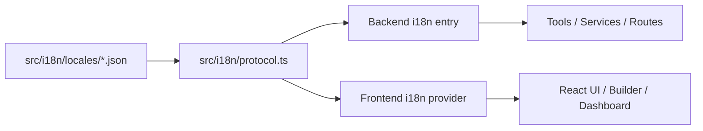

# Design: Shared i18n Protocol

## Overview

The shared i18n protocol is the multilingual layer that lets frontend and backend use **the same translation keys and the same lookup rules**. Its purpose is to prevent translation data from being duplicated across multiple paths while keeping UI and system metadata on one locale source.

## Design Intent

The current project needs to handle several kinds of text together:

- general UI strings
- dashboard and workflow-builder labels
- tool and node metadata
- category names and status labels

If frontend and backend manage those strings in unrelated formats, key drift, missing translations, and duplicated descriptions become common. The shared i18n protocol exists to stop that drift.

## Core Principles

### 1. Translation data lives in shared locale dictionaries

Translated strings are not treated as layer-specific hard-coded literals. Frontend and backend read from the same logical keyspace.

### 2. Lookup rules are shared as well

The system does not share only JSON files. It also shares key lookup and variable interpolation behavior.

### 3. Metadata is part of i18n

Buttons are not the only thing that needs translation. Tool descriptions, node labels, category names, and similar metadata are first-class translation targets.

### 4. Locale data and runtime policy are separate

Locale data lives in shared dictionaries. Runtime-specific locale selection and `t()` exposure are handled by the frontend and backend entry layers.

## Adopted Structure

## Main Components

### Locale Dictionaries

Locale dictionaries store the actual translated strings. The current structure uses language-specific JSON dictionaries as the base translation source.

### Shared Protocol

The shared protocol defines common behavior such as key lookup, fallback, and variable interpolation. Frontend and backend reuse the same protocol instead of inventing separate translation logic.

### Backend Entry

The backend entry exposes translators for the active locale. It is used for tool descriptions, server-side metadata, and workflow-related text.

### Frontend Provider

The frontend provider exposes locale state and translation helpers to React. UI surfaces use the same locale dictionaries through that provider.

## Key Design

The current structure uses namespaced meaning-based keys. The important point is that keys are organized around **conceptual meaning**, not around implementation details of one component.

Representative domains include:

- common UI
- navigation
- workflow builder
- tool metadata
- node metadata
- category and state labels

Keys therefore answer “how should this concept be rendered in a locale?” rather than “what string does this file happen to need?”

## Relationship to Tools and Nodes

The shared i18n protocol is not limited to visible UI text. Tool definitions and node descriptors must also be able to reference translation keys.

This has several advantages:

- tool descriptions do not drift between UI and server layers
- node labels and schema descriptions remain consistent across builder surfaces
- adding a new language does not require large-scale descriptor rewrites

## Role of Automation

If the system claims one translation source of truth, it also needs automation that can detect missing keys, orphaned keys, and untranslated entries. That automation is not the protocol itself, but it is part of how the protocol stays trustworthy.

The design-level concern is therefore not a particular script interface, but the fact that the shared keyspace must be machine-checkable.

## Non-goals

This document does not define:

- the full key inventory of locale files
- migration phases
- exact CLI usage of sync or generation scripts
- completion status or phase tracking

Those belong in implementation code or `docs/*/design/improved`.

## Related Documents

- [Node Registry Design](./node-registry.md)
- [Workflow Builder Command Palette Design](./workflow-builder-command-palette.md)
