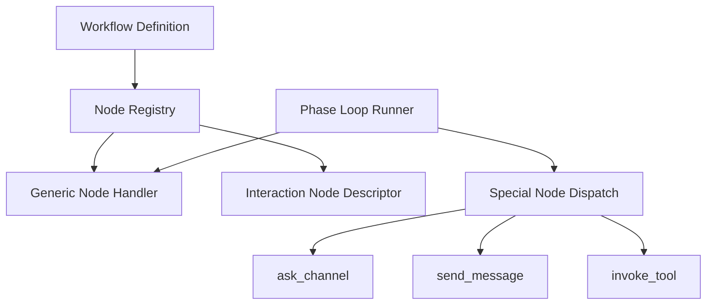

# Design: Interaction Nodes

## Overview

Interaction Nodes are the workflow-node layer used for concerns that plain data-processing nodes cannot model well: **human input, channel responses, execution control, and tool bridging**.

The purpose of this document is to explain what the project currently treats as interaction nodes, and why some nodes require runner-level execution instead of generic executor handling.

## Design Intent

The workflow engine is not composed only of pure compute nodes. Real operational flows also need to:

- ask users questions and wait for answers
- request structured approval or rejection
- collect form-style input
- send notifications or escalations
- retry a failed node
- process collections in batches or controlled loops
- invoke tools dynamically

Those concerns cannot be represented well through a generic executor context that only carries memory and workspace. The current structure therefore separates **generic node execution** from **runner-aware special node execution**.

## Core Principles

### 1. Interaction is modeled as nodes

Human input and channel interaction are not treated as implicit side effects outside the graph. They are declared as workflow nodes, so design, persistence, observability, and resume all stay inside the same graph model.

### 2. Node definition and execution context are separate

Nodes are registered in the node registry, but some nodes require additional runtime callbacks to execute. Registry and special dispatch are separate responsibilities.

### 3. Channel I/O is injected through callbacks

The phase runner gains interaction capabilities through callbacks such as `send_message`, `ask_channel`, and `invoke_tool`. The executor does not hard-code channel implementation details.

### 4. Human-in-the-loop is a normal state

HITL, approval, and form collection are not treated as failures or interrupts. They are normal workflow states.

## Adopted Structure

Generic nodes can stay on the standard executor path, while interaction nodes are handled through special dispatch in the phase loop runner.

## Node Categories

### Human-in-the-loop

These nodes require direct input from a user or operator.

- HITL
- Approval
- Form

They need outbound prompting, structured response collection, and waiting-state support.

### Notification / Escalation

These nodes send messages to a channel but do not always wait for a response.

- Notify
- SendFile
- Escalation

Their focus is delivery, with optional condition-based escalation.

### Control / Recovery

These nodes express execution policy inside the graph.

- Retry
- Batch
- Gate
- Assert
- Reconcile-style nodes

They are closer to execution control than to pure data transformation.

### Tool Bridge

These nodes delegate dynamic tool execution through runner capabilities.

- Tool Invoke

They allow workflow definitions to rely on tool invocation without embedding transport-specific tool logic directly in the graph.

## Runner-aware Execution

Interaction nodes require a broader runtime context than generic nodes.

- channel send
- channel ask/wait
- run-state updates
- retry and backoff
- batch execution
- tool invocation

For that reason, the current structure intentionally keeps two paths:

- generic node execution
- special node dispatch inside the phase loop runner

This is not an exception path. It is a deliberate layer boundary.

## State and Observability

Interaction nodes can produce states such as:

- waiting_user_input
- waiting_approval
- retrying
- notifying
- escalated

Those states connect directly to workflow runtime state, SSE events, and resume logic. Interaction nodes are therefore part of the runtime state model, not just UI elements.

## Boundary from Generic Nodes

The following are usually not treated as interaction nodes:

- pure data transformation
- template rendering
- static branching
- memory read/write

The practical distinction is whether the node requires a human, a channel, execution policy, or an external tool bridge.

## Non-goals

This document does not define:

- full parameter lists for each node
- detailed UI shape of every node
- retry constants, quorum thresholds, or backoff numbers
- status tables or completion tracking

Those belong in implementation code or `docs/*/design/improved`.

## Related Documents

- [Node Registry Design](./node-registry.md)
- [Loop Continuity + HITL Design](./loop-continuity-hitl.md)
- [Phase Loop Design](./phase-loop.md)
