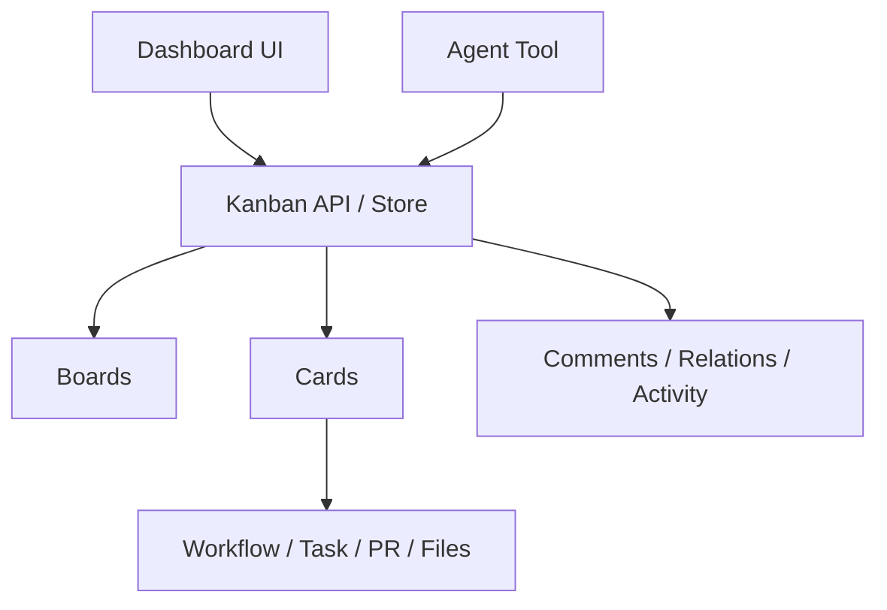

# Design: Kanban Board

## Overview

The kanban board is the **durable work-coordination layer** used by both humans and agents. Its purpose is not only to show current execution state, but to carry planning, decomposition, assignment, review, feedback, and completion through one board model.

The kanban board is separate from runtime execution state such as `TaskState`. Execution state answers “what is running now,” while the kanban board answers “what should happen, why it matters, who owns it, and how it relates to surrounding work.”

## Design Intent

In a system that mixes multi-agent execution with human input, execution logs alone are not enough. The system also needs:

- long-lived work items
- relationships between tasks
- role-specific ownership and feedback
- card-level context
- one shared surface visible to both humans and agents

The kanban board exists to keep that coordination model inside the product instead of pushing it into a separate external tracker.

## Core Principles

### 1. Boards are a different layer from execution state

Kanban cards may be linked to concrete executions, but they are not the same thing. A card is a planning and collaboration unit; an execution is one possible activity carried out in service of that card.

### 2. Humans and agents use the same model

The dashboard UI and the agent tool must share the same board/card/comment/relation model. There should not be separate human-only and agent-only coordination shapes.

### 3. Boards are scoped

A board belongs to a specific context such as a workflow, a channel, a session, or a project-like boundary. Kanban is therefore a scope-bound coordination surface, not one global board.

### 4. Cards accumulate context and history

Cards are not only TODO labels. They hold descriptions, comments, relations, metadata, and activity history.

## Adopted Structure

## Main Components

### Board

A board is the top-level coordination boundary. Column structure, scope, default flow, and board-level automation belong here.

### Card

A card is the actual work unit. Title, description, priority, labels, assignee, metadata, and linked execution context live here.

### Comment / Activity / Relation

Cards include collaboration structures as first-class concerns.

- comment: feedback from humans and agents
- activity: audit trail of card changes
- relation: structural links such as blocked_by, related_to, parent/child

### Kanban Tool and Dashboard

Kanban is not only a dashboard feature. Agents can also create, move, update, summarize, and comment through a tool surface. That makes kanban an operational layer rather than a purely visual one.

## Scope Model

Boards are bound to scopes. Those scopes relate to execution context without being reduced to execution itself.

Typical scope shapes include:

- workflow
- channel
- session
- project-like custom scope

This lets the system host multiple boards in parallel for different operational contexts.

## Automation and Templates

The kanban board is not designed as a purely manual board. In the current architecture, automation rules and templates are treated as **extensions of the board model**.

- automation rules: repeated transitions, labels, assignee changes, or reminders
- templates: reusable starting structures for recurring projects

So the board is part coordination surface and part operational scaffold.

## Metrics and Visibility

Kanban is intended to provide more than a current status board. The design supports deriving operational metrics from activity and card history, such as:

- throughput
- cycle time
- review dwell time
- stale cards
- column distribution

That makes the board an observability surface for work, not just a task list.

## Relationship to Runtime

Cards may be connected to workflows, tasks, PRs, and file changes, but the board is not owned by the execution engine. The relationship should stay loose enough that cards remain useful before, during, and after execution.

This boundary allows the board to function as:

- a planning surface before execution
- a collaboration surface during execution
- a review and feedback surface after execution

## Non-goals

This document does not define:

- the full REST endpoint list
- complete SQL schema
- phased implementation progress
- rollout sequencing of kanban features

Those belong in implementation code or `docs/*/design/improved`.

## Related Documents

- [Loop Continuity + HITL Design](./loop-continuity-hitl.md)
- [Phase Loop Design](./phase-loop.md)
