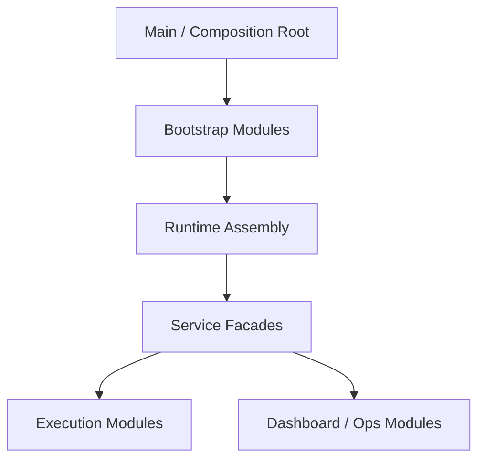

# Design: Large-File Structural Decomposition

## Overview

Large-file structural decomposition is not about making files look smaller. It is an architectural strategy for lowering change fragility by separating **assembly boundaries** from **execution boundaries**. In this project, large-file problems are treated as boundary problems rather than simple formatting problems.

## Design Intent

Large files are risky not because of line count alone, but because they often accumulate the wrong combinations of responsibility:

- initialization order and side effects get mixed together
- assembly code and business policy live in the same file
- changing one execution path can unintentionally affect other modes
- meaningful test boundaries become unclear

For that reason, the purpose of decomposition is not “split aggressively.” It is to separate composition, orchestration, and execution by responsibility.

## Core Principles

### 1. The composition root should stay thin

The top-level entry file should describe how the runtime is assembled, not carry detailed policies of every subsystem. It should mainly own composition, startup, and shutdown sequencing.

### 2. Bootstrap is an assembly layer

Bootstrap modules are not a new business layer. They are the assembly layer that wires already existing services and configuration together.

### 3. Executors should be separated from dispatch

Request dispatch, preflight, once/agent/task/phase execution, and continuation logic should not collapse into one large method. They should live in dedicated execution modules.

### 4. Facades preserve public contracts

Internal decomposition should not force public contract churn. Service facades remain stable while implementation moves into smaller modules behind them.

## Adopted Structure

The point of this structure is not to split files mechanically. It is to keep composition, runtime facade, and execution modules in separate architectural layers.

## Signals That a File Should Be Decomposed

In the current project, decomposition is justified when:

- creation order and usage order are mixed together
- multiple execution modes are embedded in one method
- state storage and state transition logic live in the same file
- UI route assembly and actual ops implementation are coupled

High line count by itself is not enough.

## Main Decomposition Axes

### Bootstrap Decomposition

Runtime startup, configuration loading, service assembly, and shutdown wiring belong in bootstrap modules. These modules assemble the system but do not invent new business policy.

### Execution Decomposition

Preflight, execution-mode dispatch, once/agent/task/phase execution, and continuation should live in dedicated execution modules. That makes execution behavior easier to test and evolve independently.

### Ops / UI Assembly Decomposition

Areas with large assembly surfaces, such as dashboard and workflow tooling, should separate façade-style orchestration from concrete implementation details.

## Boundaries That Must Be Preserved

Even after decomposition, several boundaries should remain stable:

- bootstrap should not own business rules
- execution modules should not know the composition root
- facades preserve public contracts while hiding implementation movement
- structural refactors and feature changes should be kept separate whenever possible

## Non-goals

This document does not define:

- phase-by-phase completion reports
- per-file diff statistics
- test-count or verification logs
- migration checklists

Those belong in implementation code or `docs/*/design/improved`.

## Related Documents

- [Execute Dispatcher Design](./execute-dispatcher.md)
- [Request Preflight Design](./request-preflight.md)
- [Phase Loop Design](./phase-loop.md)
