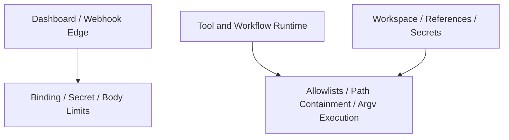

# Design: Local-Binding Security Hardening

## Overview

Local-Binding Security Hardening is the design that turns the project’s **local-first operating assumption** into an explicit security boundary. The core idea is to separate risks reduced by loopback binding from risks that remain even in a local-only environment.

## Design Intent

The project is frequently run with a locally exposed dashboard, shared workspace access, webhooks, and tool execution in the same runtime. In that setup, two security questions matter:

- what limits external exposure
- what still needs to be defended even when the service is local-only

This design exists to keep those concerns distinct instead of flattening them into one vague “security” bucket.

## Core Principles

### 1. Loopback reduces exposure, but it does not eliminate risk

Local binding is effective at shrinking remote attack surface, but it does not solve token egress, path traversal, command injection, or unsafe tool behavior.

### 2. Edge protection and internal guardrails are different layers

Host binding, webhook secret policy, and request body limits are edge protections. Outbound allowlists, filesystem containment, and argv-based execution are internal execution guardrails.

### 3. Defaults should stay conservative

Dashboard and webhook surfaces should assume local-first operation by default, with broader exposure requiring explicit opt-in.

### 4. Local runtime is not a trusted interior

Local processes, misconfigured proxies, malicious scripts, and automation sharing the same workspace are still meaningful threats. A local-only posture is not a reason to weaken outbound, filesystem, or execution guardrails.

## Adopted Security View

In the current architecture, security is viewed through two complementary axes:

- external exposure
- internal execution

## External Exposure Axis

This axis limits who can reach the dashboard and webhook entry points.

Typical elements include:

- loopback binding
- webhook secrets
- request size limits
- explicit configuration for non-local exposure

Its job is to narrow who can hit the service.

## Internal Execution Axis

This axis limits what an already accepted request can do inside the system.

Typical elements include:

- outbound host allowlists
- filesystem containment
- argv-based execution instead of shell string expansion
- host-key and secret handling policy

Its job is to narrow what a reachable request can cause.

## Position of Dashboard and Webhooks

Dashboard routes and webhook routes may share an HTTP surface, but they do not necessarily share the same trust assumptions. The dashboard is a user-facing interaction surface, while webhooks are push-style ingress paths from external systems.

That means local-binding hardening is not just about the host value. It is also about making exposure policy explicit per HTTP surface.

## Relationship to Tool Execution

Security hardening does not end at the HTTP boundary. Tool execution, OAuth fetch, file upload/delete, SSH, and archive behavior all introduce risks that exist even in a loopback-only environment.

For that reason, local-binding security hardening also has to answer questions such as:

- can sensitive tokens be sent to arbitrary hosts
- can file operations escape the intended base directory
- can shell expansion break input boundaries

## Non-goals

This document does not define:

- vulnerability priority tables
- per-fix work items
- completion verdicts
- regression test inventories

Those belong in implementation code or `docs/*/design/improved`.

## Related Documents

- [Multi-tenant Design](./multi-tenant.md)
- [Multi-Environment Setup](./multi-environment-setup.md)
