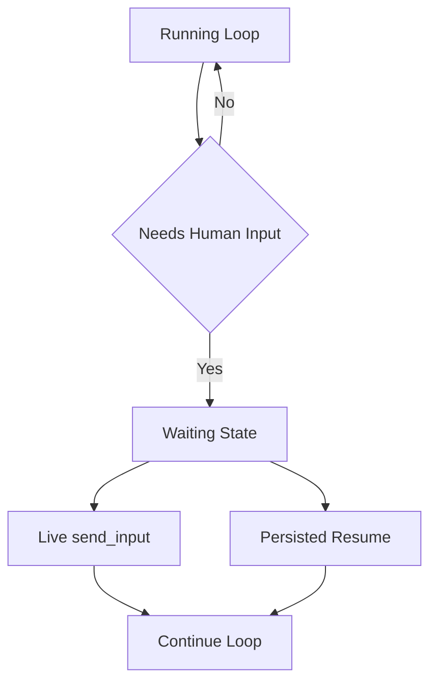

# Design: Loop Continuity + HITL

## Overview

The Loop Continuity + HITL design describes the runtime model that allows long-running tasks and workflows to **pause for user input, approval, or follow-up direction** without losing execution continuity.

The core idea is that a loop is not defined only by “start, run once, terminate.” It may enter a waiting state and later continue from that state.

## Design Intent

The current project treats the following situations as normal execution flow:

- asking the user for additional information
- waiting for approval or rejection
- waiting for a response from an external channel
- receiving new follow-up direction while execution is already in flight

For that reason, HITL is modeled as a **normal runtime transition**, not as an exception-recovery path.

## Core Principles

### 1. Waiting is not failure

States such as `waiting_user_input` and `waiting_approval` are normal runtime states. They must integrate with restart, resume, and SSE signaling.

### 2. Continuity is anchored in run state

Continuity is defined by the active run state, not by a single process lifetime or a single turn. Input acts as a signal that reactivates the run state.

### 3. Support both live input and persisted resume

Injecting input into a still-running loop and resuming a persisted waiting state are different mechanisms, but they must operate on the same state model.

### 4. Clarification and approval are different transitions

Free-form user answers and structured approval responses may both look like “input,” but they drive different state transitions.

## Adopted Structure

The key is to treat `run -> wait -> resume` as one lifecycle instead of as disconnected executions.

## Main Components

### Loop Service

Loop Service is the stateful service layer for loop-oriented execution. Input injection, stored waiting state, and resume metadata are coordinated here.

### Task Resume Service

Task Resume Service is responsible for waking up runs that have already transitioned into a waiting state. Channel replies, user messages, and approval events are mapped back into the correct run.

### Channel Manager

Channel Manager is the ingress point that decides which execution should receive inbound input. If an active run exists, it uses the live-input path. If a persisted waiting state exists, it uses the resume path.

### Execution Runners

`task`, `phase`, and `workflow` runners must treat waiting as a normal outcome. A runner therefore needs to represent not only “continue execution” but also “pause here and wait for external input.”

## Input Paths

### Live Input

This path injects follow-up input while the execution is still alive.

Typical uses:

- steering an in-flight run
- adding constraints
- quick clarification

### Persisted Resume

This path reactivates an execution after it has been stored in a waiting state.

Typical uses:

- approval waits
- long user response delays
- channel-driven continuation

## State Model

Important states in this design are:

- running
- waiting_user_input
- waiting_approval
- resumed
- completed
- aborted

These states are not only UI markers. They also drive input routing, resume behavior, SSE signaling, and channel handling.

## Relationship to Workflows

HITL is not just an extra option on a single node. It is a runtime capability that workflows can use. Interaction nodes project that capability into the workflow graph.

That ties loop continuity directly to:

- interaction nodes
- phase loop runners
- task loop continuation
- channel-bound execution

## Non-goals

This document does not define:

- historical bug analyses
- retrospective notes about premature loop termination
- completion status of implementation steps
- operational constants such as queue depth or timeout thresholds

Those belong in implementation code or `docs/*/design/improved`.

## Related Documents

- [Interaction Nodes Design](./interaction-nodes.md)
- [Interactive Loop Design](./interactive-loop.md)
- [Phase Loop Design](./phase-loop.md)
