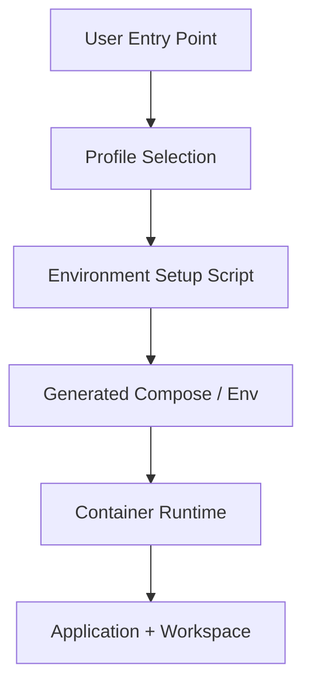

# Design: Multi-Environment Setup

## Overview

Multi-environment setup is the operational design that lets the project run as separate profiles for development, testing, verification, and operation. Its purpose is to let users work with **different isolated runtime profiles through one consistent interface**, without manually assembling the local toolchain each time.

## Design Intent

The current project may run with different ports, workspaces, and service combinations depending on the environment. If those differences are managed manually through hand-edited compose files and ad hoc environment variables, several problems appear:

- entry points drift across platforms
- multiple environments conflict on the same machine
- users must understand Node/npm/Docker sequencing
- environment differences live in documentation instead of in executable profiles

The multi-environment design solves that by making execution **profile-driven**.

## Core Principles

### 1. Environments are selected as profiles

Environment differences are not modeled as arbitrary command combinations. They are modeled as named profiles, and the system assembles the correct runtime from that choice.

### 2. Entry points may differ by platform, but not by meaning

Make, batch, and PowerShell entry points are thin wrappers over the same operational meaning. “Run dev” and “bring down test” should mean the same thing regardless of shell.

### 3. Runtime assembly is container-first

Instead of asking users to reproduce local dependency setup, the system treats the containerized runtime as the primary unit of environment assembly. This is especially important for user-facing setup simplicity.

### 4. Port and workspace isolation are part of profile resolution

If environments differ, their ports, project names, and workspace roots should differ too. Isolation is decided during environment assembly, not after the application has already started.

## Adopted Structure

## Main Components

### Entry Scripts

Platform-specific entry scripts are the thinnest user-facing surface. Their role is to hide shell differences and expose the same profile-based actions consistently.

### Environment Setup

The setup generator turns a selected profile into concrete runtime configuration. Ports, workspace roots, Docker project names, environment variables, and generated file names are resolved here.

### Generated Runtime Configuration

Generated compose and env files are outputs of the chosen profile. In the current design, they are derived artifacts rather than the primary source of environment meaning.

### Workspace Isolation

Per-profile workspace separation is not only a convenience feature. It is part of the data-isolation boundary. Profile and user differences become real filesystem and container boundaries here.

## Environment Profiles

Profiles typically encode differences such as:

- ports
- workspace paths
- runtime/build posture
- attached supporting services

The key point is that a profile is not just a label. It is the name of a non-conflicting execution bundle.

## User Experience Perspective

This design assumes a user closer to a consumer than to an operator. That means users should only need to know:

- which profile to open
- how to start and stop it
- which address to open

Internal build order, node_modules management, and compose specifics should stay behind the entry scripts and user-facing documentation.

## Relationship to Isolation and Security

Multi-environment setup is both a convenience feature and an isolation layer. Different profiles may imply different:

- network exposure
- data volumes
- workspace roots
- port bindings

So environment setup is not just a deployment helper. It is part of the runtime isolation model.

## Non-goals

This document does not define:

- full command usage for each shell script
- detailed Docker build steps
- rollout status of specific profiles
- completion-state reporting

Those belong in implementation code or `docs/*/design/improved`.

## Related Documents

- [PTY Agent Backend Design](./pty-agent-backend.md)
- [Multi-tenant Design](./multi-tenant.md)
