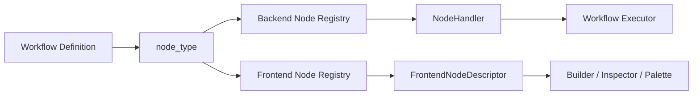

# Design: Node Registry

## Overview

Node Registry is the shared registration layer for workflow nodes. Its purpose is to replace scattered switch statements and constant maps with **one explicit registration model**.

In the current project, backend execution and frontend workflow building share the same `node_type` concept. They do not share the same descriptor object, however; each layer keeps a descriptor that matches its own responsibility.

## Design Intent

Node Registry exists to solve a specific class of problems.

- Minimize the number of places that must change when a new node type is added.
- Let the executor and the builder represent the same node meaning in different ways.
- Make UI and execution metadata queryable instead of hard-coded across multiple branches.
- Treat node definitions as contracts and descriptors, not just string literals.

## Core Principles

### 1. Backend and frontend share the same `node_type`

The same workflow definition is identified by the same type name on both server and client. That shared type is the stable meaning boundary.

### 2. Descriptors are layer-specific

The backend needs execution contracts. The frontend needs editing contracts. For that reason, the same node has different descriptors in each layer.

- backend: execute handler, schemas, defaults
- frontend: icon, color, toolbar label, edit panel, defaults

### 3. Registration is the extension point

Adding a node should not mean editing a large central switch. It should mean defining a new descriptor and registering it.

### 4. The registry describes the node; the executor runs it

The registry provides identity and metadata. Execution order, phase semantics, and state propagation belong to executor layers.

## Adopted Structure

## Backend Registry

The backend registry resolves a `node_type` into an executable handler. A handler carries information such as:

- execute function
- test or validation function
- input schema
- output schema
- default parameter factory

Its purpose is to express what code is required to execute a node.

## Frontend Registry

The frontend registry resolves the same `node_type` into a builder-facing descriptor. That descriptor carries information such as:

- icon
- color and shape
- toolbar or palette label
- edit panel component
- default parameter factory

Its purpose is to express how a node should be shown and edited.

## Registration Model

The current structure separates registry APIs from descriptor files.

- registry files handle registration and lookup
- each node file exports its own descriptor
- barrel files are the assembly points that register descriptors together

That means adding a node follows a stable pattern:

1. define backend handler
2. define frontend descriptor
3. register both through layer-specific barrels
4. reuse the same `node_type`

## Relationship to Other Design Elements

### Workflow Executor

The executor looks up handlers through the registry. The registry does not control execution order; phase runners and loop runners do.

### Node Palette / Builder

The builder uses the frontend registry to construct node lists, visual metadata, and edit panels. The palette and inspector sit on top of the registry.

### Interaction / Special Nodes

Some nodes require runner-level context. In those cases, the registry still provides type identity and metadata, while the phase loop runner performs special dispatch. Registry and special-runner logic complement each other rather than replace one another.

## Non-goals

This document does not define:

- detailed business logic of individual nodes
- retry or abort policy inside phase runners
- work classification for adding nodes
- completion status tables or audit state

Those belong in implementation code or `docs/*/design/improved`.

## Related Documents

- [Interaction Nodes Design](./interaction-nodes.md)
- [Workflow Tool Design](./workflow-tool.md)
- [Workflow Builder Command Palette Design](./workflow-builder-command-palette.md)
