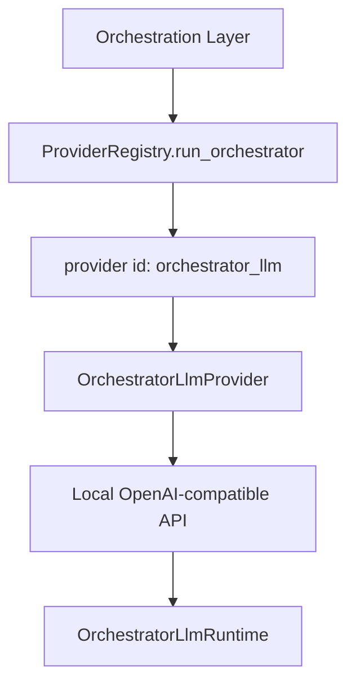

# Design: Orchestrator LLM

## Overview

Orchestrator LLM is the local model-runtime layer used for **orchestrator-specific reasoning needs** such as classification, workflow synthesis support, and local fallback reasoning. Its purpose is to treat “the local reasoning resource used by the orchestrator” as one product boundary instead of hard-coding the system around one model name or one runtime engine.

## Design Intent

The current project does not treat all reasoning needs as one provider problem. In particular, the following workloads have different operational needs from user-facing agent providers:

- execution-mode classification
- workflow synthesis or hint expansion
- some local fallback reasoning

If those paths are handled only as ordinary provider calls, model names, ports, engine lifecycles, health checks, and model management leak across the codebase. The Orchestrator LLM design exists to keep that concern inside one explicit product boundary.

## Core Principles

### 1. Model names are configuration; the product boundary is the runtime

What the project owns is not one specific model. It owns the **local reasoning runtime used by the orchestrator**. The chosen model is configuration inside that runtime.

### 2. Provider invocation and runtime lifecycle are separate

The adapter that sends inference requests and the manager that starts, stops, and supervises the local engine are not the same responsibility.

### 3. The dashboard should see a runtime, not just a provider

The orchestrator model is not only an inference endpoint. It is an operational resource with start/stop/health/model-switch behavior. The UI and service layers should therefore expose a runtime-oriented model.

### 4. It can also serve as a local fallback axis

Orchestrator LLM is not only a classifier resource. In some paths it can also act as the final local fallback provider.

## Adopted Structure

The key property is that the provider and the runtime are not the same object.

## Main Components

### OrchestratorLlmProvider

The provider performs the actual inference call. It is the adapter layer for OpenAI-compatible chat-style invocation.

### OrchestratorLlmRuntime

The runtime owns local engine lifecycle and model management. Its job is to keep process or container control out of inference-call code.

### Service / Dashboard Adapter

Service and dashboard layers expose the runtime through adapter-style operations rather than by leaking raw runtime internals. This allows the UI to manage a local reasoning runtime as a product resource.

## Runtime Boundary

The runtime boundary typically includes responsibilities such as:

- engine discovery and selection
- start and stop
- health checks
- model warm-up
- installed-model listing
- pull / delete / switch operations

So the orchestrator LLM is not just an endpoint. It is a **local reasoning infrastructure resource**.

## Engine Model

The current structure does not force one deployment mode. The local engine may run natively, in containers, or through an auto-detected mode.

The architectural point is not to choose one engine forever, but to preserve these boundaries:

- callers do not know engine details
- the runtime manager absorbs engine differences
- configuration may vary without changing the product boundary

## Relationship to Provider Registry

ProviderRegistry treats `orchestrator_llm` as one provider id, but it is not equivalent to a normal third-party API provider. In the current project it serves two roles:

- the local reasoning provider for orchestrator behavior
- a local fallback provider for some execution paths

That makes it more than a plain integration entry. It is a local reasoning axis that can live inside the system itself.

## Non-goals

This document does not define:

- preferred model lists
- deployment instructions for each engine
- role/prompt policy layers
- hosted observability or external model-registry integration

Those belong in implementation code or `docs/*/design/improved`.

## Related Documents

- [Execute Dispatcher Design](./execute-dispatcher.md)
- [Role / Protocol Architecture Design](./role-protocol-architecture.md)
