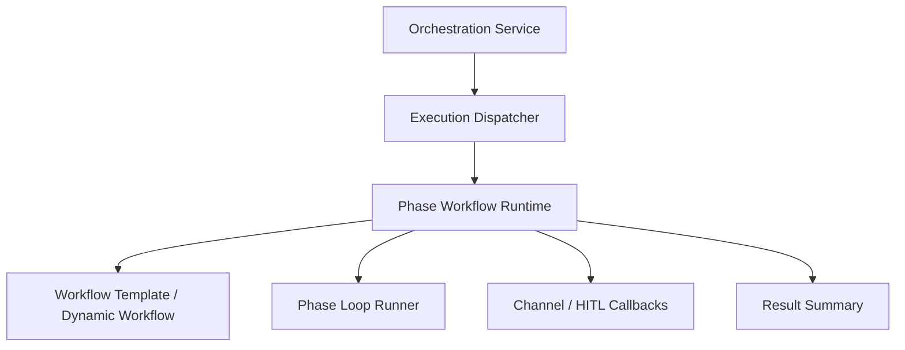

# Design: Phase Workflow Runtime Boundary

## Overview

The Phase Workflow Runtime Boundary defines the separation that keeps phase-workflow execution as a **dedicated runtime module** instead of leaving it embedded inside the service façade.

The purpose of this document is to explain where phase-workflow execution lives in the current architecture and how it relates to the orchestration service.

## Design Intent

The phase-workflow path is not a minor helper. It coordinates several responsibilities together:

- template-backed workflow loading
- dynamic workflow generation
- phase-by-phase runner orchestration
- channel and HITL callback wiring
- phase summary and result assembly

If those responsibilities stay inside the service façade, the boundaries between execution modes become blurry and the change surface grows. The current architecture therefore keeps phase workflow orchestration in a dedicated execution module.

## Core Principles

### 1. The service is a façade; phase workflow is a runtime module

The orchestration service remains the external façade that accepts requests and delegates to execution paths. The actual organization of phase workflows belongs to a dedicated runtime module.

### 2. Phase workflow operates on an explicit dependency bundle

The phase runtime receives providers, runtime objects, stores, buses, HITL rendering, and node-execution collaborators as an explicit dependency set instead of reaching through service internals everywhere.

### 3. Phase workflow is one execution mode with its own internal structure

It sits on the same dispatcher axis as `once`, `agent`, and `task`, but internally it behaves like a structured graph/phase runtime rather than a simple loop.

### 4. Channel and HITL wiring is solved inside the runtime boundary

Because phase workflows can include interaction nodes and waiting states, channel send/ask capabilities are handled inside the phase runtime through injected callbacks.

## Adopted Structure

## Relationship to the Service Layer

The orchestration service does not implement phase workflow behavior directly. Its role is to build the dependency bundle and preserve the public execution contract.

That means the service layer is responsible for:

- receiving the request
- choosing the execution path
- assembling the dependency bundle
- receiving the result and preserving outer contracts

The phase runtime is responsible for:

- workflow template interpretation
- dynamic workflow generation
- phase progression
- phase-level interaction wiring
- final result summarization

## Dependency Bundle

Phase workflow requires a broad set of collaborators. The important design choice is that they are passed explicitly into the runtime boundary instead of remaining hidden in service-local state.

Representative collaborators include:

- providers and runtime
- workspace context
- workflow store, subagent registry, and message bus
- HITL store and renderer
- node-execution collaborators
- auxiliary services such as decision or promise services

This makes the phase runtime easier to test and maintain independently.

## Relationship to Dynamic Workflow Generation

The phase-workflow path is not limited to static templates. The current design also allows workflow hints and node-category context to synthesize dynamic workflows inside the same runtime boundary.

Template-backed execution and dynamic synthesis are different features, but they run on the same phase-runtime model.

## Relationship to HITL and Channels

Because phase workflows may include interaction nodes, the runtime needs direct access to channel-send and response-wait behavior. Those capabilities are injected as callbacks inside the runtime boundary.

This gives the architecture three benefits:

- the runtime does not own concrete channel-service implementation details
- the service façade does not absorb interaction-specific workflow logic
- the workflow/HITL boundary stays explicit

## Non-goals

This document does not define:

- before/after diff reports for a refactor phase
- test counts or pass logs
- extraction rollout reports
- migration sequencing

Those belong in implementation code or `docs/*/design/improved`.

## Related Documents

- [Phase Loop Design](./phase-loop.md)
- [Interaction Nodes Design](./interaction-nodes.md)
- [Loop Continuity + HITL Design](./loop-continuity-hitl.md)
