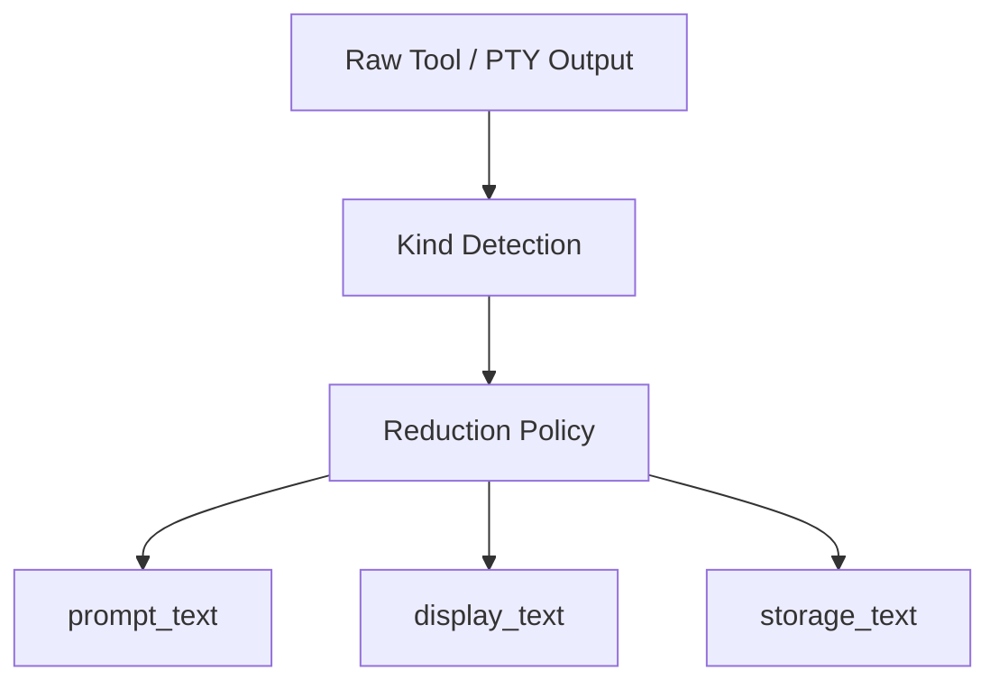

# Design: Provider-Neutral Output Reduction

## Overview

Provider-Neutral Output Reduction is the design that ensures large outputs are reduced under **the same internal rules regardless of which provider or backend produced them**. Its purpose is to stop treating raw output as one string that flows everywhere unchanged and instead produce purpose-specific projections.

## Design Intent

The current project has several execution paths:

- native tool loops
- PTY / headless agents
- one-shot execution
- workflow and event logging

If truncation happens only inside specific provider adapters, consistency breaks down. Some paths over-trim, while others leak raw output directly into prompts or memory. For that reason, reduction must happen at an **internal normalization boundary**, not at provider wire boundaries.

## Core Principles

### 1. Reduction must be provider-neutral

Provider differences such as `claude`, `codex`, `openrouter`, or `orchestrator_llm` are not the primary dimension. The main dimension is what kind of output the system is handling.

### 2. One raw output becomes multiple projections

The next stage does not always need the same representation.

- text for the next LLM turn
- text for user-facing display
- text for memory or event storage

So reduction is not only truncation. It is projection design.

### 3. Reduction should preserve meaning

Shell output, test output, JSON, diffs, and logs should not be reduced by the same rule. The goal is to preserve what matters for the next consumer.

### 4. It must fail safely

Kind detection does not need to be perfect, but the system must degrade into a safe general reduction path instead of breaking.

## Adopted Structure

The key property is that reduction sits after provider-specific transport handling and before prompt, display, and storage consumers.

## Main Components

### Tool Output Reducer

Tool execution results are classified by kind and then split into projection-specific text. This prevents raw tool output from flowing straight into prompts or user surfaces.

### PTY Output Reducer

PTY-backed execution can generate long streaming output that behaves differently from one-shot tool results. The PTY reducer prevents that stream from overwhelming user display and memory paths.

### Memory Ingestion Reducer

Memory storage has different goals from display. For that reason, memory ingestion uses its own reduction boundary focused on retrieval quality and noise control.

### Output Reduction KPI

The current architecture also tracks reduction effects through KPI-like instrumentation. That reinforces the idea that reduction is not a convenience helper, but an operational policy around budget and signal quality.

## Projection Model

The important design point is that a raw output is not treated as one final result string. Three projection shapes matter in particular:

- `prompt_text`
- `display_text`
- `storage_text`

That separation allows the same output to flow:

- into the LLM as a shorter, higher-signal summary
- into the UI as something more readable
- into storage as something friendlier to retrieval

## Kind-aware Reduction

Reduction is not solved by generic truncation alone. Different output kinds preserve value differently.

For example:

- shell / exec: errors and tail sections
- test output: failure summary and representative lines
- JSON: important fields
- diff: representative files and change counts
- logs: error counts and recent windows

So reduction is both length control and meaning selection.

## Relationship to Memory and Observability

Output reduction is not only about prompt savings. It directly affects what gets stored into memory and how noisy later retrieval becomes. At the same time, KPI-style observation helps the system measure how much budget is actually being saved.

This makes output reduction both a cost-control mechanism and a retrieval-quality protection layer.

## Non-goals

This document does not define:

- provider wire protocol details
- real-time summarization of every assistant chunk
- direct reduction of audit documents or verdict artifacts
- implementation-status reporting

Those belong in implementation code or `docs/*/design/improved`.

## Related Documents

- [PTY Agent Backend Design](./pty-agent-backend.md)
- [Memory Search Design](./memory-search-upgrade.md)
