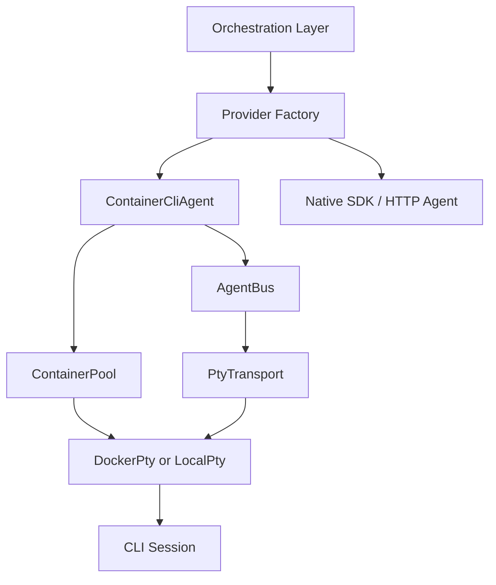

# Design: PTY Agent Backend

## Overview

The PTY agent backend is the execution layer that treats CLI-based agents as **conversational sessions** instead of one-shot process invocations. Its job is to hide long-running execution, follow-up input injection, session continuity, and local-versus-container transport details from the orchestration layer.

This document explains the role and boundaries of the PTY layer in the current project. Migration steps and work sequencing belong in `docs/*/design/improved`.

## Design Intent

The PTY path exists to solve a specific set of problems.

- Keep CLI agents alive across multiple turns.
- Allow new input to be injected into an already running agent.
- Support local development and container-isolated execution under the same abstraction.
- Give channels, tasks, and subagents the same session model.

This does **not** mean that every agent runs through PTY. In the current architecture, PTY is one backend strategy for cases that need persistent CLI execution, alongside native SDK and HTTP-based backends.

## Core Principles

### 1. Upper layers do not know the transport

The orchestration layer does not deal with Docker attach, local PTYs, or raw process stdio directly. It sees session keys, input injection, output events, and exit events.

### 2. Sessions outlive processes

The unit of continuity is the `session_key`, not the OS PID or container ID. A process may be recreated while the upper layer still treats the run as the same execution session.

### 3. Communication and lifecycle are separate concerns

Message routing belongs to `AgentBus`. Provisioning, cleanup, and recovery belong to `ContainerPool`. One component should not own both transport semantics and infrastructure lifecycle.

### 4. PTY is a backend strategy, not an execution mode

Execution modes such as `once`, `agent`, `task`, and `phase` are not the same axis as PTY selection. A plan may choose any of those modes, and the concrete backend that executes it may or may not be PTY-based.

## Adopted Structure

In this structure, `ProviderFactory` resolves provider configuration into a concrete backend. When the PTY path is selected, `ContainerCliAgent` manages a long-lived CLI session.

## Main Components

### Provider Factory

The provider factory resolves provider configuration into a concrete agent backend. This is where the system decides whether a request should use a PTY-backed session or a native backend.

### ContainerCliAgent

ContainerCliAgent is the public surface of the PTY-backed CLI backend. To upper layers it still behaves like a normal agent backend, but internally it manages long-lived sessions and follow-up input injection.

Its responsibilities are:

- starting execution for a session key
- normalizing output events into standard results
- handling follow-up, steering, and collect semantics
- classifying runtime failures and attempting recovery

### AgentBus

AgentBus is the communication layer between sessions and agents. Patterns such as ask/reply, fire-and-forget, broadcast, and lane queues are modeled here.

Its purpose is to:

- serialize input for the same session
- inject follow-up messages safely into running sessions
- keep agent-to-agent communication transport-agnostic

### ContainerPool

ContainerPool ensures that a session key has a corresponding live execution instance. It reuses an existing one when possible, creates one when needed, and removes it when the instance exits or becomes idle.

Its purpose is to:

- lazily provision sessions
- clean up idle sessions
- reconnect or recreate sessions after restart

### PtyTransport / DockerPty / LocalPty

The transport layer is responsible for actual stdin/stdout wiring. The current structure places Docker-backed execution and local PTY execution under the same abstraction.

- `DockerPty`: isolated container-backed session
- `LocalPty`: equivalent local PTY execution for development

Upper layers do not need to know which one is active.

## Session Continuity

The most important design goal of the PTY backend is **continuity**.

- The same session receives multiple inputs over time.
- A running session can accept follow-up messages.
- Collected input can be flushed into the next turn when the current turn ends.
- Long-running flows and human-in-the-loop paths can build on the same session model.

For that reason, the PTY layer is not just a process launcher. It is part of the continuity foundation for loop execution and HITL.

## Security and Isolation

The PTY backend supports both local and isolated execution, but isolated execution follows a consistent model.

- Execution stays inside workspace boundaries.
- Network, filesystem, and resource permissions are constrained at the backend-strategy level.
- The orchestration layer does not depend directly on container-specific details.

The point of this document is not to list every container flag, but to make clear that **CLI isolation is part of backend selection**, not an accidental runtime detail.

## Non-goals

This document does not define:

- container image build procedures
- per-CLI command-line flags
- exact retry thresholds
- rollout stage or completion status

Those belong in implementation code or `docs/*/design/improved`.

## Related Documents

- [Phase Loop Design](./phase-loop.md)
- [Interactive Loop Design](./interactive-loop.md)
- [Container Code Runner Design](./container-code-runner.md)
