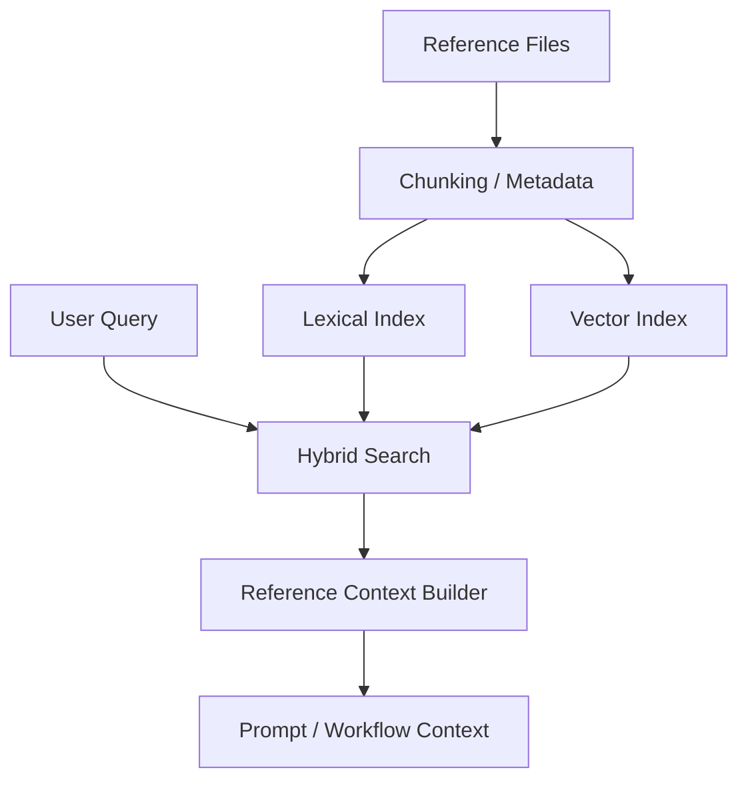

# Design: RAG Reference Store

## Overview

The RAG Reference Store is the **reference storage and retrieval layer** that supplies grounded material to user requests. Its purpose is to treat reference files inside the workspace as searchable context assets instead of passive attachments.

## Design Intent

The project should not dump entire long documents, references, or skill notes directly into prompts. It needs a retrieval layer that can answer:

- which references are relevant to the current request
- which chunks matter instead of the whole file
- how lexical and semantic search should cooperate

The RAG Reference Store exists as that common retrieval layer.

## Core Principles

### 1. References require both storage and retrieval

A file is not a useful reference asset just because it exists on disk. Searchability, chunking, metadata, and freshness all matter.

### 2. Retrieval should be hybrid

The current architecture combines lexical and vector search. One path is used for fast candidate generation, and the other path is used for semantic enrichment or reranking.

### 3. Context is built from relevant chunks, not whole documents

The job of RAG is not to “show the file.” It is to select relevant evidence and turn it into prompt or workflow context.

### 4. The same retrieval philosophy should support workspace and skill references

Workspace references are the primary focus today, but the design treats skill-bound references and richer ingestion formats as extensions of the same retrieval model.

## Adopted Structure

## Main Components

### Reference Store

The reference store watches or ingests reference files, persists document and chunk metadata, and acts as the storage base for hybrid retrieval.

### Chunk Model

Documents are stored as chunks. Chunks are the minimum retrieval unit, and they are also the unit used for actual context injection.

### Hybrid Retrieval

Hybrid retrieval combines lexical and vector paths. The lexical path narrows candidates quickly, and the vector path enriches or reranks them semantically.

### Context Builder

Search results are not surfaced raw. A context builder turns relevant chunks into prompt-ready or workflow-ready grounded context.

## Relationship to Document and Media Types

The current design is centered on text references, but the store is treated as an expandable ingestion layer rather than a text-only special case. The important architectural point is that even different media pipelines should converge on the same retrieval contract.

So the top-level concern is not whether one format is already supported. It is that richer sources should still feed one reference-retrieval model.

## Relationship to Skill References

Skills may carry their own reference material in addition to their skill body. The retrieval philosophy stays the same:

- do not inject the full reference set
- select only relevant chunks for the current request
- allow skill-aware and workspace-wide references to coexist

That makes the RAG Reference Store both a workspace reference layer and a foundation for skill-aware retrieval.

## Freshness and Synchronization

Reference retrieval is only trustworthy if the index and the actual file state stay aligned. For that reason, the reference store is not just an append-only cache. It must be able to realign chunk indices with file updates.

At the design level, freshness is not just a search-quality concern. It is a context-trust concern.

## Non-goals

This document does not define:

- extractor implementation for specific file formats
- embedding model comparisons
- exact rebuild-script usage
- phased implementation progress

Those belong in implementation code or `docs/*/design/improved`.

## Related Documents

- [Hybrid Vector Search Design](./hybrid-vector-search.md)
- [Memory Search Design](./memory-search-upgrade.md)
- [sqlite-vec Vector Store Design](./vector-store-sqlite-vec.md)
