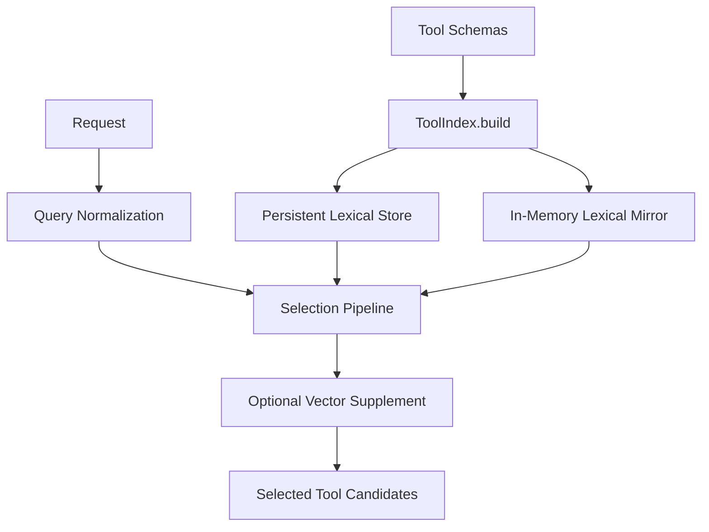

# Design: Tool Selection Lexical Foundation

## Overview

The Tool Selection Lexical Foundation is the lexical retrieval layer that narrows tool candidates **before** full execution instead of exposing the entire tool surface to the model on every request. Although the filename includes `fts5`, the current architecture is not just FTS5 alone. It combines a **persistent lexical store, an in-memory lexical mirror, and optional vector supplementation**.

## Design Intent

If tool selection is treated only as a prompt-engineering problem, several issues appear:

- every request tends to carry the full tool schema set
- token cost and execution budget grow quickly
- mixed Korean/English requests perform poorly on direct tool-name matching
- different execution modes end up seeing the same undifferentiated tool surface

For that reason, the current project treats tool selection not as “let the model choose from everything,” but as an **execution-time candidate-narrowing problem**.

## Core Principles

### 1. Tool selection is a retrieval layer

The first job of tool selection is not to make the final execution decision. It is to shrink the candidate set that the model and runtime need to reason about.

### 2. Lexical search is primary; vectors are supplementary

Vector search does not replace the lexical foundation. The lexical path performs primary candidate generation, and vectors open only as a semantic support path.

### 3. Persistent storage and runtime mirrors are used together

Searchable tool documents are persisted, but request-time selection prefers a faster in-memory lexical mirror built from that source.

### 4. Query normalization must support multilingual usage

Direct tool-name matching is not enough. Korean keyword expansion, identifier splitting, and stop-word removal all belong to the same lexical policy.

## Adopted Structure

## Main Components

### ToolIndex

ToolIndex is the center of the current tool-selection layer. It reads tool metadata, maintains the lexical backing store, and prepares the runtime mirror used for fast selection.

### Persistent Lexical Store

The persistent store holds the source search documents for tools. That includes names, descriptions, categories, action-derived tags, and content hashes.

Its purposes are:

- preserve the durable tool-search corpus
- keep lexical policy aligned with the storage layer
- provide stable rows that can be associated with optional vector entries

In that sense, FTS5 is the storage form of the lexical foundation, not the whole runtime selection algorithm.

### In-Memory Lexical Mirror

Request-time selection should not depend entirely on disk-backed search. The current structure therefore builds an in-memory lexical mirror from the stored tool corpus.

Typical contents include:

- token -> weighted tool map
- category -> tool list
- core tool set

Its purpose is fast candidate generation under low request-time overhead.

## Query Normalization

The lexical foundation does not search raw user text unchanged. It normalizes requests to improve retrieval quality.

Typical policies include:

- English tokenization
- stop-word removal
- identifier decomposition
- Korean keyword expansion

In particular, Korean requests can be expanded into English tool tags through rules such as `KO_KEYWORD_MAP`. That is a key part of multilingual lexical candidate generation.

## Selection Pipeline

The current tool-selection order is roughly:

1. guarantee core tools
2. apply classifier-explicit tools
3. run lexical search
4. use category fallback
5. apply optional vector supplementation

That order is intentional:

- essential tools are guaranteed first
- classifier intent is respected early
- lexical search provides most candidates
- category fallback handles lexical under-recall
- vector search supplements only when needed

So vector search is not the center of the system. It is the final support layer.

## Relationship to Execution Modes

The current architecture does not expose the same core tool set to every execution mode. Simple responses and multi-turn execution use different tool budgets.

- `once`: smaller minimal set
- `agent`, `task`: broader core set

This shows that tool selection is both a retrieval concern and part of execution-budget policy.

## Relationship to Hybrid Vector Search

`tool-selection-fts5` focuses on lexical foundations and candidate generation for tools. `hybrid-vector-search` is the broader retrieval concept used across memory, references, and other retrieval surfaces.

So this document is not about retrieval in general. It is about **the role of lexical retrieval in tool narrowing**.

## Non-goals

This document does not define:

- role / protocol prompt policy
- gateway routing rules
- tool execution logic itself
- session reuse freshness policy
- rollout of tokenizer improvements

Those belong in implementation code or `docs/*/design/improved`.

## Related Documents

- [Hybrid Vector Search Design](./hybrid-vector-search.md)
- [Provider-Neutral Output Reduction Design](./provider-neutral-output-reduction.md)
