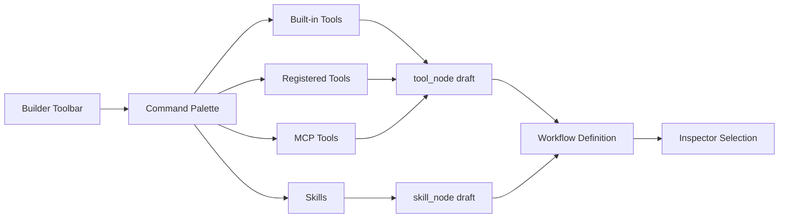

# Design: Workflow Builder Command Palette

## Overview

The Workflow Builder Command Palette is the search-driven insertion surface for **tool nodes and skill nodes** inside the workflow builder. Its purpose is to simplify canvas authoring while giving the project a unified way to expose multiple tool sources through one selection interface.

This document explains the role and boundary of the current command palette. Rollout steps and work sequencing belong in `docs/*/design/improved`.

## Design Intent

The workflow builder needs a fast insertion path for several resource kinds:

- built-in tools
- registered tools
- MCP-provided tools
- skill-backed nodes

If each source is exposed through a separate UI, insertion becomes unnecessarily heavy. The current structure therefore uses **one searchable insertion surface** and converts the selected item into the workflow-native node shape.

## Core Principles

### 1. The palette is an insertion interface, not a catalog manager

Its job is not to manage the full lifecycle of tools. Its job is to quickly add the right node to the workflow currently being edited.

### 2. Tool sources are unified, but provenance is preserved

Users interact with one search surface, but results remain grouped by source such as built-in, registered, MCP, and skills.

### 3. Selection is converted into workflow-native structure

Choosing an item does not persist a raw string. It creates a `tool_node` or `skill_node` draft that can be attached to the current workflow definition.

### 4. It complements the builder instead of replacing it

The command palette does not replace the canvas, the inspector, or the node registry. It is the fast-add surface.

## Adopted Structure

## Input Data

The command palette reads from multiple sources while presenting one unified surface.

- tool inventory
- tool definitions
- MCP server availability and tool lists
- skill inventory

That data is used for search, grouping, and labeling.

## User Flow

The current palette flow is:

1. the user opens the add action in the builder
2. the palette shows a searchable list
3. the user selects an item
4. the item is converted into a `tool_node` or `skill_node` draft
5. the draft is attached to the appropriate place in the workflow
6. the inspector opens on the new node for editing

In other words, the palette is both a selection UI and a **draft-node generator**.

## Grouping and Search

The palette combines search with grouped provenance.

- built-in
- registered
- per-MCP-server groups
- skills

Search exists to navigate the whole insertion surface. Grouping exists to preserve where a capability came from.

## Position of MCP and Skills

MCP tools and skills are both insertable resources, but they are not the same kind of thing.

- MCP: capability exposed by an external server
- Skill: reusable task or template-like capability

The command palette presents them together without collapsing them into one data model.

## Relationship to the Canvas and Node Palette

The current builder has multiple add-entry points:

- canvas-based node insertion
- inspector-based editing
- command-palette-based quick insertion

The command palette focuses specifically on fast searchable insertion. Detailed parameter editing and graph placement remain the responsibility of the inspector and builder canvas.

## Non-goals

This document does not define:

- exact CSS structure
- detailed keyboard event handling
- icon-set or styling choices
- completion status or test scenario lists

Those belong in implementation code or `docs/*/design/improved`.

## Related Documents

- [Workflow Tool Design](./workflow-tool.md)
- [Node Registry Design](./node-registry.md)
- [Phase Loop Design](./phase-loop.md)
