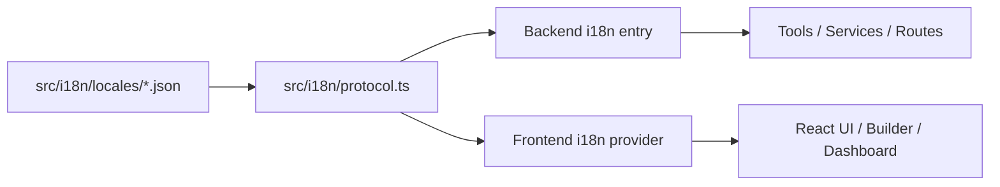

# 설계: 공유 i18n 프로토콜

## 개요

공유 i18n 프로토콜은 프론트엔드와 백엔드가 **같은 번역 키와 같은 해석 규칙**을 사용하도록 만드는 다국어 계층이다. 이 설계의 목적은 번역 데이터를 여러 코드 경로에 중복 보관하지 않고, UI와 시스템 메타데이터가 하나의 locale source 위에서 동작하게 하는 데 있다.

## 설계 의도

현재 프로젝트는 다음 종류의 텍스트를 함께 다룬다.

- 일반 UI 문자열
- 대시보드와 워크플로우 빌더 문구
- 도구 및 노드 설명 메타데이터
- 상태 라벨과 카테고리 이름

이 텍스트를 프론트엔드와 백엔드가 서로 다른 형식으로 따로 관리하면, 키 누락·번역 드리프트·도구 설명 중복이 쉽게 발생한다. 공유 i18n 프로토콜은 이를 막기 위한 공통 계층이다.

## 핵심 원칙

### 1. 번역 데이터는 공통 locale dictionary에 둔다

번역 원문은 계층별 하드코딩 문자열이 아니라 공통 locale dictionary에서 관리한다. 프론트엔드와 백엔드는 같은 키 집합을 읽는다.

### 2. 해석 규칙도 공유한다

단순히 JSON 파일만 공유하는 것이 아니라, 키 조회와 변수 치환 규칙까지 같은 프로토콜을 사용한다.

### 3. 메타데이터도 i18n 대상이다

버튼 텍스트만 다국어 대상이 아니다. 도구 설명, 노드 라벨, 카테고리 이름 같은 메타데이터도 번역 가능한 키로 다룬다.

### 4. locale 데이터와 런타임 정책을 분리한다

번역 데이터는 locale file에 있고, 현재 locale 선택과 `t()` 함수 노출은 각 런타임 계층이 맡는다.

## 현재 채택한 구조

## 주요 구성 요소

### Locale Dictionaries

locale dictionary는 실제 번역 문자열의 저장소다. 현재 구조는 언어별 JSON 사전을 기준점으로 사용한다.

### Shared Protocol

공유 프로토콜은 번역 키 조회, fallback, 변수 치환 같은 공통 동작을 정의한다. 프론트엔드와 백엔드는 서로 다른 구현을 두는 대신 같은 프로토콜을 재사용한다.

### Backend Entry

백엔드 진입점은 현재 locale에 맞는 translator를 제공한다. 이 계층은 도구 설명, 서버 응답 메타데이터, 워크플로우 관련 텍스트를 해석하는 데 사용된다.

### Frontend Provider

프론트엔드 provider는 React 계층에 locale 상태와 translator를 제공한다. UI는 이 provider를 통해 문자열을 가져오며, 공통 locale dictionary를 그대로 사용한다.

## 키 설계

현재 구조는 의미 단위의 네임스페이스 키를 사용한다. 핵심은 번역 키가 특정 화면 구현보다 **도메인 의미**를 기준으로 나뉘어야 한다는 점이다.

대표적인 범주는 다음과 같다.

- 공통 UI
- 내비게이션
- 워크플로우 빌더
- 도구 메타데이터
- 노드 메타데이터
- 카테고리 및 상태 라벨

즉 키는 “이 컴포넌트 안의 문자열”이 아니라 “이 개념을 어떤 언어로 표시할 것인가”를 표현한다.

## 도구 및 노드와의 관계

공유 i18n 프로토콜은 UI에만 머물지 않는다. 도구 정의와 노드 descriptor도 번역 키를 사용할 수 있어야 한다.

이 구조의 장점은 다음과 같다.

- 도구 설명이 UI와 서버에서 따로 드리프트하지 않는다.
- 노드 라벨과 스키마 설명을 빌더와 문서에서 같은 기준으로 다룰 수 있다.
- 새 언어 추가 시 descriptor 코드를 대규모로 다시 쓰지 않아도 된다.

## 자동 검증의 위치

i18n의 단일 source of truth를 유지하려면, 누락 키·고아 키·미번역 항목을 검사하는 자동화가 필요하다. 이 자동화는 프로토콜의 일부라기보다 **프로토콜을 지키는 운영 수단**이다.

즉 상위 설계에서 중요한 점은 “자동 검사 스크립트가 있다”보다 “공유 키 집합이 검증 가능한 구조여야 한다”이다.

## 비목표

이 문서는 다음 내용을 정의하지 않는다.

- 특정 locale 파일의 전체 키 목록
- 마이그레이션 단계
- 자동 생성 스크립트의 상세 CLI 사용법
- 완료 상태나 phase 진행률

그 내용은 구현 코드 또는 `docs/*/design/improved`에서 관리한다.

## 관련 문서

- [Node Registry 설계](./node-registry.md)
- [Workflow Builder Command Palette 설계](./workflow-builder-command-palette.md)
