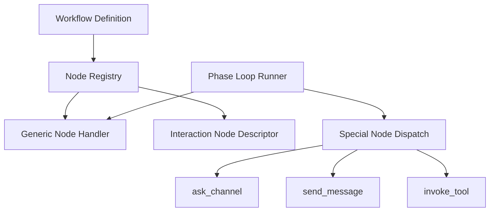

# 설계: Interaction Nodes

## 개요

Interaction Nodes는 일반적인 데이터 변환 노드만으로 표현하기 어려운 **사람 개입, 채널 응답, 실행 제어, 도구 브리지**를 워크플로우 그래프 안에 올리기 위한 노드 계층이다.

이 문서의 목적은 현재 프로젝트가 어떤 종류의 노드를 “상호작용 노드”로 보고, 왜 일부 노드가 runner 레벨 실행을 요구하는지를 설명하는 데 있다.

## 설계 의도

워크플로우 엔진은 단순 계산 노드만으로 구성되지 않는다. 실제 운영 흐름에서는 다음 같은 단계가 필요하다.

- 사용자에게 질문을 보내고 답을 기다린다.
- 승인 또는 거절을 구조적으로 받는다.
- 폼 입력을 수집한다.
- 상황에 따라 알림이나 에스컬레이션을 보낸다.
- 특정 노드의 실패를 재시도한다.
- 여러 아이템을 병렬 또는 반복으로 처리한다.
- 동적으로 도구를 호출한다.

이런 노드는 메모리와 workspace만 받는 일반 executor context로는 충분히 표현되지 않는다. 그래서 현재 구조는 **일반 노드 실행**과 **runner-aware special node 실행**을 나누어 다룬다.

## 핵심 원칙

### 1. 상호작용은 노드로 모델링한다

사람 개입이나 채널 상호작용을 그래프 밖의 암묵적 이벤트로 두지 않고, 워크플로우 노드로 선언한다. 덕분에 설계, 저장, 관측, 재개가 모두 같은 그래프 모델 안에서 이뤄진다.

### 2. 노드 정의와 실행 컨텍스트는 분리한다

노드 정의는 registry에 등록되지만, 일부 노드의 실제 실행은 runner 레벨 콜백이 필요하다. 즉 registry와 special dispatch는 서로 다른 책임을 가진다.

### 3. 채널 I/O는 선택적 콜백으로 주입한다

phase runner는 `send_message`, `ask_channel`, `invoke_tool` 같은 콜백을 통해 상호작용 능력을 얻는다. 실행기는 채널 구현 세부사항을 직접 품지 않는다.

### 4. 사람 개입은 예외가 아니라 정상 상태다

HITL, approval, form 같은 단계는 실패나 인터럽트가 아니라 정상적인 워크플로우 상태 전이로 취급한다.

## 현재 채택한 구조

일반 노드는 generic executor 경로로 충분하지만, 상호작용 노드는 phase loop runner가 special dispatch를 통해 실행한다.

## 노드 범주

### Human-in-the-loop

사용자 또는 운영자의 응답을 직접 요구하는 노드다.

- HITL
- Approval
- Form

이 노드들은 질문 전송, 구조화된 응답 수집, 대기 상태 유지가 필요하다.

### Notification / Escalation

채널로 메시지를 보내지만 반드시 응답을 기다리지는 않는 노드다.

- Notify
- SendFile
- Escalation

이 노드들은 외부 채널로의 전달이 핵심이며, 필요하면 특정 조건에서만 발화한다.

### Control / Recovery

실행 순서를 바꾸거나 실패 처리 정책을 그래프 안에서 표현하는 노드다.

- Retry
- Batch
- Gate
- Assert
- Reconcile 계열

이 노드들은 단순 데이터 처리보다 실행 정책에 가깝다.

### Tool Bridge

동적으로 도구 호출을 위임하는 노드다.

- Tool Invoke

이 노드는 워크플로우 정의에서 도구를 직접 박아 넣지 않고, runner가 가진 tool invocation 능력을 통해 실행된다.

## Runner-aware Execution

상호작용 노드는 공통적으로 더 넓은 실행 컨텍스트를 요구한다.

- 채널 전송
- 채널 응답 대기
- 현재 run 상태 갱신
- 재시도와 백오프
- 병렬 실행
- 도구 호출 브리지

그래서 현재 구조는 다음 두 경로를 함께 가진다.

- generic node execution
- special node dispatch inside phase loop runner

이 분리는 “예외 처리”가 아니라 의도적인 계층 구분이다.

## 상태와 관측성

상호작용 노드는 실행 중 다음과 같은 상태를 만들어낸다.

- waiting_user_input
- waiting_approval
- retrying
- notifying
- escalated

이 상태는 워크플로우 런타임, SSE 이벤트, 재개 로직과 연결된다. 따라서 interaction nodes는 단순 UI 요소가 아니라 런타임 상태 모델의 일부다.

## 일반 노드와의 경계

다음과 같은 노드는 보통 interaction nodes로 보지 않는다.

- 순수 데이터 변환
- 템플릿 렌더링
- 정적 조건 분기
- 메모리 읽기/쓰기

즉 interaction nodes의 핵심 기준은 “사람, 채널, 실행 제어, 외부 tool bridge가 필요한가”이다.

## 비목표

이 문서는 다음 내용을 정의하지 않는다.

- 각 노드의 상세 파라미터 목록
- 개별 UI 컴포넌트 모양
- 재시도 횟수, 백오프 상수, 정족수 임계값
- 작업 상태 표나 구현 완료 판정

이런 내용은 구현 코드 또는 `docs/*/design/improved`에서 다룬다.

## 관련 문서

- [Node Registry 설계](./node-registry.md)
- [Loop Continuity + HITL 설계](./loop-continuity-hitl.md)
- [Phase Loop 설계](./phase-loop.md)
