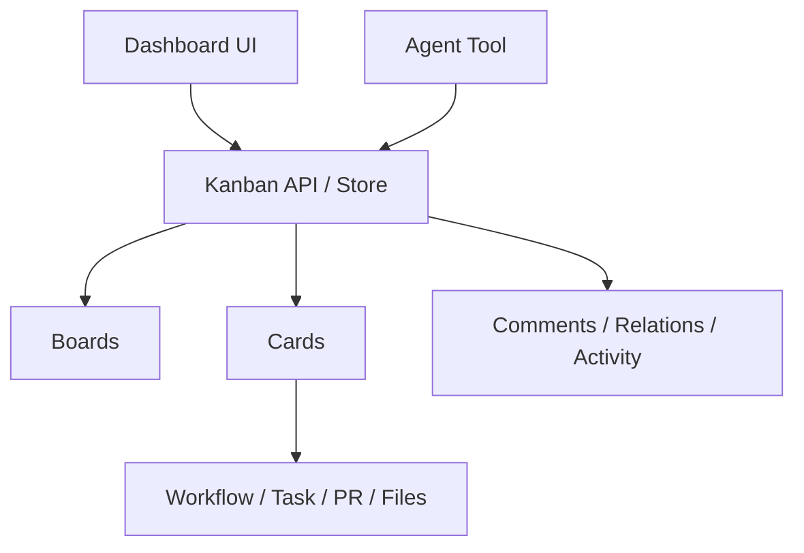

# 설계: 칸반 보드

## 개요

칸반 보드는 사람과 에이전트가 같은 작업 단위를 공유하기 위한 **지속형 작업 조정 계층**이다. 이 계층의 목적은 단순 실행 상태를 보여주는 것이 아니라, 계획, 분해, 배정, 피드백, 검토, 완료까지를 하나의 보드 모델 위에서 다루게 하는 데 있다.

칸반 보드는 `TaskState` 같은 런타임 실행 상태와는 별개의 개념이다. 실행 상태가 “지금 무엇이 돌고 있는가”를 표현한다면, 칸반 보드는 “무엇을 왜 해야 하고, 누가 책임지며, 어떤 맥락으로 이어지는가”를 표현한다.

## 설계 의도

멀티에이전트 실행과 사람 개입이 섞인 시스템에서는 실행 로그만으로는 충분하지 않다. 다음 요소가 함께 필요하다.

- 장기적인 작업 목록
- 작업 간 관계
- 역할별 책임과 피드백
- 카드 수준의 맥락 기록
- 사람과 에이전트가 함께 보는 상태판

칸반 보드는 이 요구를 런타임 밖의 외부 도구로 넘기지 않고, 프로젝트 자체의 운영 모델 안에 포함시키기 위한 설계다.

## 핵심 원칙

### 1. 보드는 실행 상태와 다른 계층이다

칸반 카드는 실제 실행 태스크와 연결될 수 있지만, 동일한 것은 아니다. 카드는 계획과 협업의 단위이고, 실행은 그 카드가 유발하는 하위 활동일 수 있다.

### 2. 사람과 에이전트가 같은 모델을 사용한다

대시보드 UI와 에이전트 도구가 같은 board/card/comment/relation 모델을 공유해야 한다. 한쪽 전용 데이터 모델을 두지 않는다.

### 3. 보드는 scope를 가진다

보드는 프로젝트 전체, 특정 워크플로우, 특정 채널, 특정 세션처럼 맥락을 가진다. 즉 칸반은 전역 보드 하나가 아니라 scope-bound coordination surface다.

### 4. 카드에는 맥락과 변경 이력이 쌓인다

카드는 제목만 가진 TODO 항목이 아니라, 설명, 코멘트, 관계, 메타데이터, 활동 기록을 담는 작업 문서다.

## 현재 채택한 구조

## 주요 구성 요소

### Board

보드는 작업 흐름의 상위 경계다. 컬럼 구성, scope, 기본 흐름, 자동화 규칙 같은 보드 수준 정책은 여기서 관리된다.

### Card

카드는 실제 작업 단위다. 제목, 설명, 우선순위, 라벨, 담당자, 메타데이터, 관련 실행 정보가 이 단위에 모인다.

### Comment / Activity / Relation

카드는 단독 객체가 아니라 협업 축을 함께 가진다.

- comment: 사람과 에이전트의 피드백
- activity: 카드의 변경 이력
- relation: blocked_by, related_to, parent/child 같은 구조적 연결

### Kanban Tool and Dashboard

칸반은 대시보드 UI에서만 다루는 기능이 아니라, 에이전트도 도구를 통해 생성·이동·업데이트·요약을 수행할 수 있다. 즉 칸반은 UI 기능이 아니라 운영 계층이다.

## Scope 모델

칸반 보드는 특정 범위에 묶인다. 이 범위는 실행 맥락과 결합되지만, 실행 엔진에 종속되지는 않는다.

대표적인 범위는 다음과 같다.

- workflow
- channel
- session
- project-like custom scope

이 구조는 같은 시스템 안에서도 서로 다른 보드를 병행할 수 있게 해준다.

## 자동화와 템플릿

칸반 보드는 단순 수동 게시판이 아니다. 현재 설계는 보드 자동화와 템플릿을 **보드의 확장 기능**으로 본다.

- 자동화 규칙: 상태 이동, 라벨 부여, 담당자 배정 같은 반복 규칙
- 템플릿: 반복 프로젝트에서 초기 컬럼/카드 구조를 빠르게 생성

즉 칸반은 정적 CRUD를 넘어서, 실행 워크플로우와 연결되는 운영 표면이다.

## 메트릭과 가시성

칸반은 카드의 현재 위치만 보여주는 것이 아니라, 활동 기반 메트릭을 계산할 수 있는 설계를 가진다.

예를 들면:

- 처리량
- cycle time
- review 체류 시간
- 정체 카드
- 컬럼 분포

이 메트릭은 칸반을 단순 UI가 아니라 운영 관측면으로 만든다.

## 런타임과의 관계

칸반 카드는 워크플로우, 태스크, PR, 파일 변경 같은 산출물과 연결될 수 있다. 그러나 칸반이 실행 엔진에 종속되지는 않는다. 연결은 느슨해야 하며, 카드가 실행 로그의 단순 파생물이 되어서는 안 된다.

이 경계 덕분에 칸반은 다음 역할을 동시에 수행할 수 있다.

- 실행 전 계획 도구
- 실행 중 협업 표면
- 실행 후 회고와 피드백 저장소

## 비목표

이 문서는 다음 내용을 정의하지 않는다.

- REST 엔드포인트 목록
- SQL 스키마 전체
- 단계별 구현 진행도
- 개별 기능의 rollout 순서

그 내용은 구현 코드 또는 `docs/*/design/improved`에서 다룬다.

## 관련 문서

- [Loop Continuity + HITL 설계](./loop-continuity-hitl.md)
- [Phase Loop 설계](./phase-loop.md)
