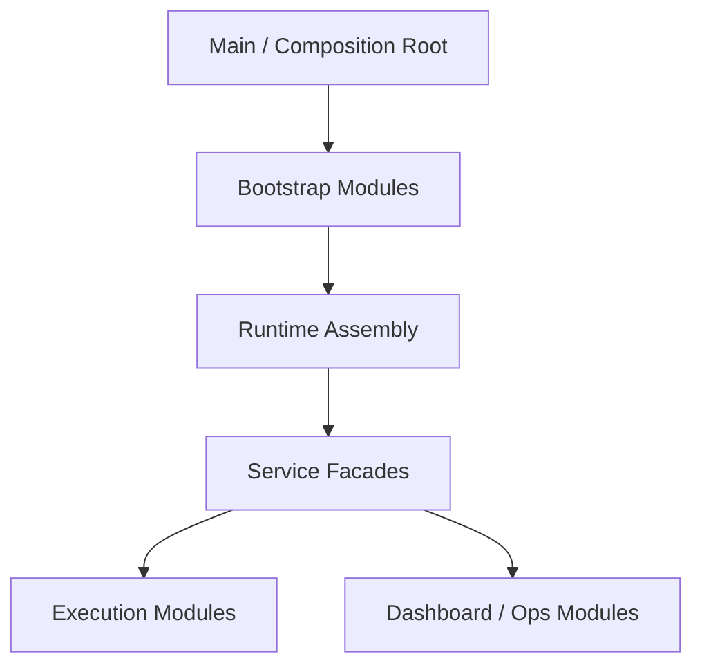

# 대형 파일 구조 분해 설계

## 개요

대형 파일 구조 분해는 “파일 줄 수를 줄인다”는 미관상의 목표가 아니라, **조립 경계와 실행 경계를 분리해 변경 취약점을 낮추는 구조 설계**다. 현재 프로젝트는 bootstrap, orchestration, dashboard, workflow 같은 복합 계층이 서로 얽혀 있기 때문에, 큰 파일 문제를 단순 분할이 아니라 아키텍처 경계 문제로 본다.

## 설계 의도

거대 파일이 문제인 이유는 길이 자체보다 다음 위험 때문이다.

- 초기화 순서와 부작용이 섞인다.
- 조립 코드와 비즈니스 정책이 한 파일에 공존한다.
- 실행 경로 하나를 바꾸면 다른 모드까지 영향을 받기 쉽다.
- 테스트 대상 경계가 흐려진다.

그래서 구조 분해의 목적은 “잘게 쪼개기”가 아니라, **책임 기준으로 조립 계층과 실행 계층을 분리하는 것**이다.

## 핵심 원칙

### 1. composition root는 얇아야 한다

최상위 엔트리 파일은 런타임 전체를 설명하는 곳이지, 개별 정책을 직접 품는 곳이 아니다. 구성, 초기화 순서, 종료 순서만 담당해야 한다.

### 2. bootstrap은 조립 계층이어야 한다

bootstrap 모듈은 새 비즈니스 레이어가 아니다. 이미 존재하는 서비스와 설정을 묶는 조립 계층이어야 한다.

### 3. 실행기는 분기와 정책을 분리해야 한다

요청 분기, preflight, once/agent/task/phase 실행, continuation 같은 경로는 하나의 거대 메서드보다 작은 실행 모듈로 나뉘어야 한다.

### 4. facade는 외부 계약을 지킨다

내부 구조가 분해되더라도 외부에서 보는 계약은 안정적으로 유지한다. 서비스 facade는 조립과 위임 중심으로 남고, 내부 구현은 전용 모듈로 이동한다.

## 현재 채택한 구조

이 구조에서 핵심은 큰 파일을 무조건 잘게 나누는 것이 아니라, **구성**, **운영 facade**, **실행 모듈**을 다른 계층으로 분리하는 데 있다.

## 분해 대상의 기준

현재 프로젝트에서 구조 분해 대상이 되는 대표 신호는 다음과 같다.

- 생성 순서와 사용 순서가 같은 파일에 섞여 있다.
- 서로 다른 실행 모드가 한 메서드에 함께 있다.
- 상태 보관과 상태 전이가 같은 파일에 섞여 있다.
- UI route 조립과 실제 ops 구현이 분리되지 않는다.

반대로 단순히 줄 수가 많다는 이유만으로 분해 대상을 만들지는 않는다.

## 주요 분해 축

### Bootstrap 분해

런타임 시작, 설정 로드, 서비스 조립, 종료 wiring 같은 항목은 bootstrap 계층으로 모은다. 이 계층은 실행 정책을 새로 만들지 않고, 이미 존재하는 구성 요소를 순서 있게 묶는다.

### Execution 분해

요청 preflight, 실행 모드 분기, once/agent/task/phase 실행, continuation 같은 경로는 전용 실행 모듈로 분리한다. 이렇게 하면 실행 정책을 독립적으로 테스트하고 변경할 수 있다.

### Ops / UI 조립 분해

dashboard나 workflow builder처럼 조립 지점이 많은 영역은 facade와 실제 구현을 나누어, 상위 계층이 구현 세부사항에 직접 묶이지 않게 한다.

## 유지해야 할 경계

구조 분해 후에도 다음 경계는 유지되어야 한다.

- bootstrap은 business rule을 갖지 않는다.
- execution 모듈은 composition root를 모른다.
- facade는 외부 계약을 유지하지만 내부 구현 세부사항을 노출하지 않는다.
- 구조 변경과 기능 변경은 가능한 한 같은 커밋에서 섞지 않는다.

## 비목표

이 문서는 다음 내용을 정의하지 않는다.

- 특정 분해 phase의 완료 보고
- 파일별 diff 통계
- 테스트 개수나 검증 로그
- 세부 마이그레이션 체크리스트

그 내용은 구현 코드 또는 `docs/*/design/improved`에서 관리한다.

## 관련 문서

- [Execute Dispatcher 설계](./execute-dispatcher.md)
- [Request Preflight 설계](./request-preflight.md)
- [Phase Loop 설계](./phase-loop.md)
