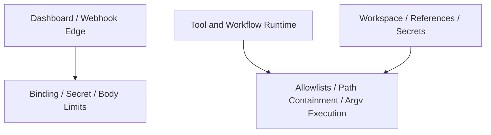

# 설계: Local-Binding Security Hardening

## 개요

Local-Binding Security Hardening은 대시보드와 웹훅, 도구 실행이 **로컬 우선 환경**에서 동작한다는 전제를 보안 경계로 끌어올리는 설계다. 핵심은 “로컬에만 열어 두면 안전하다”는 막연한 가정이 아니라, 로컬 바인딩이 줄여 주는 위험과 그렇지 않은 위험을 분리해서 다루는 것이다.

## 설계 의도

현재 프로젝트는 로컬에서 대시보드를 띄우고, 채널·웹훅·도구 실행이 같은 워크스페이스를 공유하는 사용 방식이 많다. 이 환경에서 중요한 질문은 두 가지다.

- 외부 노출을 줄이는 경계는 무엇인가
- 로컬 바인딩과 무관하게 막아야 하는 위험은 무엇인가

이 설계는 그 둘을 같은 “보안” 이름 아래 섞지 않고 구분하는 데 목적이 있다.

## 핵심 원칙

### 1. loopback은 노출 범위를 줄이지만 모든 위험을 없애지 않는다

로컬 바인딩은 원격 공격면을 줄이는 데 효과적이지만, 토큰 유출, 경로 탈출, 도구 인젝션 같은 문제를 해결하지는 않는다.

### 2. 엣지 보호와 내부 가드를 분리한다

호스트 바인딩, webhook secret, request body limit 같은 항목은 edge protection이다. outbound allowlist, path containment, argv 기반 실행 같은 항목은 내부 실행 가드다.

### 3. 기본값은 보수적이어야 한다

대시보드와 웹훅은 공개 배포를 전제로 두기보다, 로컬 우선 기본값과 명시적 opt-in 확장으로 다루는 것이 맞다.

### 4. 로컬 환경도 신뢰 경계 안쪽이 아니다

로컬 프로세스, 잘못된 프록시, 악성 스크립트, 같은 워크스페이스를 건드리는 자동화는 여전히 위험 요인이다. 따라서 로컬 실행이라고 해서 outbound·filesystem·tool execution 가드를 약하게 잡아서는 안 된다.

## 현재 채택한 보안 관점

현재 구조에서 보안은 단일 계층이 아니라 다음 두 축으로 본다.

- 외부 노출 축
- 내부 실행 축

## 외부 노출 축

외부 노출 축은 대시보드와 웹훅 진입점의 노출 범위를 줄이는 설계다.

대표 요소:

- 로컬 바인딩
- webhook secret
- 요청 크기 제한
- 공개 배포 시의 명시적 설정

이 축의 목적은 “누가 서버에 도달할 수 있는가”를 좁히는 것이다.

## 내부 실행 축

내부 실행 축은 이미 실행 권한이 있는 요청이 시스템 내부에서 얼마나 멀리 갈 수 있는지를 제한하는 설계다.

대표 요소:

- outbound host allowlist
- filesystem containment
- shell 대신 argv 기반 실행
- host key / secret handling policy

이 축의 목적은 “도달한 요청이 무엇을 할 수 있는가”를 줄이는 것이다.

## 웹훅과 대시보드의 위치

웹훅과 대시보드는 같은 HTTP 진입점이지만, 신뢰 모델은 다를 수 있다. 대시보드는 사용자 상호작용 표면이고, 웹훅은 외부 시스템의 push 진입점이므로 secret, binding, route guard가 더 명시적이어야 한다.

즉 local-binding 설계는 단순 host 설정이 아니라, **HTTP surface별 노출 모델 정리**를 포함한다.

## 도구 실행과의 관계

보안 hardening은 HTTP 엣지에서 끝나지 않는다. 도구 실행, OAuth fetch, 파일 업로드/삭제, SSH/Archive 같은 경로는 로컬 바인딩과 무관한 위험을 가진다.

따라서 local-binding security hardening은 다음 질문까지 포함해야 한다.

- 민감한 토큰이 임의 호스트로 나갈 수 있는가
- 파일 경로가 base dir 밖으로 탈출할 수 있는가
- shell expansion이 입력 경계를 무너뜨리는가

## 비목표

이 문서는 다음 내용을 정의하지 않는다.

- 취약점 우선순위 표
- 개별 수정 단위의 작업 목록
- 완료 판정
- 회귀 테스트 목록

그 내용은 구현 코드 또는 `docs/*/design/improved`에서 관리한다.

## 관련 문서

- [멀티테넌트 설계](./multi-tenant.md)
- [다중 환경 설정](./multi-environment-setup.md)
