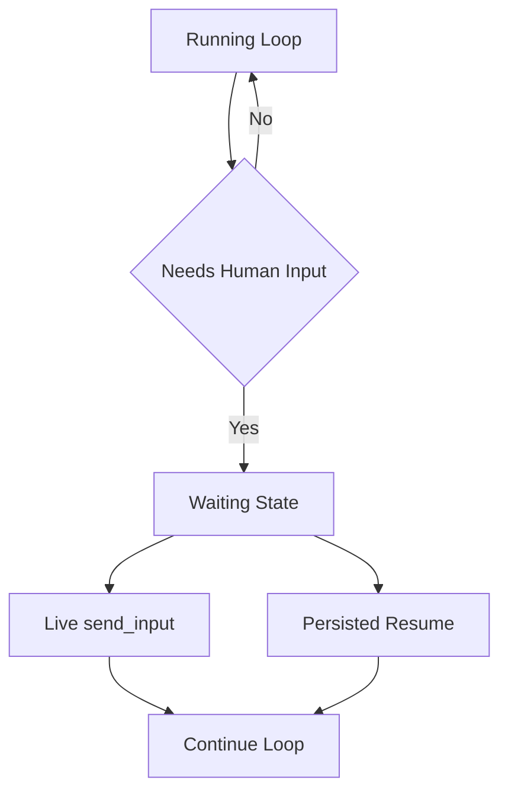

# 설계: Loop Continuity + HITL

## 개요

Loop Continuity + HITL 설계는 장시간 실행되는 태스크나 워크플로우가 **사용자 입력, 승인, 추가 지시**를 만났을 때도 중간 상태를 잃지 않고 이어질 수 있도록 하는 런타임 모델을 설명한다.

이 설계의 핵심은 “루프가 한 번 끝나면 모든 문맥이 사라진다”가 아니라, **실행은 대기 상태를 가질 수 있고 그 상태에서 다시 이어질 수 있다**는 점이다.

## 설계 의도

현재 프로젝트의 실행기는 다음 상황을 정상적인 운영 흐름으로 본다.

- 사용자에게 추가 정보를 묻는다.
- 승인 또는 거절을 기다린다.
- 외부 채널의 응답을 기다린다.
- 실행 중 새로운 follow-up 지시를 받는다.

따라서 HITL은 예외 복구가 아니라 **런타임의 정상 상태 전이**로 모델링되어야 한다.

## 핵심 원칙

### 1. 대기는 실패가 아니다

`waiting_user_input`, `waiting_approval` 같은 상태는 오류가 아니라 정상적인 런타임 상태다. 이 상태는 재시작·재개·SSE 표시와 연결되어야 한다.

### 2. 연속성의 기준은 run state다

프로세스나 특정 턴이 아니라, 현재 실행 중인 run state가 연속성의 기준이 된다. 입력은 run state를 다시 활성화하는 신호로 작동한다.

### 3. live input과 persisted resume을 모두 지원한다

이미 실행 중인 루프에 즉시 입력을 넣는 경로와, 대기 상태를 저장해 두었다가 나중에 다시 시작하는 경로는 서로 다른 수단이지만 같은 상태 모델 위에서 동작해야 한다.

### 4. clarification과 approval은 분리된 의미를 가진다

사용자 자유 응답과 구조화된 승인 응답은 같은 “입력”으로 보이더라도 다른 상태 전이 규칙을 가진다.

## 현재 채택한 구조

이 구조에서 핵심은 루프를 “한 번 실행 후 종료”로 보는 것이 아니라, **실행-대기-재개**를 같은 실행 생명주기의 일부로 보는 것이다.

## 주요 구성 요소

### Loop Service

Loop Service는 태스크 또는 루프 실행 상태를 다루는 서비스 계층이다. 실행 중인 루프에 대한 입력 주입, 상태 저장, 재개 정보 유지 같은 책임이 이 계층에 모인다.

### Task Resume Service

Task Resume Service는 이미 대기 상태로 전이한 실행을 다시 깨우는 역할을 한다. 채널 응답, 사용자 메시지, 승인 이벤트가 들어오면 적절한 run state와 연결한다.

### Channel Manager

Channel Manager는 외부 입력이 어느 실행과 연결되어야 하는지를 판별하는 진입점이다. 활성 실행이 있으면 live input 경로로, 저장된 대기 상태가 있으면 resume 경로로 연결한다.

### Execution Runners

`task`, `phase`, `workflow` 실행기는 대기 상태를 단순 예외가 아니라 정상 결과로 처리한다. 즉 runner는 “계속 실행”만이 아니라 “지금은 멈추고 이후 입력을 기다림”도 표현해야 한다.

## 입력 경로

### Live Input

실행이 아직 살아 있는 동안 follow-up 입력을 즉시 주입하는 경로다.

적합한 경우:

- 방향 수정
- 추가 조건 제시
- 빠른 clarification

### Persisted Resume

실행이 대기 상태로 저장된 후, 나중에 다시 활성화하는 경로다.

적합한 경우:

- 승인 대기
- 장시간 사용자 응답 대기
- 채널 응답 기반 재개

## 상태 모델

Loop continuity 문맥에서 중요한 상태는 다음과 같다.

- running
- waiting_user_input
- waiting_approval
- resumed
- completed
- aborted

이 상태는 단순 UI 표시에만 쓰이지 않는다. 입력 라우팅, 재개 로직, SSE 이벤트, 채널 처리의 기준이 된다.

## HITL과 Workflow의 관계

HITL은 특정 노드의 부가기능이 아니라, workflow runtime이 가진 능력이다. 일부 interaction node는 그 능력을 사용해 질문과 응답을 그래프 안에 올린다.

따라서 loop continuity 설계는 다음 요소와 연결된다.

- interaction nodes
- phase loop runner
- task loop continuation
- channel-bound execution

## 비목표

이 문서는 다음 내용을 정의하지 않는다.

- 특정 버그 수정 회고
- 과거 조기 종료 현상 분석 기록
- 개별 구현 단계의 완료 상태
- 큐 깊이, 타임아웃 값 같은 운영 상수

그 내용은 구현 코드 또는 `docs/*/design/improved`의 세부 작업 문서에서 다룬다.

## 관련 문서

- [Interaction Nodes 설계](./interaction-nodes.md)
- [Interactive Loop 설계](./interactive-loop.md)
- [Phase Loop 설계](./phase-loop.md)
