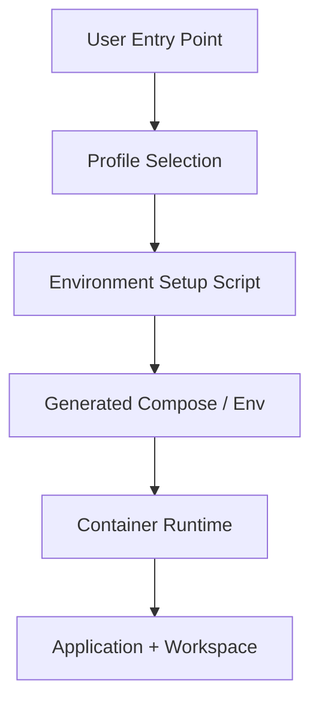

# 설계: 다중 환경 설정

## 개요

다중 환경 설정은 프로젝트를 개발, 테스트, 검증, 운영 같은 서로 다른 실행 프로필로 분리해 다루기 위한 운영 설계다. 이 설계의 목적은 사용자가 복잡한 로컬 도구 체인을 직접 조립하지 않고도, **같은 인터페이스로 서로 다른 격리 환경**을 다룰 수 있게 만드는 데 있다.

## 설계 의도

현재 프로젝트는 로컬 개발 환경, 테스트 환경, 검증 환경, 운영 환경이 서로 다른 포트·워크스페이스·서비스 조합을 가질 수 있다. 이 차이를 사용자가 직접 compose 파일과 환경 변수를 손으로 맞추게 하면 다음 문제가 생긴다.

- 실행 진입점이 플랫폼마다 달라진다.
- 같은 머신에서 여러 환경이 충돌하기 쉽다.
- 사용자가 Node/npm/Docker 내부 빌드 순서를 알아야 한다.
- 환경 차이가 문서에만 남고 실제 구성이 표준화되지 않는다.

다중 환경 설정은 이 문제를 **프로필 기반 실행**으로 정리한다.

## 핵심 원칙

### 1. 환경은 프로필로 선택한다

환경 차이는 개별 명령 조합이 아니라 명시적인 profile로 모델링한다. 사용자는 profile을 선택하고, 시스템은 그에 맞는 실행 구성을 조립한다.

### 2. 진입점은 플랫폼별로 다르더라도 의미는 같아야 한다

Make, batch, PowerShell 같은 진입점은 플랫폼 차이를 흡수하는 얇은 래퍼여야 한다. “dev를 실행한다”, “test를 내린다” 같은 의미는 동일해야 한다.

### 3. 환경 조립은 컨테이너 우선이다

로컬 의존성 설치 절차를 사용자에게 떠넘기기보다, 실행 환경 자체를 컨테이너 조립으로 관리한다. 이 설계는 특히 사용자 중심 배포 경험을 위해 중요하다.

### 4. 워크스페이스와 포트 충돌은 프로필 계층에서 해결한다

환경이 다르면 데이터 경로, 포트, 프로젝트 이름도 분리되어야 한다. 격리는 애플리케이션 시작 후가 아니라 환경 조립 단계에서 결정된다.

## 현재 채택한 구조

## 주요 구성 요소

### Entry Scripts

플랫폼별 진입 스크립트는 사용자가 환경을 여는 가장 얇은 표면이다. 이 계층의 역할은 셸 차이를 감추고, profile 기반 실행을 같은 의미로 노출하는 데 있다.

### Environment Setup

환경 설정 생성기는 profile을 실제 실행 구성으로 바꾼다. 포트, workspace, Docker project 이름, 환경 변수, 생성 파일 위치 등이 이 단계에서 결정된다.

### Generated Runtime Configuration

생성된 compose 파일과 env 파일은 특정 profile의 실행 산출물이다. 즉 손으로 유지하는 설정보다, 선택된 profile의 결과로 보는 것이 현재 구조에 맞다.

### Workspace Isolation

환경별 workspace 분리는 단순 편의 기능이 아니라 데이터 격리 경계다. profile 차이와 사용자 차이는 여기에서 실제 파일시스템/컨테이너 경계로 반영된다.

## 환경 프로필

프로필은 일반적으로 다음 차이를 담는다.

- 포트
- workspace 경로
- 빌드/런타임 성격
- 부가 서비스 구성

중요한 점은 profile이 단순 label이 아니라, 서로 충돌하지 않는 실행 조합의 이름이라는 것이다.

## 사용자 경험 관점

이 설계는 운영자보다 소비자에 가까운 사용자를 전제한다. 따라서 사용자는 다음 정도만 알면 된다.

- 어떤 profile을 열 것인지
- 어떻게 시작하고 내릴 것인지
- 어느 주소로 접속하는지

반대로 내부 빌드 순서, node_modules 관리, compose 세부 문법은 상위 사용자 문서와 실행 스크립트가 숨기는 것이 맞다.

## 보안과 격리의 관계

다중 환경 설정은 개발 편의 기능이면서 동시에 격리 계층이다. profile이 다르면 다음 경계도 달라질 수 있다.

- 네트워크 노출 범위
- 데이터 볼륨
- 워크스페이스 루트
- 포트 바인딩

즉 환경 설정은 단순 배포 스크립트가 아니라, 런타임 격리 모델의 일부다.

## 비목표

이 문서는 다음 내용을 정의하지 않는다.

- 개별 셸 스크립트의 전체 사용법
- Dockerfile 상세 빌드 단계
- 특정 profile rollout 상태
- 완료/부분 완료 같은 진행 표기

그 내용은 구현 코드 또는 `docs/*/design/improved`에서 다룬다.

## 관련 문서

- [PTY 에이전트 백엔드 설계](./pty-agent-backend.md)
- [멀티테넌트 설계](./multi-tenant.md)
