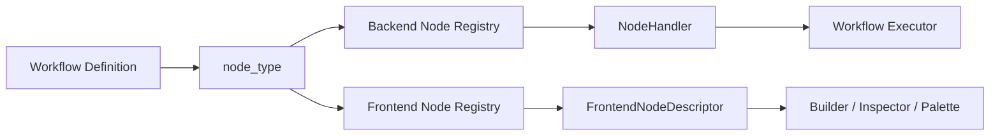

# 설계: Node Registry

## 개요

Node Registry는 워크플로우 노드 체계의 공통 등록 계층이다. 이 계층의 목적은 노드 타입을 코드 곳곳의 switch 문과 상수 집합에 흩뿌리는 대신, **하나의 등록 체계**로 모으는 데 있다.

현재 프로젝트는 백엔드 실행기와 프론트엔드 빌더가 같은 `node_type` 개념을 공유한다. 다만 두 계층은 같은 객체를 공유하지 않고, 각자의 책임에 맞는 descriptor를 가진다.

## 설계 의도

Node Registry는 다음 문제를 해결하기 위해 존재한다.

- 새 노드 타입 추가 시 수정 지점을 최소화한다.
- 실행기와 빌더가 같은 노드 의미를 서로 다른 방식으로 표현할 수 있게 한다.
- 노드 메타데이터를 데이터 기반으로 조회하게 만들어, UI와 실행 로직에서 분기 코드가 증식하지 않게 한다.
- 노드 정의를 “타입 이름”이 아니라 “계약과 descriptor” 단위로 관리한다.

## 핵심 원칙

### 1. 백엔드와 프론트엔드는 같은 `node_type`를 공유한다

동일한 워크플로우 정의는 서버와 클라이언트에서 같은 타입 이름으로 식별된다. 이것이 노드 의미의 공통 기준점이다.

### 2. descriptor는 계층별로 나뉜다

백엔드는 실행 계약이 필요하고, 프론트엔드는 편집 계약이 필요하다. 그래서 같은 노드라도 descriptor가 서로 다르다.

- 백엔드: 실행 핸들러, 입출력 스키마, 기본값
- 프론트엔드: 아이콘, 색상, 도구막대 레이블, 편집 패널, 기본값

### 3. 등록은 확장 지점이어야 한다

새 노드 추가는 기존 거대 switch를 수정하는 작업이 아니라, 새 descriptor를 추가하고 registry에 등록하는 작업이어야 한다.

### 4. registry는 의미를 설명하고, executor는 실행만 한다

Registry는 노드의 정체성을 제공한다. 실제 실행 순서, phase 평가, 상태 전파는 실행기 계층이 담당한다.

## 현재 채택한 구조

## 백엔드 레지스트리

백엔드 레지스트리는 `node_type`를 실행 가능한 핸들러로 해석한다. 각 핸들러는 다음과 같은 성격의 정보를 가진다.

- 실행 함수
- 테스트 또는 검증 함수
- 입력 스키마
- 출력 스키마
- 기본 파라미터 생성기

이 계층의 목적은 “이 노드를 실행하려면 어떤 코드가 필요한가”를 표현하는 것이다.

## 프론트엔드 레지스트리

프론트엔드 레지스트리는 같은 `node_type`를 빌더 친화적인 descriptor로 해석한다. 이 descriptor는 다음과 같은 성격의 정보를 가진다.

- 아이콘
- 색상과 shape
- 툴바 또는 팔레트 레이블
- 편집 패널 컴포넌트
- 기본 파라미터 생성기

이 계층의 목적은 “이 노드를 사용자에게 어떻게 보여주고 편집하게 할 것인가”를 표현하는 것이다.

## 등록 모델

현재 구조는 registry API와 descriptor 파일을 분리한다.

- registry 파일은 등록과 조회만 담당한다.
- 각 노드 파일은 자기 descriptor를 export 한다.
- index/barrel 파일은 descriptor를 한 번에 등록하는 조립 지점이다.

이 구조 덕분에 노드 추가는 다음 흐름으로 정리된다.

1. 백엔드 핸들러 정의
2. 프론트엔드 descriptor 정의
3. 각 계층의 barrel 등록
4. 공통 `node_type` 사용

## Node Registry와 다른 설계 요소의 관계

### Workflow Executor

실행기는 registry를 통해 핸들러를 찾는다. registry는 실행 순서를 제어하지 않으며, phase 실행기나 loop runner가 registry 결과를 사용한다.

### Node Palette / Builder

빌더는 frontend registry를 통해 노드 목록, 시각 표현, 편집 패널을 구성한다. 즉 palette와 inspector는 registry 위에서 동작한다.

### Interaction / Special Nodes

일부 노드는 runner 레벨 컨텍스트가 필요하다. 이 경우에도 registry는 타입과 메타데이터를 제공하고, 실제 특수 실행 분기는 phase loop runner가 맡는다. 따라서 registry와 runner special dispatch는 서로 대체 관계가 아니라 보완 관계다.

## 비목표

이 문서는 다음 내용을 정의하지 않는다.

- 개별 노드의 세부 비즈니스 로직
- phase runner의 재시도·중단 정책
- 노드 추가 절차의 작업 분류
- 완료 상태나 구현 현황 표

그런 내용은 구현 코드 또는 `docs/*/design/improved`에서 관리한다.

## 관련 문서

- [Interaction Nodes 설계](./interaction-nodes.md)
- [Workflow Tool 설계](./workflow-tool.md)
- [Workflow Builder Command Palette 설계](./workflow-builder-command-palette.md)
