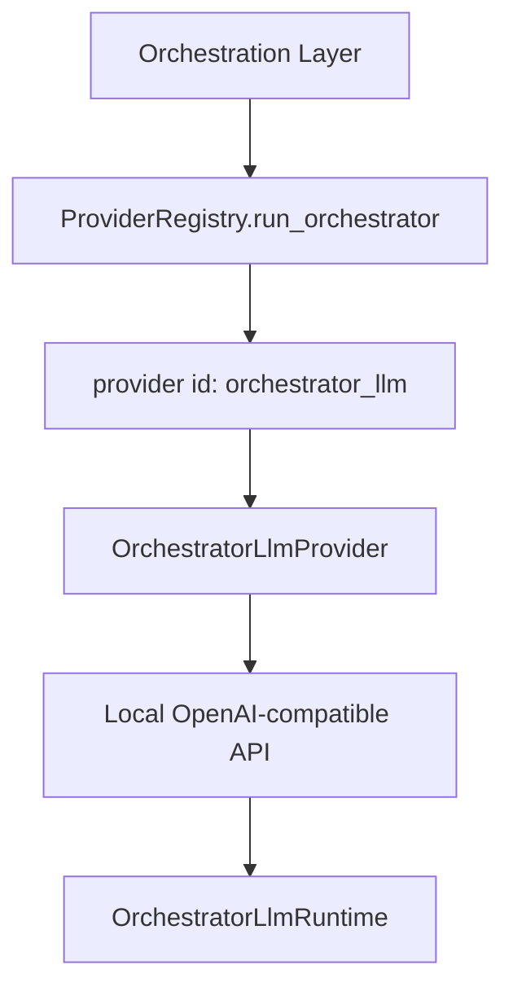

# 설계: Orchestrator LLM

## 개요

Orchestrator LLM은 분류기, 워크플로우 생성 보조, fallback 추론 같은 **오케스트레이터 전용 추론 수요**를 위해 존재하는 로컬 모델 런타임 계층이다. 이 설계의 목적은 특정 모델명이나 특정 실행 엔진을 제품 개념으로 고정하지 않고, “오케스트레이터가 사용하는 로컬 추론 자원”을 하나의 경계로 다루는 데 있다.

## 설계 의도

현재 프로젝트는 모든 추론을 동일한 provider로 처리하지 않는다. 특히 다음 종류의 작업은 일반 사용자-facing agent provider와 다른 요구를 가진다.

- execution mode 분류
- workflow synthesis 또는 hint expansion
- 일부 로컬 fallback reasoning

이 경로를 일반 provider와 같은 방식으로만 다루면 모델명, 포트, 런타임 엔진, health check, model lifecycle 관리가 코드 전반에 흩어진다. Orchestrator LLM 설계는 이 문제를 하나의 제품 개념으로 묶는다.

## 핵심 원칙

### 1. 모델명은 설정값이고, 제품 경계는 런타임이다

현재 프로젝트가 직접 소유하는 것은 특정 모델이 아니라 **오케스트레이터용 로컬 추론 런타임**이다. 어떤 모델을 쓰는지는 그 런타임의 설정 문제다.

### 2. provider 호출과 runtime lifecycle은 분리한다

실제 추론 호출을 수행하는 provider adapter와, 로컬 엔진을 띄우고 상태를 관리하는 runtime manager는 같은 책임을 가지지 않는다.

### 3. dashboard는 provider보다 runtime 관점을 본다

오케스트레이터 모델은 단순 chat completion endpoint가 아니라, 시작/중지/health/model switch를 포함한 운영 자원이다. 따라서 UI와 service layer도 runtime 상태 모델을 중심으로 다루는 것이 맞다.

### 4. local fallback 축으로 재사용 가능해야 한다

Orchestrator LLM은 classifier 전용 자원일 뿐 아니라, 일부 경로에서는 최후의 로컬 fallback provider 성격도 가질 수 있다.

## 현재 채택한 구조

핵심은 provider와 runtime이 같은 객체가 아니라는 점이다.

## 주요 구성 요소

### OrchestratorLlmProvider

Provider는 실제 추론 요청을 보낸다. 이 계층은 OpenAI-compatible chat 호출 같은 실행 adapter 역할을 한다.

### OrchestratorLlmRuntime

Runtime은 로컬 엔진의 lifecycle과 모델 관리를 담당한다. 이 계층은 실행 환경의 상태를 다루며, provider 호출 코드가 프로세스/컨테이너 관리 세부를 알지 않게 만든다.

### Service / Dashboard Adapter

서비스 계층과 대시보드는 runtime manager를 직접 노출하기보다, adapter와 ops를 통해 제품 수준 인터페이스로 다룬다. 이 때문에 UI는 “API provider”가 아니라 “로컬 추론 런타임”을 관리하는 느낌으로 동작한다.

## 런타임 경계

현재 런타임 경계에서 중요한 책임은 다음과 같다.

- 엔진 탐색과 선택
- 시작과 중지
- health check
- 모델 warm-up
- 설치된 모델 조회
- pull / delete / switch 같은 모델 관리 작업

즉 orchestrator LLM은 단순 호출 endpoint가 아니라 **로컬 추론 인프라 자원**이다.

## 엔진 모델

현재 구조는 단일 배포 방식을 강제하지 않는다. 로컬 엔진은 native, container-based, auto-detected 같은 여러 운영 형태를 가질 수 있다.

여기서 중요한 설계 의도는 특정 엔진을 선택하는 것이 아니라 다음 경계를 유지하는 것이다.

- 호출자는 엔진 세부를 모른다.
- runtime manager가 엔진 차이를 흡수한다.
- 설정은 모델/포트/엔진을 바꾸더라도 제품 경계는 유지된다.

## Provider Registry와의 관계

ProviderRegistry는 `orchestrator_llm`을 하나의 provider id로 취급한다. 하지만 이 provider는 일반 외부 API provider와 성격이 다르다. 현재 프로젝트에서 이것은 다음 두 역할을 겸한다.

- orchestrator 전용 로컬 reasoning provider
- 일부 경로의 로컬 fallback provider

따라서 이 계층은 단순 integration entry가 아니라, 시스템 내부에 상주할 수 있는 로컬 추론 기반축이다.

## 비목표

이 문서는 다음 내용을 정의하지 않는다.

- 특정 모델 추천 목록
- 엔진별 배포 절차
- role/prompt 정책 계층
- hosted observability나 외부 model registry 통합

그 내용은 구현 코드 또는 `docs/*/design/improved`에서 다룬다.

## 관련 문서

- [Execute Dispatcher 설계](./execute-dispatcher.md)
- [Role / Protocol Architecture 설계](./role-protocol-architecture.md)
