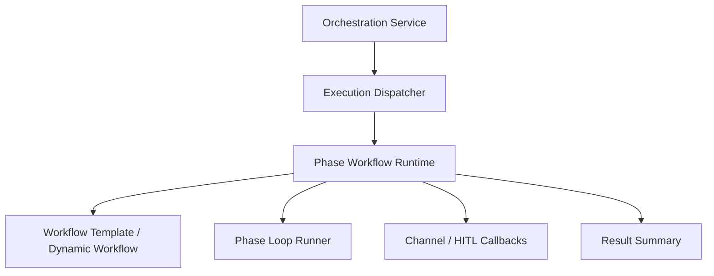

# 설계: Phase Workflow Runtime Boundary

## 개요

Phase Workflow Runtime Boundary는 phase workflow 실행 경로를 서비스 facade와 분리해, **phase 기반 워크플로우 조직화 로직이 독립된 실행 모듈**로 유지되도록 하는 설계다.

이 문서의 목적은 현재 프로젝트에서 phase workflow가 어떤 계층에 위치하고, orchestration service와 어떤 관계를 가지는지를 설명하는 데 있다.

## 설계 의도

phase workflow 경로는 단순한 하위 함수가 아니라, 다음 요소를 함께 다루는 별도의 실행 축이다.

- 템플릿 기반 워크플로우 로딩
- 동적 workflow 생성
- phase별 runner 조정
- 채널/HITL 콜백 연결
- phase 요약과 결과 조립

이 책임을 서비스 facade 안에 그대로 두면, 다른 실행 모드와 경계가 흐려지고 변경 영향 범위가 커진다. 그래서 현재 구조는 phase workflow 경로를 전용 execution 모듈로 둔다.

## 핵심 원칙

### 1. 서비스는 facade, phase workflow는 runtime module이다

Orchestration service는 외부 요청을 받아 적절한 실행 경로로 위임하는 facade로 남고, phase workflow의 실제 조직화는 독립 모듈이 맡는다.

### 2. phase workflow는 자체 의존성 묶음을 가진다

phase runtime은 provider, runtime, store, bus, HITL renderer, node execution collaborator 같은 묶음을 한 번에 받아 동작한다. 이 묶음은 service 내부 필드 접근을 직접 퍼뜨리는 대신 명시적 dependency bundle로 전달된다.

### 3. phase workflow는 실행 모드 중 하나이지만 별도 구조를 가진다

`once`, `agent`, `task`와 같은 실행 모드와 같은 dispatcher 축에 올라가지만, 내부 동작은 훨씬 구조화된 graph/phase 런타임이다.

### 4. channel/HITL 연결은 runtime 경계 안에서 해결한다

phase workflow는 상호작용 노드와 HITL 상태를 지원해야 하므로, 채널 전송과 응답 대기를 runtime 경계 안에서 callback 형태로 다룬다.

## 현재 채택한 구조

## 서비스와의 관계

Orchestration service는 phase workflow 자체를 구현하는 곳이 아니라, phase runtime에 필요한 dependency bundle을 조립해 넘기는 곳이다.

즉 서비스 계층의 책임은 다음에 가깝다.

- 요청 수신
- 적절한 실행 경로 선택
- dependency bundle 조립
- 결과 수령 및 상위 계약 유지

반대로 phase runtime의 책임은 다음에 가깝다.

- workflow 템플릿 해석
- 동적 workflow 생성
- phase 진행
- phase-level interaction wiring
- 최종 결과 요약

## Dependency Bundle

Phase workflow는 여러 collaborator를 요구한다. 현재 구조에서 중요한 점은 이들이 service 내부 전역 상태로 흩어지지 않고, phase runtime 경계로 명시적으로 전달된다는 점이다.

대표적으로 다음 축이 포함된다.

- providers / runtime
- workspace context
- workflow store / subagent registry / message bus
- HITL store 및 renderer
- node execution collaborator
- decision / promise 같은 부가 서비스

이렇게 dependency bundle을 명시하면 phase runtime을 독립적으로 검증하고 유지하기 쉬워진다.

## Dynamic Workflow와의 관계

phase workflow 경로는 정적 템플릿만 실행하는 계층이 아니다. 현재 구조는 workflow hint나 node category 정보를 이용해 동적 workflow를 생성하는 경로도 같은 runtime boundary 안에서 다룬다.

즉 template-based execution과 dynamic synthesis는 서로 다른 기능이지만, 동일한 phase runtime 모델 위에서 동작한다.

## HITL / Channel과의 관계

phase workflow는 interaction nodes를 포함할 수 있으므로, 채널 전송과 응답 대기 능력을 직접 사용한다. 다만 이 능력은 runtime 모듈 안에서 callback 형태로 주입된다.

이 구조의 장점은 다음과 같다.

- runtime은 채널 서비스 구현 세부를 직접 소유하지 않는다.
- service facade는 phase runtime 내부 상호작용 로직을 품지 않는다.
- workflow와 HITL의 경계가 명확해진다.

## 비목표

이 문서는 다음 내용을 정의하지 않는다.

- 특정 refactor 단계의 전후 diff
- 테스트 개수와 통과 결과
- phase extraction 작업 보고
- 세부 이행 순서

그 내용은 구현 코드 또는 `docs/*/design/improved`에서 다룬다.

## 관련 문서

- [Phase Loop 설계](./phase-loop.md)
- [Interaction Nodes 설계](./interaction-nodes.md)
- [Loop Continuity + HITL 설계](./loop-continuity-hitl.md)
