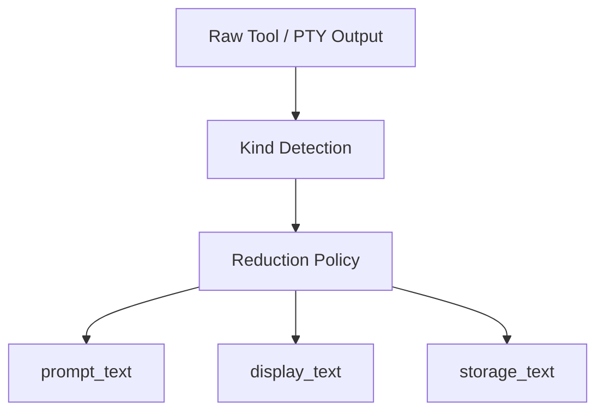

# 설계: Provider-Neutral Output Reduction

## 개요

Provider-Neutral Output Reduction은 대량 출력이 어떤 provider나 backend에서 나왔는지와 무관하게, **같은 내부 경계에서 같은 축약 원칙**을 적용받도록 만드는 설계다. 목적은 raw output 하나를 무조건 그대로 넘기지 않고, 다음 단계의 목적에 맞는 projection으로 나누는 데 있다.

## 설계 의도

현재 프로젝트는 여러 실행 경로를 가진다.

- native tool loop
- PTY / headless agent
- one-shot execution
- workflow / event logging

이 구조에서 특정 provider adapter 안에서만 truncation을 하면 일관성이 무너진다. 어떤 경로는 너무 많이 잘리고, 어떤 경로는 raw output이 그대로 메모리나 프롬프트를 오염시킬 수 있다. 그래서 축약은 provider wire format이 아니라 **내부 정규화 경계**에서 일어나야 한다.

## 핵심 원칙

### 1. 축약은 provider-neutral이어야 한다

`claude`, `codex`, `openrouter`, `orchestrator_llm` 같은 provider 차이는 출력 축약의 기준이 아니다. 축약의 기준은 “이 출력이 어떤 의미의 텍스트인가”이다.

### 2. 하나의 raw output은 여러 projection으로 나뉜다

같은 출력이라도 다음 단계의 목적은 다르다.

- 다음 LLM 턴에 넣는 텍스트
- 사용자에게 보여 주는 텍스트
- 메모리나 이벤트 로그에 남기는 텍스트

따라서 reduction은 단순 truncation이 아니라 projection 설계다.

### 3. 의미 보존 중심으로 줄인다

shell, test output, JSON, diff, log는 서로 다른 축약 규칙을 가져야 한다. 중요한 것은 글자 수를 줄이는 것이 아니라, 다음 단계에 필요한 의미를 보존하는 것이다.

### 4. 실패해도 안전해야 한다

출력 종류 감지가 완벽하지 않아도 시스템이 깨지면 안 된다. kind 판별이 실패하면 최소한 일반 축약 경로로 안전하게 내려와야 한다.

## 현재 채택한 구조

이 구조의 핵심은 reduction이 provider adapter보다 뒤, tool/PTY/memory 경계보다 앞에 있다는 점이다.

## 주요 구성 요소

### Tool Output Reducer

도구 실행 결과는 kind를 판별한 뒤 projection별 텍스트로 나뉜다. 이 계층은 tool result를 바로 LLM에 넣거나 그대로 UI에 표시하지 않도록 중간 보호층 역할을 한다.

### PTY Output Reducer

PTY 기반 실행은 tool result보다 훨씬 긴 스트림형 출력을 만들 수 있다. PTY output reducer는 이 대량 출력이 그대로 사용자 스트림과 메모리를 오염시키지 않게 한다.

### Memory Ingestion Reducer

메모리 저장은 display와 목적이 다르다. 따라서 memory ingestion은 별도 reduction 경계를 갖는다. 저장용 텍스트는 retrieval 품질과 noise control을 우선한다.

### Output Reduction KPI

현재 구조는 reduction 결과를 관찰할 수 있는 계측 계층도 가진다. 이 관점은 reduction이 단순 편의 기능이 아니라 prompt budget과 noise control을 함께 다루는 운영 정책임을 보여준다.

## Projection 모델

현재 설계에서 중요한 점은 raw output이 하나의 결과 문자열로 끝나지 않는다는 것이다. 대표적으로 다음 세 projection이 중요하다.

- `prompt_text`
- `display_text`
- `storage_text`

이 분리가 있어야 같은 실행 결과라도:

- LLM에는 더 짧고 핵심적인 형태로
- 사용자에게는 더 읽기 쉬운 형태로
- 저장소에는 더 retrieval-friendly한 형태로

흘러갈 수 있다.

## Kind-aware Reduction

출력 reduction은 generic text truncation만으로 충분하지 않다. 출력 종류에 따라 보존해야 할 정보가 다르기 때문이다.

예를 들어:

- shell / exec: 에러와 tail
- test output: 실패 요약과 대표 라인
- JSON: 핵심 field
- diff: 대표 파일과 변경량
- log: error count와 최근 구간

즉 reduction은 텍스트 길이 제어이면서 동시에 의미 추출이다.

## 메모리와 관측성의 관계

output reduction은 단순 프롬프트 절약이 아니다. 이 계층은 메모리에 들어가는 텍스트 품질과, 이후 retrieval 결과의 노이즈 수준에도 영향을 준다. 동시에 KPI 계층은 reduction이 실제로 어느 정도 예산을 절약하는지 관찰하게 한다.

따라서 이 설계는 비용 최적화와 retrieval 품질 보호를 동시에 겨냥한다.

## 비목표

이 문서는 다음 내용을 정의하지 않는다.

- 특정 provider wire protocol 상세
- 실시간 assistant chunk 전체를 즉시 재요약하는 정책
- audit 문서나 verdict 문서를 직접 축약하는 규칙
- 구현 상태 보고

그 내용은 구현 코드 또는 `docs/*/design/improved`에서 다룬다.

## 관련 문서

- [PTY 에이전트 백엔드 설계](./pty-agent-backend.md)
- [메모리 검색 설계](./memory-search-upgrade.md)
