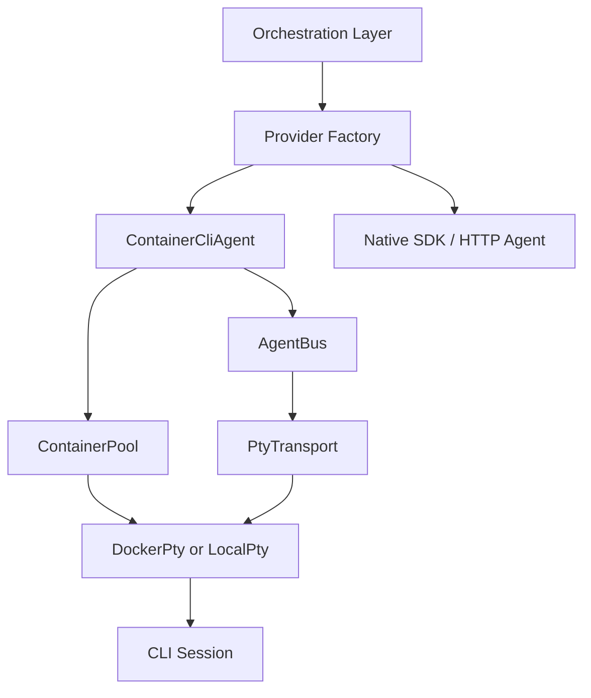

# 설계: PTY 에이전트 백엔드

## 개요

PTY 에이전트 백엔드는 CLI 기반 에이전트를 **단발성 프로세스 호출**이 아니라 **대화 가능한 세션**으로 다루기 위한 실행 계층이다. 이 계층의 목적은 장시간 실행, 후속 입력 주입, 세션 재개, 로컬 또는 컨테이너 환경 전환을 상위 오케스트레이션 계층으로부터 숨기는 데 있다.

이 문서는 PTY 계층이 현재 프로젝트에서 어떤 역할을 맡고, 어떤 경계 안에서 동작하는지를 설명한다. 개별 개선 과제나 이행 순서는 `docs/*/design/improved`에서 관리한다.

## 설계 의도

PTY 경로는 다음 문제를 해결하기 위해 존재한다.

- CLI 에이전트를 여러 턴에 걸쳐 지속되는 세션으로 유지한다.
- 실행 중인 에이전트에 후속 입력을 주입할 수 있게 한다.
- 로컬 개발 환경과 컨테이너 격리 환경을 같은 추상화로 다룬다.
- 채널, 태스크, 서브에이전트가 동일한 세션 모델을 공유하게 한다.

이 계층은 “모든 에이전트를 PTY로 실행한다”는 뜻이 아니다. 현재 구조에서 PTY는 **지속형 CLI 실행이 필요한 백엔드 전략 중 하나**이며, 네이티브 SDK/HTTP 백엔드와 병존한다.

## 핵심 원칙

### 1. 상위 계층은 전송 수단을 모른다

오케스트레이션 계층은 Docker attach, 로컬 pty, 프로세스 표준 입출력을 직접 다루지 않는다. 상위 계층은 세션 키, 입력 주입, 출력 이벤트, 종료 이벤트만 본다.

### 2. 세션은 프로세스보다 오래간다

세션의 기준은 OS PID나 컨테이너 ID가 아니라 `session_key`다. 실제 프로세스가 재생성되더라도 상위 계층은 동일한 실행 단위로 취급한다.

### 3. 통신과 생명주기를 분리한다

메시지 라우팅은 `AgentBus`, 실행 인스턴스 생성·정리·복구는 `ContainerPool`이 담당한다. 하나의 객체가 통신과 인프라 수명을 동시에 책임지지 않는다.

### 4. PTY는 워크플로우 모드가 아니라 백엔드 전략이다

`once`, `agent`, `task`, `phase` 같은 실행 모드와 PTY 여부는 같은 축이 아니다. 실행 계획이 어떤 모드로 결정되더라도, 그 모드를 수행하는 구체 백엔드가 PTY일 수도 있고 아닐 수도 있다.

## 현재 채택한 구조

이 구조에서 `ProviderFactory`는 공급자 설정과 실행 조건을 보고 적절한 에이전트 백엔드를 선택한다. PTY 경로가 선택되면 `ContainerCliAgent`가 지속형 CLI 세션을 관리한다.

## 주요 구성 요소

### Provider Factory

Provider Factory는 공급자 설정을 실제 백엔드 인스턴스로 해석한다. 이 단계에서 “이 요청은 PTY 세션이 필요한가”가 결정된다.

### ContainerCliAgent

ContainerCliAgent는 PTY 기반 CLI 백엔드의 표면 API다. 상위 계층 입장에서는 일반 에이전트처럼 보이지만, 내부적으로는 지속형 세션과 후속 입력 주입을 다룬다.

주요 책임은 다음과 같다.

- 세션 키 기준 실행 시작
- 출력 이벤트를 표준 결과 형태로 정규화
- follow-up, steering, collect 같은 후속 입력 주입
- 런타임 오류 분류와 복구 시도

### AgentBus

AgentBus는 세션과 에이전트 사이의 메시지 통신 계층이다. ask/reply, fire-and-forget, broadcast, lane queue 같은 패턴은 이 계층에서 다룬다.

핵심 목적은 다음과 같다.

- 동일 세션에 대한 입력 직렬화
- 실행 중인 세션으로의 안전한 후속 메시지 주입
- 에이전트 간 통신을 transport-agnostic 형태로 유지

### ContainerPool

ContainerPool은 세션 키에 대응하는 실행 인스턴스를 보장한다. 현재 인스턴스가 살아 있으면 재사용하고, 없으면 생성하며, 종료되면 정리한다.

핵심 목적은 다음과 같다.

- 지연 생성
- 유휴 세션 정리
- 재시작 후 세션 재연결 또는 재생성

### PtyTransport / DockerPty / LocalPty

Transport 계층은 실제 입출력 연결을 수행한다. 현재 구조는 Docker 기반 실행과 로컬 PTY 기반 실행을 같은 추상화 아래에 둔다.

- `DockerPty`: 격리된 컨테이너 기반 세션
- `LocalPty`: 로컬 개발 환경에서의 동등한 PTY 실행

상위 계층은 둘 중 어느 구현이 선택되었는지 알 필요가 없다.

## 세션과 연속성

PTY 백엔드의 가장 중요한 설계 목표는 **연속성**이다.

- 같은 세션은 여러 입력을 순차적으로 받는다.
- 실행 도중 follow-up 메시지를 받을 수 있다.
- 필요 시 현재 턴이 끝난 뒤 수집된 입력을 다음 턴으로 이어간다.
- 장시간 실행이나 사용자 개입이 필요한 경로와 자연스럽게 연결된다.

따라서 PTY 계층은 단순한 “프로세스 실행기”가 아니라, 루프 연속성과 HITL을 위한 기반 계층으로도 동작한다.

## 보안과 격리

PTY 백엔드는 로컬 실행과 격리 실행을 모두 지원하지만, 격리 환경에서는 다음 원칙을 유지한다.

- 실행 환경은 workspace 경계 안에 묶는다.
- 네트워크, 파일시스템, 리소스 권한은 백엔드 전략 수준에서 제한한다.
- 상위 오케스트레이션이 컨테이너 세부 설정에 직접 의존하지 않게 한다.

이 문서의 목적은 보안 옵션 목록을 나열하는 것이 아니라, **CLI 세션 격리가 백엔드 전략의 일부**라는 점을 명확히 하는 데 있다.

## 비목표

다음은 이 설계 문서의 범위가 아니다.

- 특정 컨테이너 이미지 빌드 절차
- 특정 CLI의 명령행 옵션 비교
- 재시도 정책의 세부 임계값
- 개별 이행 단계와 완료 상태

그 내용은 구현 코드 또는 `docs/*/design/improved`의 세부 작업 문서에서 관리한다.

## 관련 문서

- [Phase Loop 설계](./phase-loop.md)
- [Interactive Loop 설계](./interactive-loop.md)
- [Container Code Runner 설계](./container-code-runner.md)
