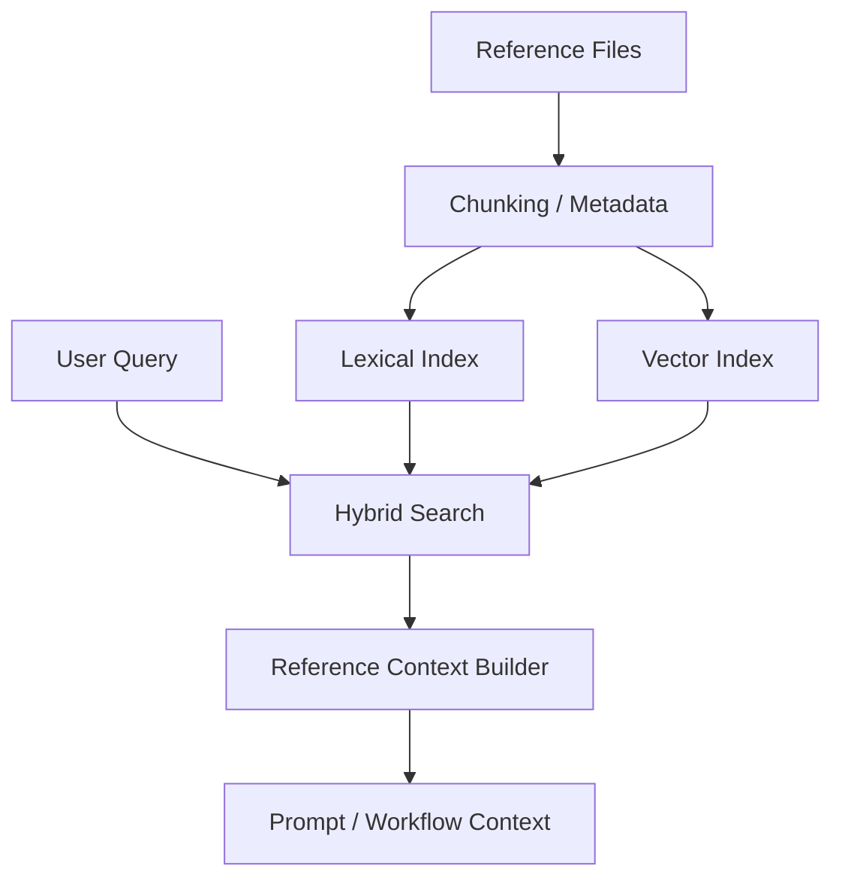

# 설계: RAG Reference Store

## 개요

RAG Reference Store는 사용자 요청에 문맥화된 참고 자료를 공급하는 **참조 저장소 + 검색 계층**이다. 이 설계의 목적은 워크스페이스 안의 reference 자료를 단순 첨부 파일이 아니라, 검색 가능하고 요약 가능한 컨텍스트 자산으로 다루게 하는 데 있다.

## 설계 의도

프로젝트는 장문의 자료, reference 문서, 작업 문맥, 스킬 레퍼런스 같은 정보를 모두 프롬프트 본문에 직접 밀어 넣지 않는다. 대신 다음 질문에 답할 수 있는 저장소 계층이 필요하다.

- 지금 이 요청과 관련된 reference는 무엇인가
- 전체 문서가 아니라 어떤 청크가 필요한가
- lexical 검색과 semantic 검색을 어떻게 같이 쓸 것인가

RAG Reference Store는 이 문제를 해결하기 위한 공통 retrieval 계층이다.

## 핵심 원칙

### 1. 참조 자료는 저장과 검색을 함께 가진다

reference는 파일만 저장한다고 끝나지 않는다. 검색, 청킹, 메타데이터 관리, freshness 판단이 함께 있어야 실제 컨텍스트 자산이 된다.

### 2. retrieval은 hybrid여야 한다

현재 구조는 lexical 검색과 vector 검색을 함께 쓴다. 하나는 빠른 candidate 확보에, 다른 하나는 의미 기반 재정렬과 보강에 사용된다.

### 3. context는 전체 문서가 아니라 관련 청크로 만든다

RAG는 “파일을 보여준다”가 아니라, 현재 요청에 필요한 근거를 추려 시스템이나 워크플로우 컨텍스트에 주입하는 방식이어야 한다.

### 4. 참조 저장소는 워크플로우와 스킬 모두의 기반이 된다

workspace references가 현재 핵심이지만, 구조적으로는 skill reference나 richer document ingestion도 같은 retrieval 철학 아래에 둔다.

## 현재 채택한 구조

## 주요 구성 요소

### Reference Store

Reference Store는 reference 파일을 감시하고, 청크와 문서 메타데이터를 저장하며, hybrid retrieval의 기본 저장소 역할을 한다.

### Chunk Model

문서는 chunk 단위로 저장된다. chunk는 검색의 최소 단위이며, 실제 컨텍스트 주입도 chunk 중심으로 이뤄진다.

### Hybrid Retrieval

hybrid retrieval은 lexical search와 vector search를 결합한다. lexical 경로는 빠르게 후보를 줄이고, vector 경로는 의미 기반으로 보강하거나 재정렬한다.

### Context Builder

검색 결과는 그대로 사용자에게 던져지지 않는다. context builder가 관련 청크를 정리해 프롬프트 또는 실행 문맥으로 변환한다.

## 문서와 미디어의 관계

현재 설계의 중심은 텍스트 reference지만, reference store 자체는 richer ingestion으로 확장 가능한 저장소 계층으로 본다. 중요한 점은 포맷별 파이프라인이 달라도 **검색 결과는 같은 retrieval 계약**으로 수렴해야 한다는 것이다.

즉 top-level 설계에서 중요한 것은 특정 포맷 지원 여부보다, 다양한 자료형도 같은 reference retrieval 모델에 연결된다는 점이다.

## Skill References와의 관계

스킬은 자신의 body만이 아니라 별도 reference 집합을 가질 수 있다. 이 경우에도 reference retrieval 철학은 동일하다.

- 전체 reference를 통째로 주입하지 않는다.
- 현재 요청과 관련된 reference chunk를 선택한다.
- skill 활성 문맥과 일반 workspace reference를 함께 고려할 수 있다.

따라서 RAG Reference Store는 workspace reference 저장소이면서 동시에 skill-aware retrieval의 기반 계층이 된다.

## Freshness와 동기화

reference retrieval이 신뢰 가능하려면 저장소와 실제 파일 상태 사이의 동기화가 필요하다. 따라서 reference store는 단순 append-only 캐시가 아니라, 파일 변경과 chunk 인덱스를 다시 맞출 수 있는 구조여야 한다.

상위 설계에서 중요한 점은 freshness가 “검색 품질” 문제가 아니라, **컨텍스트 신뢰도 문제**라는 것이다.

## 비목표

이 문서는 다음 내용을 정의하지 않는다.

- 특정 포맷별 extractor 구현
- 개별 임베딩 모델 비교
- 인덱스 재구축 스크립트 사용법
- 단계별 구현 진행 상황

그 내용은 구현 코드 또는 `docs/*/design/improved`에서 다룬다.

## 관련 문서

- [하이브리드 벡터 검색 설계](./hybrid-vector-search.md)
- [메모리 검색 설계](./memory-search-upgrade.md)
- [sqlite-vec 벡터 스토어 설계](./vector-store-sqlite-vec.md)
