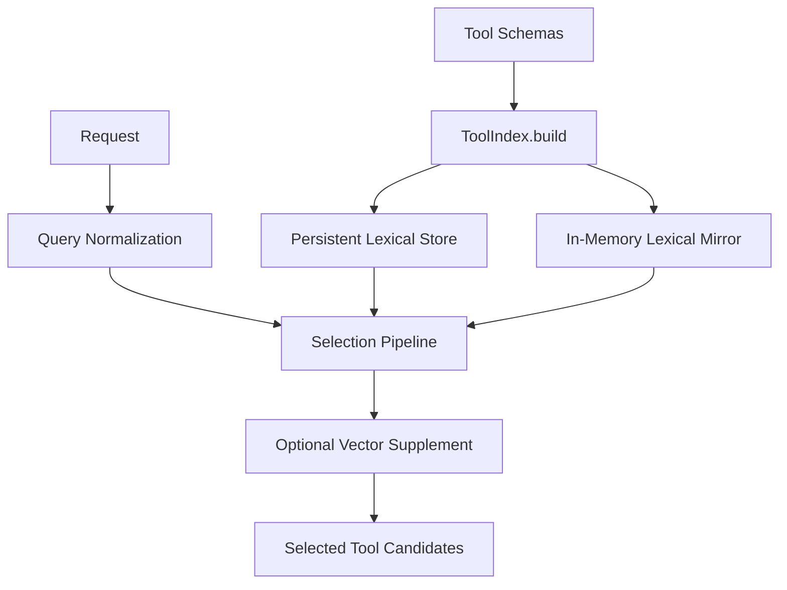

# 설계: Tool Selection Lexical Foundation

## 개요

Tool Selection Lexical Foundation은 요청마다 전체 도구 집합을 모델에 그대로 노출하지 않고, **관련 있는 도구 후보만 먼저 좁히기 위한 lexical retrieval 계층**이다. 파일 이름에 `fts5`가 들어가 있지만, 현재 구조의 핵심은 FTS5 단독이 아니라 **영속 lexical 저장소 + 인메모리 lexical mirror + optional vector 보강**의 조합이다.

## 설계 의도

도구 선택을 단순 프롬프트 엔지니어링 문제로 두면 다음 문제가 생긴다.

- 요청마다 전체 도구 스키마를 다 보여줘야 한다.
- 토큰 비용과 실행 budget이 빠르게 커진다.
- 한국어/영어 혼합 요청에서 도구 이름 직접 매칭이 약해진다.
- once, agent, task처럼 서로 다른 실행 모드가 같은 도구 표면을 보게 된다.

그래서 현재 구조는 도구 선택을 “모델이 알아서 고르는 문제”가 아니라, **실행 전 candidate narrowing 문제**로 다룬다.

## 핵심 원칙

### 1. 도구 선택은 retrieval 계층이다

도구 선택의 1차 목적은 최종 실행 결정을 내리는 것이 아니라, 모델과 실행기가 다룰 도구 후보를 빠르게 좁히는 것이다.

### 2. lexical 경로가 기본이고 vector는 보강이다

현재 구조에서 vector search는 lexical foundation을 대체하지 않는다. lexical path가 기본 candidate generation을 맡고, vector는 부족할 때만 의미 기반 보조 경로로 열린다.

### 3. persistent store와 runtime mirror를 함께 쓴다

검색 가능한 도구 문서는 영속적으로 저장하되, 실제 request-time selection은 더 빠른 인메모리 lexical mirror를 우선 사용한다.

### 4. query normalization은 다국어 요청까지 포함한다

도구 이름 직접 매칭만으로는 충분하지 않다. 한국어 키워드, 식별자 분해, stop-word 제거 같은 normalization 정책이 같은 lexical foundation 아래에서 동작해야 한다.

## 현재 채택한 구조

## 주요 구성 요소

### ToolIndex

ToolIndex는 현재 도구 선택 계층의 중심이다. 도구 메타데이터를 읽고, lexical backing store를 유지하며, request-time selection에 필요한 인메모리 mirror를 준비한다.

### Persistent Lexical Store

영속 저장소는 도구 문서의 기준본을 담는다. 여기에는 도구 이름, 설명, 카테고리, action 기반 태그, content hash 같은 검색용 문맥이 들어간다.

이 계층의 목적은 다음과 같다.

- 도구 검색 문서의 영속 기준 유지
- lexical policy와 저장 구조의 일관성 유지
- 필요 시 vector row와 연결되는 기준 row 제공

즉 FTS5는 이 설계에서 “저장 형식”이지, 런타임 선택 알고리즘 전체가 아니다.

### In-Memory Lexical Mirror

실시간 요청 처리에서 매번 디스크 검색을 수행하면 비용이 커진다. 그래서 현재 구조는 lexical backing store를 바탕으로 인메모리 mirror를 만든다.

대표 정보:

- token → weighted tool map
- category → tool list
- core tool set

이 mirror의 목적은 빠른 candidate generation이다.

## Query Normalization

현재 lexical foundation은 요청을 그대로 검색하지 않는다. normalization을 통해 검색 품질을 끌어올린다.

대표 정책:

- 영문 토큰화
- stop-word 제거
- 식별자 분해
- 한국어 키워드 확장

특히 한국어 요청은 `KO_KEYWORD_MAP` 같은 확장 규칙을 통해 영어 도구 태그로 연결될 수 있다. 이것이 다국어 환경에서 lexical candidate generation의 핵심이다.

## Selection Pipeline

현재 도구 선택은 대략 다음 순서를 따른다.

1. core tools 확보
2. classifier explicit tools 반영
3. lexical search
4. category fallback
5. optional vector supplement

이 순서의 의미는 다음과 같다.

- 항상 필요한 최소 도구는 먼저 보장한다.
- classifier가 명시한 도구는 우선 존중한다.
- lexical search가 대부분의 후보를 만든다.
- lexical recall이 부족할 때 category fallback을 사용한다.
- 그래도 부족할 때만 vector가 보강한다.

즉 vector는 중심이 아니라 마지막 보조 축이다.

## 실행 모드와의 관계

현재 구조는 모든 실행 모드에 같은 core set을 노출하지 않는다. 단순 응답과 다회전 실행은 서로 다른 도구 budget을 가진다.

- `once`: 더 작은 최소 집합
- `agent`, `task`: 더 넓은 기본 집합

이 차이는 도구 선택이 retrieval이면서 동시에 **execution budget policy**의 일부임을 보여준다.

## Hybrid Vector Search와의 관계

`tool-selection-fts5`는 도구 선택의 lexical foundation과 candidate generation에 집중한다. 반면 `hybrid-vector-search`는 memory, references, retrieval 전반의 더 넓은 공통 개념이다.

즉 이 문서는 검색 일반론이 아니라, **도구 선택에서 lexical retrieval이 차지하는 위치**를 설명한다.

## 비목표

이 문서는 다음 내용을 정의하지 않는다.

- role / protocol prompt 정책
- gateway routing 규칙
- 도구 실행 로직 자체
- 세션 reuse freshness 정책
- tokenizer 개선 작업의 rollout

그 내용은 구현 코드 또는 `docs/*/design/improved`에서 다룬다.

## 관련 문서

- [하이브리드 벡터 검색 설계](./hybrid-vector-search.md)
- [Provider-Neutral Output Reduction 설계](./provider-neutral-output-reduction.md)
