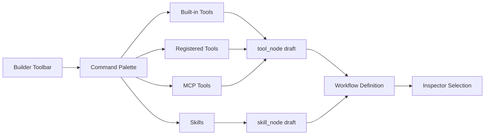

# 설계: Workflow Builder Command Palette

## 개요

Workflow Builder Command Palette는 워크플로우 빌더 안에서 **도구 노드와 스킬 노드의 삽입 지점**을 제공하는 검색 기반 인터페이스다. 이 구성 요소의 목적은 캔버스 편집 경험을 단순화하면서도, 프로젝트가 가진 다양한 도구 소스를 하나의 선택 화면으로 묶는 데 있다.

이 문서는 현재 채택한 명령 팔레트의 역할과 경계를 설명한다. 구현 단계나 개선 순서는 `docs/*/design/improved`에서 관리한다.

## 설계 의도

워크플로우 빌더는 일반 노드 추가뿐 아니라 다음 종류의 리소스를 빠르게 삽입해야 한다.

- 내장 도구
- 등록된 일반 도구
- MCP 서버가 제공하는 도구
- 스킬 기반 노드

이 리소스를 각각 별도 UI로 분리하면 삽입 경험이 불필요하게 무거워진다. 그래서 현재 구조는 **검색 가능한 공통 삽입 표면**을 두고, 선택 결과를 워크플로우 정의에 맞는 노드로 변환한다.

## 핵심 원칙

### 1. 팔레트는 “카탈로그”가 아니라 “삽입 인터페이스”다

이 UI의 목적은 도구 전체를 관리하는 것이 아니라, 현재 편집 중인 워크플로우에 필요한 노드를 빠르게 넣는 것이다.

### 2. 도구 소스는 하나의 리스트로 합쳐지되, 출처는 유지한다

사용자는 하나의 검색창으로 접근하지만, 결과는 built-in, registered, MCP, skills처럼 출처별로 그룹화된다.

### 3. 선택 결과는 워크플로우 친화적 구조로 변환된다

팔레트에서 선택한 항목은 그대로 문자열로 저장되지 않고, `tool_node` 또는 `skill_node` 초안으로 변환되어 현재 워크플로우 정의에 붙는다.

### 4. 빌더 보조 UI로서 동작한다

Command Palette는 캔버스, inspector, node registry를 대체하지 않는다. 빠른 추가 진입점 역할을 맡는다.

## 현재 채택한 구조

## 입력 데이터

Command Palette는 여러 데이터 소스를 읽되, 표현은 통합한다.

- tool inventory
- tool definitions
- MCP server별 연결 상태와 도구 목록
- skill inventory

이 데이터는 팔레트 안에서 검색, 그룹화, 라벨링에 사용된다.

## 사용자 흐름

현재 팔레트의 기본 흐름은 다음과 같다.

1. 사용자가 빌더에서 추가 액션을 연다.
2. 팔레트가 검색 가능한 항목 목록을 보여준다.
3. 사용자가 항목을 선택한다.
4. 선택 결과가 `tool_node` 또는 `skill_node` 초안으로 변환된다.
5. 현재 워크플로우의 적절한 위치에 노드가 추가된다.
6. inspector가 새 노드를 편집 가능한 상태로 연다.

즉 이 컴포넌트는 선택 UI이면서 동시에 **draft node 생성기**다.

## 그룹화와 검색

팔레트는 검색과 출처 그룹화를 동시에 제공한다.

- built-in
- registered
- MCP 서버별 그룹
- skills

검색의 목적은 전체 도구 인덱스를 탐색하는 것이고, 그룹화의 목적은 “이 항목이 어디서 온 것인지”를 사용자에게 보존하는 것이다.

## MCP와 스킬의 위치

MCP 도구와 스킬은 워크플로우 빌더에 추가 가능한 리소스지만, 수명주기와 제공 방식은 서로 다르다.

- MCP: 외부 서버가 제공하는 도구 capability
- Skill: 재사용 가능한 작업 단위 또는 템플릿 성격의 capability

Command Palette는 이 둘을 같은 화면에서 보여주되, 같은 객체로 취급하지 않는다.

## Node Palette / Canvas와의 관계

현재 빌더는 여러 추가 진입점을 가진다.

- 캔버스 기반 노드 추가
- inspector 기반 편집
- command palette 기반 빠른 삽입

Command Palette는 이 중 “검색을 통한 빠른 삽입”에 집중한다. 복잡한 파라미터 편집이나 노드 배치는 이후 inspector와 builder 캔버스가 담당한다.

## 비목표

이 문서는 다음 내용을 정의하지 않는다.

- 정확한 CSS 클래스 구조
- 키보드 이벤트 처리 세부 구현
- 특정 아이콘 세트나 스타일링 정책
- 구현 완료 상태나 테스트 시나리오

그 내용은 구현 코드 또는 `docs/*/design/improved`에서 다룬다.

## 관련 문서

- [Workflow Tool 설계](./workflow-tool.md)
- [Node Registry 설계](./node-registry.md)
- [Phase Loop 설계](./phase-loop.md)
