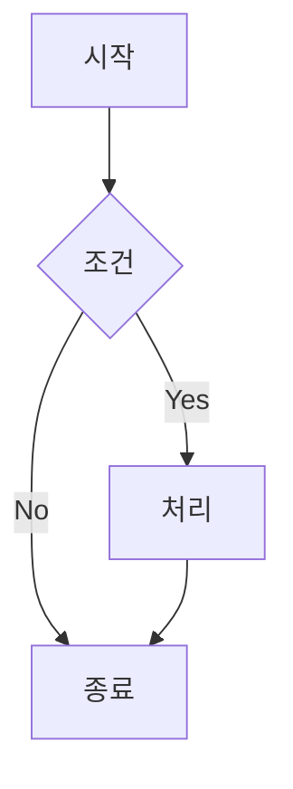
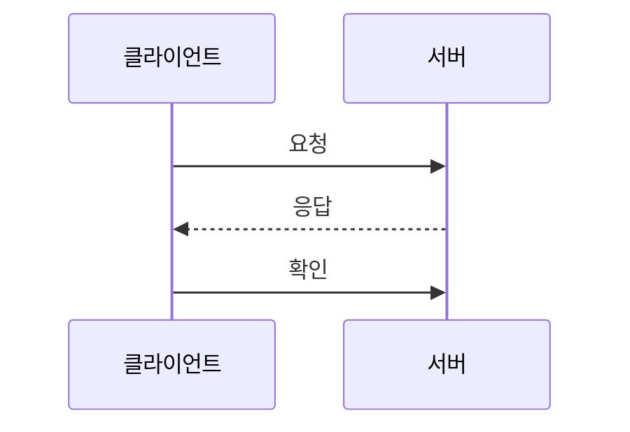
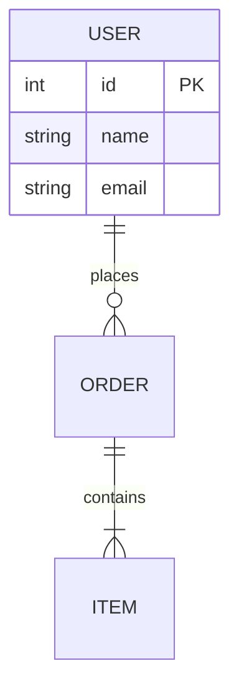
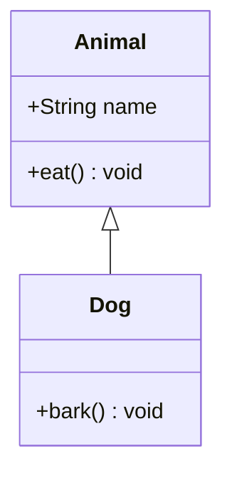
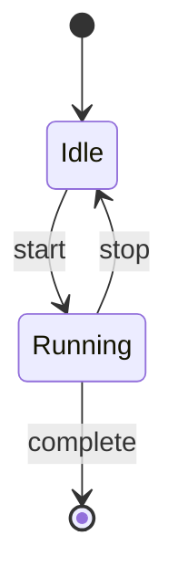
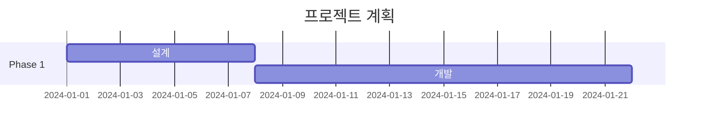
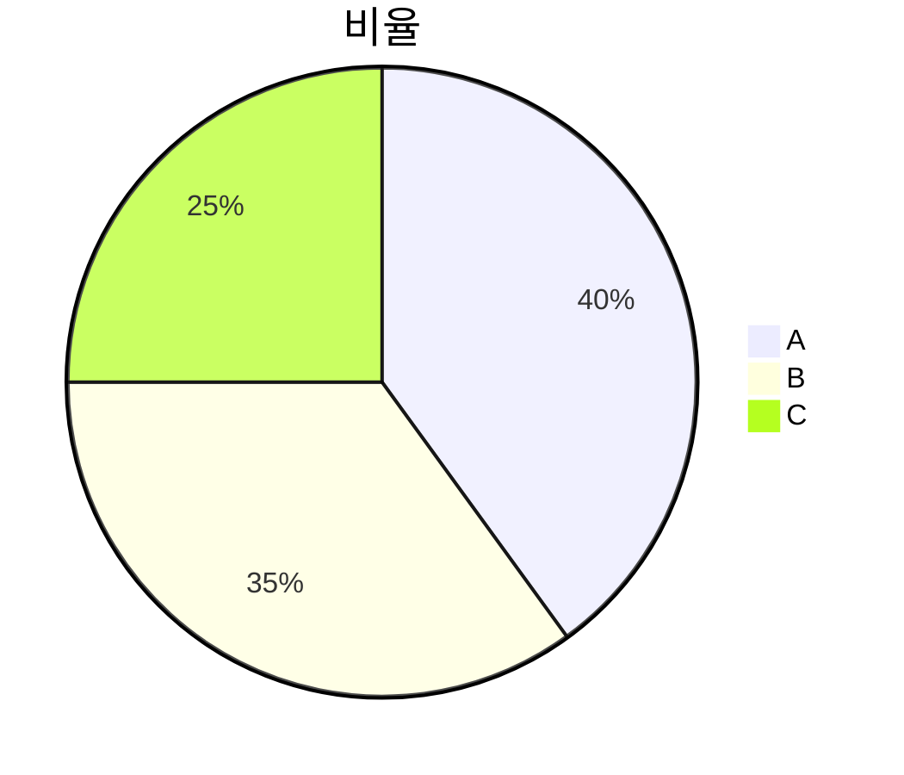
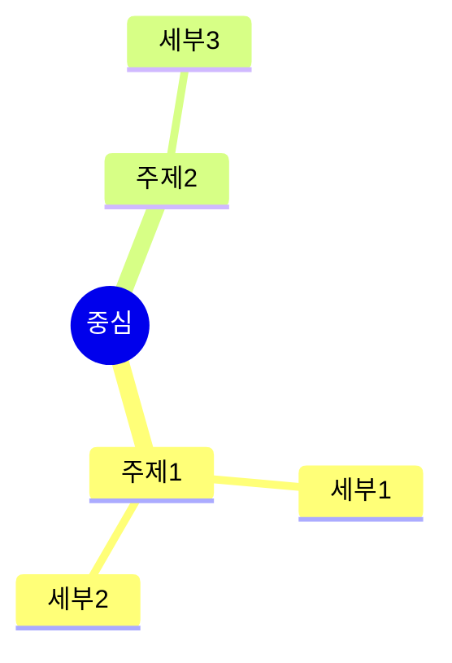

# Mermaid 다이어그램 문법 레퍼런스

## Flowchart

방향: `TD` (위→아래), `LR` (왼→오른), `BT`, `RL`
노드: `[]` 사각형, `()` 둥근 사각형, `{}` 마름모, `(())` 원

## Sequence

화살표: `->>` 실선, `-->>` 점선, `-x` 비동기

## ERD

관계: `||--||` 1:1, `||--o{` 1:다, `}o--o{` 다:다

## Class

## State

## Gantt

## Pie

## Mindmap

## 공통 팁

- 노드 ID는 알파벳+숫자만 (한글 ID 금지, 한글은 `[]` 라벨에)
- 긴 라벨은 ` ` 줄바꿈 사용
- 특수문자는 `""`로 감싸기
